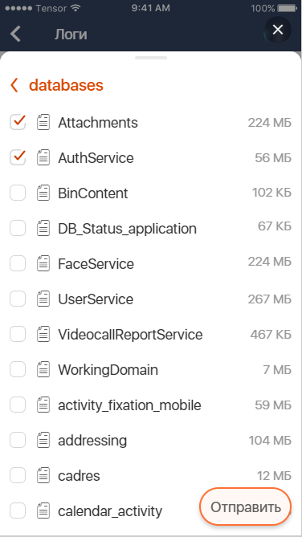

# Браузер файлов приложения на устройстве

| Ответственность                                                                                         | Ответственные                                                                                                |
|---------------------------------------------------------------------------------------------------------|--------------------------------------------------------------------------------------------------------------|
| Участок работ                                                                                           | [Настройки в мобильном приложении Android](https://online.sbis.ru/area/bb121ab6-731c-4184-b567-1f6f148e2345) |  
| [AppFileBrowserFeature](src/main/java/ru/tensor/sbis/app_file_browser/feature/AppFileBrowserFeature.kt) | [Бессонов Ю. С.](https://dev.sbis.ru/person/0744ffc8-075a-40e7-a1bd-5d6fff8655f2)                            |  


## Документация

[Ссылка на ТЗ](https://online.sbis.ru/shared/disk/18da967b-be72-4a64-9977-828910e6605a)  

[Описание БП](https://online.sbis.ru/shared/disk/bfd95151-65d0-4827-b56a-553a37d617b5)  

## Описание

Модуль содержит реализацию браузера файлов мобильного приложения, доступных для отправки в качестве 
диагностических данных.  
Компонент открывается в шторке и поддерживает выбор целых папок или отдельных файлов. По клику в 
папку происходит проваливание. Размер отображается по умолчанию у файлов, а по свайпу влево 
доступен у папок.

##### Внешний вид



[Макет](http://axure.tensor.ru/MobileAPP/логирование_и_отправка_диагностических_данных.html) 
(Меню - Данные для диагностики: Выборочные - Отправить)

## Руководство по подключению и инициализации

Для добавления модуля в проект, в `settings.gradle` проекта должны быть подключены следующие модули:  

| Репозиторий                                            | модуль                   |  
|--------------------------------------------------------|--------------------------|  
| https://git.sbis.ru/mobileworkspace/android-design.git | design                   |  
| https://git.sbis.ru/mobileworkspace/android-utils.git  | common                   |  
| https://git.sbis.ru/mobileworkspace/android-design.git | design_dialogs           |  
| https://git.sbis.ru/mobileworkspace/android-utils.git  | list                     |  
| https://git.sbis.ru/mobileworkspace/android-utils.git  | crud3                    |  
| https://git.sbis.ru/mobileworkspace/android-design.git | design_checkbox          |  
| https://git.sbis.ru/mobileworkspace/android-design.git | design_custom_view_tools |  
| https://git.sbis.ru/mobileworkspace/android-design.git | design_utils             |  
| https://git.sbis.ru/mobileworkspace/android-design.git | design_breadcrumbs       |  
| https://git.sbis.ru/mobileworkspace/android-utils.git  | modalwindows             |  
| https://git.sbis.ru/mobileworkspace/android-utils.git  | base_components          |

## Описание публичного API

Взаимодействие с компонентом осуществляется посредством [AppFileBrowserFeature](src/main/java/ru/tensor/sbis/app_file_browser/feature/AppFileBrowserFeature.kt).  
Для её получения предусмотрен метод `createAppFileBrowserFeature()`. В качестве 
`viewModelStoreOwner` нужно использовать родительский фрагмент, либо `Activity`, в зависимости от 
используемого `FragmentManager`'a. 


```kotlin
// this - родительский фрагмент файлового браузера 
private val appFileBrowserFeature = createAppFileBrowserFeature(this)
```

Для показа панели нужно вызвать метод `show()` у [AppFileBrowserFeature](src/main/java/ru/tensor/sbis/app_file_browser/feature/AppFileBrowserFeature.kt), 
указав, в частности, идентификатор view контейнера, в котором следует отображать панель:

```kotlin
appFileBrowserFeature.show(
    requireContext(),
    childFragmentManager,
    R.id.file_browser_container
)
```

Для получения результата выбора файлов предусмотрена `LiveData`, обновляемая при изменении состава 
выбранных файлов и папок:

```kotlin
appFileBrowserFeature.selectedFiles.observe(fragment) { selectedFiles ->
    // Реагируем на обновление выбора файлов
}
```

Предусмотрено оповещение о закрытии панели. Для этого необходимо подписаться на 
`panelCloseEvent`.

Для получения строки с общим объёмом выбранных файлов используйте метод `getSelectedTotalFiles()`.

Отметки о выборе сохраняются в пределах жизненного цикла экрана, из которого открывается файловый 
браузер. По необходимости, этот выбор можно сбросить методом `reset()`.
