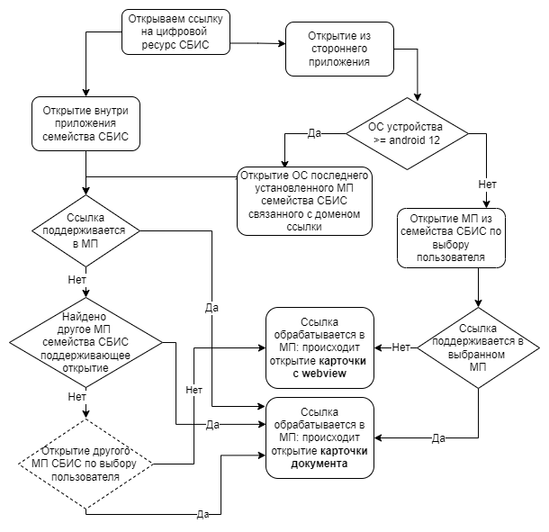
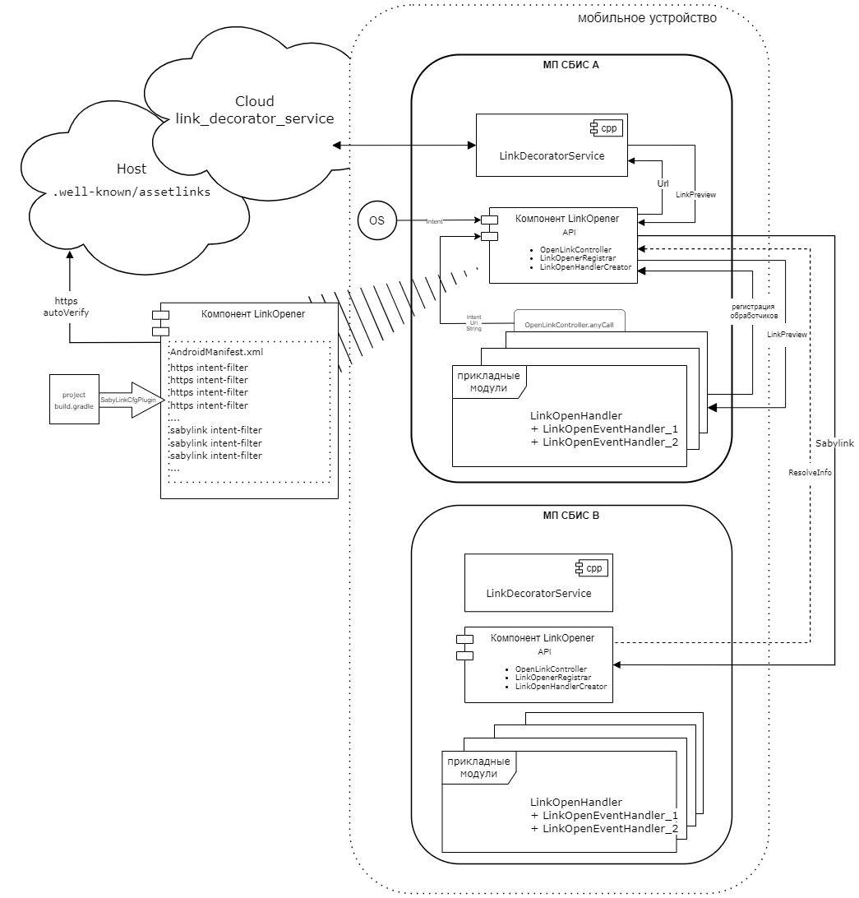

### Document Opener (компонент открытия ссылок)
Модуль `link_opener` содержит стандартный компонент Открытия документов по ссылкам. 
Предназначен для открытия ссылок внутри установленного мобильного приложения.
Целевой домен адресов электронных ресурсов может быть дополнительно сконфигурирован, подробнее см. пункт `Особенности работы.Конфигурирование компонента`.<br/>
 
| Ответственность                        | Ответственные                                                                       | Добавить                                                                                                         |
|----------------------------------------|-------------------------------------------------------------------------------------|------------------------------------------------------------------------------------------------------------------|
| Компонент открытия ссылок (LinkOpener) | [Участок](https://online.sbis.ru/area/997231a7-2092-40fa-9fee-9a10a73c1534)         | [Проект на разработку компонента](https://online.sbis.ru/opendoc.html?guid=bb3423d7-741b-4723-ad48-817bcf6ffd55) |
| Мобильная платформа                    | [Рязанцев Д.А.](https://online.sbis.ru/person/78d9c32c-e814-418a-a3f8-e82a308b9013) | [Участок](https://online.sbis.ru/area/1eb8ec65-bf47-4265-9ea4-d14c7fce07ef)                                      |
| Микросервис декорирования              | [Игумнов Г.А.](https://online.sbis.ru/person/146b02c6-083e-4342-bf2c-315657a80d93)  | [Участок](https://online.sbis.ru/area/1eb8ec65-bf47-4265-9ea4-d14c7fce07ef)                                      |

#### Использование в приложениях
- [Брендовые приложения](https://git.sbis.ru/mobileworkspace/apps/droid/brand)
- [Бизнес](https://git.sbis.ru/mobileworkspace/apps/droid/business)
- [Курьер](https://git.sbis.ru/mobileworkspace/apps/droid/courier)
- [MySaby Личный кабинет сотрудника](https://git.sbis.ru/mobileworkspace/apps/droid/mysaby/)
- [Витрина](https://git.sbis.ru/mobileworkspace/apps/droid/sabyget)
- [Кладовщик](https://git.sbis.ru/mobileworkspace/apps/droid/storekeeper)
- [Коммуникатор](https://git.sbis.ru/mobileworkspace/apps/droid/communicator)
- [SabyLite Легкий коммуникатор](https://git.sbis.ru/mobileworkspace/apps/droid/sabylite/)

#### Внешний вид
[ТЗ](https://online.sbis.ru/shared/disk/6563ec7b-9ef7-44c7-9781-3c1dda584393) <br/>
[ТЗ после выпуска Android 12](https://online.sbis.ru/shared/disk/2d309779-d63e-4d35-8e1a-1726d49ee59e) <br/>
[БП](https://online.sbis.ru/shared/disk/ad54d9c6-21a3-432f-b126-cd3f774fb0ef)
[ТД. Механизм открытия ссылок LinkOpener](https://n.sbis.ru/article/14e3d18e-15fc-48c8-b49d-f888b701fd1e)

#### Зависимости
В файл `settings.gradle` проекта должны быть подключены модули `:link_opener`, `toolbox-decl` , а также все модули-зависимости.

`include ':link_opener'`
`project(':link_opener').projectDir = new File(settingsDir, 'common/link_opener')`

`include ':toolbox-decl'`
`project(':toolbox-decl').projectDir = new File(settingsDir, 'declaration/toolbox-decl')`

#### Описание
* Поддерживаемые ссылки открываются переходом на соответствующий экран текущего приложения или любого другого приложения семейства Сбис.
* Не поддерживаемые ссылки открываются в приложении через Chrome custom tabs, WebView или браузер.

Ожидаемый результат навигации с использованием компонента:
1. обработанные целевые электронные адреса будут перенаправлены на соответсвующий экран приложения;
2. необработанные целевые электронные адреса будут перенаправлены в целевое МП семейства Сбис если такое доступно на устройстве пользователя;
3. необработанные целевые электронные адреса будут открыты в `Chrome custom tabs` или `WebView` текущего приложения;
4. любые другие сторонние электронные адреса (нецелевые) будут открыты в стороннем приложении браузера, если такое установлено на устройстве.




#### Использование
##### Содержание
- [Настройка gradle модуля проекта](#настройка-gradle-модуля-проекта)
- [Настройка gradle модуля проекта (DEPRECATED)](#настройка-gradle-модуля-проекта-DEPRECATED)
- [Подключение компонента модуля открытия ссылок](#подключение-компонента-модуля-открытия-ссылок)
- [Регистрация обработчиков](#регистрация-обработчиков)
- [Добавление разработчиками поддержки открытия новых специфических url ресурсов](#добавление-разработчиками-поддержки-открытия-новых-специфических-url-ресурсов)
- [Ошибки открытия документа по ссылке](#ошибки-открытия-документа-по-ссылке)
- [Регистрация интент фильтров с поддержкой Android 12](#регистрация-интент-фильтров-с-поддержкой-Android-12)
- [Если на устройстве Android 12 установлено несколько приложений сбис](#если-на-устройстве-Android-12-установлено-несколько-приложений-сбис)
- [Регистрация sabylink-ссылок для поддержки Android 12](#регистрация-sabylink-ссылок-для-поддержки-Android-12)
- [Использование компонента для навигации](#использование-компонента-для-навигации)
- [Использование компонента для навигации входа в приложение](#использование-компонента-для-навигации-входа-в-приложение)
- [Конфигурирование компонента](#конфигурирование-компонента)
- [Особенности работы](#особенности-работы)
- [Аналитика](#аналитика)

##### Настройка gradle модуля проекта
В .gradle модуль проекта добавить плагин [SabyLinkCfgPlugin](https://git.sbis.ru/mobileworkspace/configs/android-configs/-/blob/rc-23.1204/gradle_configs/gradle_settings/settings-plugin/src/main/groovy/ru/tensor/gradle/subconfig/sabylinks/SabyLinkCfgPlugin.groovy).
Пример:
```gradle
rootProjectConfig { cfg ->
    ...
    cfg.enableSabyLinkCfg()
    ...
}
```
Зарегистрировать **компонент-получатель** интент-фильтров по схеме `https` для **домена** по умолчанию опциональному **паттерну пути**. 
Где:<br/>
- **компонент-получатель** - наименование класса `Activity`, которое будет вызываться по интент-фильтрам
  в [манифесте компонента](src/main/AndroidManifest.xml). Указывается по свойству `component`.<br/>
  По умолчанию указан `ru.tensor.sbis.droid.MainActivity`.<br/>
- **паттерн пути** - путь URI, представляет собой паттерн применяемый к url-ссылке `online.sbis.ru` и `online.saby.ru`.
  Указывается  по свойству `pattern`, по умолчанию указан `.*`, т.е. для любого набора символов.

По умолчанию **компонент-получатель** будет использоваться для открытия ресурсов онлайна `*online.sbis.ru` и зеркала онлайна `*online.saby.ru`.
Для отключения основного интент-фильтра доступно свойство `enableOnlineSbis`.

Далее выполнить настройку компонента связанную с возможностью открытия `https` ссылок специфичных ресурсов.
Список свойств специфичных цифровых ресурсов начинается с префикса `enable<Имя_ресурса>`.
По умолчанию все дополнительные спецификации `https` ссылок отключены.

Далее выполнить настройку компонента связанную с возможностью редиректа открытия ссылок между МП семейства Сбис, т.е. редиректа в текущее настраиваемое приложение.
Подробнее о редиректе см. раздел ([Регистрация sabylink-ссылок для поддержки Android 12](#регистрация-sabylink-ссылок-для-поддержки-Android-12))
Список свойств фич для которых может настраиваться открытие ссылок заканчивается на суффикс `<Имя_фичи>Feature`.
По умолчанию все фичи редиректа отключены.

Подробнее ознакомиться со всеми доступными настройками можно в плагине [SabyLinkCfgPlugin](https://git.sbis.ru/mobileworkspace/configs/android-configs/-/blob/rc-23.1204/gradle_configs/gradle_settings/settings-plugin/src/main/groovy/ru/tensor/gradle/subconfig/sabylinks/SabyLinkCfgPlugin.groovy).
Пример:
```gradle
sabyLinks.setup { set ->
    set.component = "ru.tensor.sbis.business.LaunchActivity"   // компонент-получатель
    set.pattern = "/opendoc.*"                                 // опциональный паттерн пути `online.sbis.ru` и `online.saby.ru`
    set.enableOnlineSbis = true                                // если требуется включить открытие всех ресурсов онлайна `*online.sbis.ru`
    set.enableQrAuthAndInstallApp = false                      // если требуется отключить открытие ссылки qr-кода установки МП с токеном авторизации
    set.enableLinkContractorsCard = true                       // включить открытие специфичных цифровых ресурсов Карточки компании
    set.enableLinkNews = true                                  // включить открытие специфичных цифровых ресурсов Новости компании
    set.contractorsCardFeature = true                          // включить редирект в настраиваемое МП для фичи Карточки компании
    set.paymentDocumentFeature = true                          // включить редирект в настраиваемое МП для фичи Платежного документа
    ...
}
```

##### Настройка gradle модуля проекта DEPRECATED
**Данный подход устарел и не должен более использоваться, оставлен для обратной совместимости!**

Зарегистрировать **активити-получатель** интент-фильтров по схеме `https` для **домена** по
опциональному **паттерну пути**. Где:<br/>
- **активити-получатель** - наименование класса `Activity`, которое будет вызываться по интент-фильтрам
в [манифесте компонента](src/main/AndroidManifest.xml). Переопределяется по .gradle свойству `deepLinkHost`.<br/>
По умолчанию указан `ru.tensor.sbis.droid.MainActivity`. Смотреть настройки [build.gradle модуля](build.gradle).<br/>
- **паттерн пути** - путь URI, представляет собой паттерн применяемый к url-ссылке. Переопределяется
по .gradle свойству `deepLinkPattern`, по умолчанию указан `.*`, т.е. для любого набора символов.

В [манифесте](src/main/AndroidManifest.xml) модуля открытия ссылок `link_opener` есть:
- основные интент-фильтры для открытия `*online.sbis.ru`, `*online.saby.ru`, по умолчанию включены
- дополнительные интент-фильтры, используемые для добавления поддержки специфичных url-ресурсов, по
  умолчанию выключены

Основной список интент-фильтров в виде <url-ресурс>:<.gradle-свойство>
Онлайн: `enableOnlineSbis` (host=`*online.sbis.ru` и `*online.saby.ru`)

Дополнительный список интент-фильтров в виде <url-ресурс>:<.gradle-свойство>
- вебинары: `enableDeepLinkWebinar` (host=`*w.sbis.ru`)
- митинг: `enableDeepLinkMeeting` (host=`*n.sbis.ru`, pathPrefix=`/meeting/`)
- видеоконференция: `enableDeepLinkVideoconf` (host=`*n.sbis.ru`, pathPrefix=`/videoconf/`)
- новость: `enableDeepLinkNews` (host=`*n.sbis.ru`, pathPrefix=`/news/`)
- новости портала компании по работе с партнерами: `enableDeepLinkRegNews` (host=`*reg.tensor.ru`, pathPrefix=`/news/`)
- служебая ссылка розницы: `enableDeepLinkRetailDevice` (host=`api.sbis.ru`, pathPrefix=`/retail/point.device_link/`)
- статьи базы знаний: `enableDeepLinkWikiArticle` (host=`*n.sbis.ru`, pathPrefix=`/article/`)
- карточка компании: `enableDeepLinkContractorsCard` (host=`*online.sbis.ru`, pathPrefix=`/contractors-mobile-api/`)
- заявка на выпуск НЭП: `enableDeepLinkCertificateSubmission` (host=`*.sbis.ru`, pathPrefix=`/page/application-for-unqualified-signature`)

Для включения/отключения в приложении интент-фильтров необходимо задать значение `true`/`false`
соответствующих им `.gradle` свойствам в проекте.

Примеры настройки .gradle файла проекта для конфигурирования использования модуля:
- Переопределить активность получателя интентов и url-схему. Пример:
```gradle
project.ext {
    ...
    deepLinkHost = "ru.tensor.sbis.business.LaunchActivity"
    deepLinkPattern = "/opendoc"
    ...
}
```
- Включить все основные url-ресурсы
```
project.ext {
    ...
    enableOnlineSbis = true
    ...
}
```
- Добавить поддержку дополнительных url-ресурсов
```gradle
project.ext {
    ...
    enableDeepLinkWebinar = true
    enableDeepLinkVideoconf = true
    enableDeepLinkMeeting = true
    ...
}
```

##### Подключение компонента модуля открытия ссылок
1. Добавить плагин `LinkOpenerPlugin` в систему плагинов приложения `PluginSystem`:
```kotlin
internal object AppPlugin : BasePlugin<Unit>() {
    //...
    override fun registerPlugins(app: Application, pluginManager: PluginManager) {
        pluginManager.registerPlugins(
            // ....
            LinkOpenerPlugin
        )
        pluginManager.configure(app)
    }
}
```

2. Описать зависимости требуемые модулем [LinkOpenerDependency](src/main/java/ru/tensor/sbis/link_opener/contract/LinkOpenerDependency.kt).
Обычно они уже описаны в `AppPlugin` приложения.

3. В плагине своего модуля зарегистрировать один или несколько обработчиков ([Регистрация обработчиков](#регистрация-обработчиков)). 

##### Регистрация обработчиков
Регистрация обработчика `LinkOpenerHandler` осуществляется через `LinkOpenerHandlerCreator` посредством DSL:
- **on** - установить обработчик открытия ссылки специфичного документа
    - **type** - поддерживаемый тип ссылки на документ [DocType](https://git.sbis.ru/mobileworkspace/android-serviceapi/-/blob/rc-23.1200/toolbox-decl/src/main/java/ru/tensor/sbis/toolbox_decl/linkopener/data/DocType.kt)
    - **subtype** - поддерживаемый подтип ссылки на документ [LinkDocSubtype](https://git.sbis.ru/mobileworkspace/android-serviceapi/-/blob/rc-23.1200/toolbox-decl/src/main/java/ru/tensor/sbis/toolbox_decl/linkopener/data/LinkDocSubtype.kt)
    - **accomplish** - действие выполняемое по событию открытия данного типа ссылки
- **default** - опциональный обработчик для событий открытия ссылки на неизвестный контент.<br/>
  Используется для документов с типом и подтипом не поддерживающих роутинг в
  приложении, по умолчанию предусмотрено открытие документа в WebView.
- **priority** - приоритет текущего обработчика по отношению к обработчикам сторонних фич.<br/>
  Используется при определении обработчика которому будет делегирован вызов если на один набор
  типов `DocType` и подтипов `LinkDocSubtype` таких зарегистрировано несколько.

1. Вариант регистрации в плагине:
```kotlin
object MyFeaturePlugin : BasePlugin {
    private lateinit var linkOpenHandlerCreatorProvider: FeatureProvider<LinkOpenHandlerCreator.Provider>

    override val dependency: Dependency by lazy {
        Dependency.Builder()
        // ...
        .require(LinkOpenHandlerCreator.Provider::class.java) { linkOpenHandlerCreatorProvider = it }
        .build()
    }

    override fun doAfterInitialize() {
        if (linkOpenerHandlerEnabled) {
            linkOpenHandlerCreatorProvider.linkOpenerHandlerCreator.create {
                on {
                    type = DocType.MEETING
                    accomplish { /** Действие при открытии */ }
                }
            }
        }
    }
}
```

2. Вариант регистрации в фиче и подключение в плагине через `LinkOpenerRegistrar`:
```kotlin
object MyFeaturePlugin : BasePlugin {
    private lateinit var linkOpenHandlerCreatorProvider: FeatureProvider<LinkOpenHandlerCreator.Provider>
    private var linkOpenerRegistrarProvider: FeatureProvider<LinkOpenerRegistrar.Provider>? = null

    private val fooFeature by lazy {
        FooFeatureImpl(linkOpenHandlerCreatorProvider.get())
    }

    override val dependency: Dependency by lazy {
        Dependency.Builder()
        // ...
        .require(LinkOpenHandlerCreator.Provider::class.java) { linkOpenHandlerCreatorProvider = it }
        .requireIf(linkOpenerHandlerEnabled, LinkOpenerRegistrar.Provider::class.java) {
            linkOpenerRegistrarProvider = it
        }
        .build()
    }

    override fun doAfterInitialize() {
        if (linkOpenerHandlerEnabled) {
            linkOpenerRegistrarProvider!!.get().linkOpenerRegistrar.registerProvider(fooFeature)
        }
    }
}

class FooFeatureImpl(
    private val linkOpenHandlerCreatorProvider: LinkOpenHandlerCreator.Provider
) : LinkOpenHandler.Provider {  
    // ...
    override fun getLinkOpenHandler(): LinkOpenHandler =
        linkOpenHandlerCreatorProvider.linkOpenerHandlerCreator.create {
            on {
                type = DocType.MEETING
                accomplish { /** Действие при открытии */ }
            }
        }
}
```

##### Добавление разработчиками поддержки открытия новых специфических url ресурсов
Каждый прикладной разработчик должен самостоятельно добавлять специфичные для конкретного приложения
url-ресурсы в [манифест компонента](src/main/AndroidManifest.xml), тем самым разделяя зоны ответственности
между приложениями. Порядок добавления специфичного интент-фильтра:
1. предварительно убедиться что существующие интент-фильтры не покрывают необходимый сценарий использования;
2. добавить специфичный интент-фильтр, в зависимости от указания стенда (подробнее [Регистрация интент-фильтров с поддержкой Android 12](#регистрация-интент-фильтров-с-поддержкой-Android-12))
3. добавить новый `manifestPlaceholder` в [.gradle модуля](build.gradle)<br/>
   `Нужно для опционального включения интент-фильтра в приложении`
4. указать новый `manifestPlaceholder` в `scheme` добавленного интент-фильтра<br/>
   `Тогда если интент-фильтр будет включен в приложении, то в `scheme` подставится `https`, иначе невалидная схема `placeholder``
5. указать имя нового `BuildConfigField` в gradle-плагине `SabyLinkFieldsCfgPlugin`;
6. указать имя нового свойства для активации создаваемого интент-фильтра в gradle-плагине `SabyLinkCfgPlugin`;
7. активировать специфичный цифровой ресурс в .gradle модуле своего проекта (подробнее [Настройка gradle модуля проекта](#настройка-gradle-модуля-проекта));
8. для поддержки Android 12+:
- опубликовать файл ассоциаций (подробнее [Регистрация интент-фильтров с поддержкой Android 12](#регистрация-интент-фильтров-с-поддержкой-Android-12);
- зарегистрировать sabylink-ссылку для роутинга из нецелевого приложения (подробнее [Регистрация sabylink ссылок для поддержки Android 12](#регистрация-sabylink-ссылок-для-поддержки-Android-12).
6. обновить документацию в плагинах.

##### Ошибки открытия документа по ссылке
Если при переходе по ссылке возникла ошибка открытия карточки документа или документ был открыт в WebView вместо целевого экрана
вероятнее всего возникла одна из следующих проблем:
- сервис декорирования ссылок не вернул достаточно информации по ссылке. А именно отсутсвет тип `DocType` или подтип `LinkDocSubtype` документа.
Проверить это можно включив режим отладки в настройках приложения и проверив логи записанные в момент перехода по ссылке.
Результат полученный с сервиса `LinkPreview` должен содержать действительные типы документа, а не `DocType.UNKNOWN` / `LinkDocSubtype.UNKNOWN`.
См. раздел ([Особенности работы](#особенности-работы));
- у текущего пользователя нет прав на документ (ссылка на документ связана с др. пользователем);
- ссылка на документ связана с другим тестовым-стендом.

##### Регистрация интент фильтров с поддержкой Android 12
Начиная с Android 12 теперь необходимо подтверждать, что приложение принадлежит сайту, ссылки
которого она может открыть в приложении. Без верификации ссылка открывается в браузере!<br/>
Для верификации используется json-файл, размещённый по адресу 
`https://<имя хоста>/.well-known/assetlinks.json`. См. [пример](https://online.sbis.ru/.well-known/assetlinks.json).<br/>
Запрос верификации происходит один раз после установки приложения. Результаты верификации можно
посмотреть через команду `adb shell pm get-app-links <package-name>`.<br/>

###### Порядок добавления поддержки верификации для приложения
1. Мобильный разработчик берёт за основу актуальную версию файла [assetlinks.json](https://git.sbis.ru/ha/sbis-nginx-route/-/blob/rc-24.3000/SOURCES/.well-known/assetlinks.json)
и редактирует его, добавляя в json элемент следующего вида:
```json
{
		"relation": [
			"delegate_permission/common.handle_all_urls"
		],
		"target": {
			"namespace": "android_app",
			"package_name": "ru.tensor.sbis.droid",
			"sha256_cert_fingerprints": [
				"A7:C2:7F:BB:DF:9D:48:1E:7C:A7:7C:5B:59:4E:D4:FC:E9:86:F6:6B:60:8B:D4:D4:7A:70:D7:03:1A:1B:B6:5F"
			]
		}
}
```
Необходимо указать имя пакета приложения и отпечаток сертификата sha256 (можно взять [здесь](https://git.sbis.ru/mobileworkspace/ci_scripts/-/blob/development/Pipelines/android/android_parameters.json?ref_type=heads), 
либо уточнить у сборщиков, если нужное приложение отсутствует).  
Обратите внимание, если размер файла превысит 100 KB, верификация может перестать работать для всех 
приложений (недокументированное ограничение со стороны Google).  

2. Нужно выписать задачу в разработку подразделению [Инфраструктурные сервисы/HL/HA](https://online.sbis.ru/department/2a54881a-9d5d-477c-b18b-65ac14b1ddae/) 
на обновление файла на сервисе. Отредактированный файл нужно прикрепить к задаче.  
[Пример такой задачи](https://online.sbis.ru/opendoc.html?guid=11f6a088-b9ae-4768-82e7-bf373cfca85d&client=3)  
[Ещё один пример](https://online.sbis.ru/doc/13a7230b-b8a3-408c-aa67-f55517fe8ced?client=3)  
 
###### Стенды
Стенды в url могут указываться разными способами:
- через сабдомен `.` (например `fix.sabyget.ru`)
- через `-` (например `fix-online.sbis.ru`)

###### Если указание стендов через сабдомен '.'
Если стенды указываются через сабдомен, например `fix.sabyget.ru`, `test.sabyget.ru`, то в
интент-фильтре хост можно указать так же как и до Android 12: `data android:host="*.sabyget.ru"` ,
андроид успешно распарсит домен и отправит запрос верификации, в этом случае на `sabyget.ru/.well-known/assetlinks.json`.<br/>
**Верификация пройдет для всех стендов, даже для тестовых, недоступных вне рабочего VPN**.<br/>
Пример интент-фильтра:
```
<intent-filter android:autoVerify="true">

<action android:name="android.intent.action.VIEW"/>

<category android:name="android.intent.category.DEFAULT"/>
<category android:name="android.intent.category.BROWSABLE"/>

<data android:scheme="${SCHEME}" />
<data android:host="sabyget.ru" /> <!-- Для prod-стенда -->
<data android:host="*.sabyget.ru" /> <!-- Для остальных стендов -->
</intent-filter>
```

###### Если указание стендов через '-'
До Android 12 было возможно указать хост в интент-фильтре так: `data android:host="*online.sbis.ru"`,
и тогда в приложении будут открываться `online.sbis.ru` со стендами: `test-online.sbis.ru`, `fix-online.sbis.ru`
и т.д. Но с Android 12 такая запись невалидна, т.к. непонятно к какому домену обращаться за
верификацией (`*online.sbis.ru` может быть как `123online.sbis.ru`, `1234online.sbis.ru` и т.д.).<br/>
Поэтому в этом случае остается только прописать все стенды отдельно в одном интент-фильтре, например:
```
<intent-filter android:autoVerify="true">

<action android:name="android.intent.action.VIEW"/>

<category android:name="android.intent.category.DEFAULT"/>
<category android:name="android.intent.category.BROWSABLE"/>

<data android:scheme="${SCHEME}" />
<data android:host="online.sbis.ru" />
<data android:host="fix-online.sbis.ru" />
</intent-filter>
```
**При этом верификацию смогут пройти только те стенды, которые доступны вне VPN**, так, верифицировано
будет только `fix-online.sbis.ru`, а `test-online.sbis.ru`, `pre-test-online.sbis.ru` — нет.
Поэтому ссылки на тестовых стендах `pre-test`, `test` нужно прописывать в отдельном [debug-манифесте модуля](src/debug/AndroidManifest.xml),
тогда при debug-сборке [debug-манифест](src/debug/AndroidManifest.xml) будет смержен с [основным](src/main/AndroidManifest.xml).<br/>
Для тестирования ссылок на стендах, доступных только под VPN, нужно будет вручную их верифицировать в системных настройках
приложения: `О приложении` -> `Открывать по умолчанию`.

[Подробнее про верификацию ссылок в оф. документации](https://developer.android.com/training/app-links/verify-site-associations)

##### Если на устройстве Android 12 установлено несколько приложений сбис
Если на устройстве Android 12 установлено несколько приложений сбис, которые подключили один и тот
же интент-фильтр (например `https://online.sbis.ru/opendoc.html?guid=...` для courier и communicator), то диалог
выбора между приложением способным открыть ссылку больше не показывается (как это было до Android 12),
и открывается [последнее установленное приложение](https://developer.android.com/training/app-links/verify-android-applinks#multi-app-same-domain).<br/>
Если последнее установленное приложение оказывается **нецелевое**, то есть не поддерживает открытие
этого документа по ссылке, то происходит поиск **целевого**:
1. В нецелевом приложении через микросервис декорирования определяется у ссылки:
   - тип `DocType`
   - подтип `LinkDocSubtype`
   - заголовок документа `String`
2. Строится `sabylink` ссылка вида: `sabylink://type.subtype/details?uuid=...&rawSubtype=...&title=...`
3. Проверяется, есть ли на устройстве приложения, зарегистрировашие открытие этого типа/подтипа ссылки ([Регистрация sabylink ссылок для поддержки Android 12](#регистрация-sabylink-ссылок-для-поддержки-Android-12))
4. Если приложения не были найдены, то ссылка открывается в WebView (если ссылка из сбис), иначе в браузере <br/>
4.1. Если приложения найдено, то открывается целевое приложение, а в нём нужный документ <br/>
4.2. Если найдено несколько подходящих приложений, то показывается диалог выбора

##### Регистрация sabylink ссылок для поддержки Android 12
1. Фича (или плагин), которая регистрирует ссылки (например, `MyDocumentsFeature`), регистрируется
в [SabyLinkCfgPlugin.SabyLinkProducer](https://git.sbis.ru/mobileworkspace/configs/android-configs/-/blob/rc-23.1204/gradle_configs/gradle_settings/settings-plugin/src/main/groovy/ru/tensor/gradle/subconfig/sabylinks/SabyLinkCfgPlugin.groovy)
```groovy
class SabyLinkProducer {
    // ...
    /**
     * Список фич для которых настраивается открытие ссылок.
     * Название свойства должно соответствовать нормализованному названию фичи (плагина).
     */
    def myDocumentsFeature = false
    // ...
}
```

1.1. А так же в этом же классе добавляется в методе `applyBuildConfigField`:
```groovy
private void applyBuildConfigField() {
    project.subprojects { Project subPrj ->
        // ...
        subPrj.beforeEvaluate {
            // ...
            setActiveBuildConfig(subPrj, "SABYLINK_MY_DOCUMENTS_FEATURE", myDocumentsFeature)
        }
    }
}
```
Где `SABYLINK_MY_DOCUMENTS_FEATURE` - имя фичи с приставкой `SABYLINK` и постфиксом `FEATURE`

1.2. Затем `SABYLINK_MY_DOCUMENTS_FEATURE` регистрируется в `expectedBuildConfigFields`
в [SabyLinkFieldsCfgPlugin](https://git.sbis.ru/mobileworkspace/configs/android-configs/-/blob/rc-23.1204/gradle_configs/gradle_settings/settings-plugin/src/main/groovy/ru/tensor/gradle/subconfig/sabylinks/SabyLinkFieldsCfgPlugin.groovy)
```groovy
class SabyLinkFieldsCfgPlugin implements Plugin<Project> {
    // ...
    private def expectedBuildConfigFields = [
        //...
        "SABYLINK_MY_DOCUMENTS_FEATURE"
    ]
}
```

2. Далее в [build.gradle модуля](build.gradle) определяется схема с именем фичи `MY_DOCUMENTS_FEATURE_SCHEME`
для подстановки в будущий интент-фильтр в [манифесте](src/main/AndroidManifest.xml) (на шаге №3)
```groovy
android {
    defaultConfig {
        manifestPlaceholders = [
            // ...
            MY_DOCUMENTS_FEATURE_SCHEME: internalScheme("SABYLINK_MY_DOCUMENTS_FEATURE")
        ]
    }
}
```

3. В [манифесте](src/main/AndroidManifest.xml) определяется интент-фильтр вида:
```xml

<intent-filter>
    <action android:name="android.intent.action.VIEW" />
    <category android:name="android.intent.category.DEFAULT" />

    <data android:scheme="${MY_DOCUMENTS_FEATURE_SCHEME}" />
    <data android:host="type.subtype" />
    <data android:host="type2.subtype2" />
</intent-filter>
```
Где:
- `MY_FEATURE_FEATURE_SCHEME` - `manifestPlaceholder`, зарегистрированный на шаге №2. Если для
приложения включено использования ссылок фичи, то подменится на `sabylink://`, иначе на невалидную
схему `placeholder`<br/>
- `type` - тип `DocType` в нижнем регистре, который указывается при регистрации ссылки в плагине/фиче <br/>
- `subtype` - подтип `LinkDocSubtype` в нижнем регистре, который указывается при регистрации ссылки в плагине/фиче

4. В `build.gradle` уровня приложения (не `app`-модуля) включается использование ссылок из фичи:
```groovy
apply plugin: 'rootproject-cfg-plugin'

rootProjectConfig { cfg ->
    // ...
    cfg.enableSabyLinkCfg() // Подключение плагина, в котором зарегистрировали фичу (на шаге №1)
}
// ...
project.ext {
    // ...
    sabyLinks.setup { set ->
        set.myDocumentsFeature = true // Имя фичи в плагине, зарегистрированное на шаге №1
    }
}
```

5. В плагине/фиче, где регистрируется ссылка, перед регистрацией проверять, включено ли
   использование ссылок фичи в приложении:
```kotlin
class MyDocumentsPlugin : BasePlugin {
    private val linkOpenerHandlerEnabled = BuildConfig.SABYLINK_MY_DOCUMENTS_FEATURE

    // ...
    override fun doAfterInitialize() {
        if (linkOpenerHandlerEnabled) {
            linkOpenerRegistrarProvider!!.get().linkOpenerRegistrar.registerProvider(MyDocumentsFeature)
        }
    }
}
```
Где:
- `BuildConfig.SABYLINK_MY_DOCUMENTS_FEATURE` - поле в BuildConfig сгенерированное на шаге №1.1,
  показывает, была ли фича включена в приложении в `build.gradle` app-модуля (на шаге №4)

##### Использование компонента для навигации
Использование компонента `LinkOpenerFeature` для навигации по ссылке. Для роутинга при открытии
ссылки на контент (документ) в мобильном приложении используется контроллер навигации [OpenLinkController](https://git.sbis.ru/mobileworkspace/android-serviceapi/-/blob/rc-23.1200/toolbox-decl/src/main/java/ru/tensor/sbis/toolbox_decl/linkopener/OpenLinkController.kt)<br/>
Ниже приведена схематика использования контроллера навигации.

Получить интерфейс контроллера навигации.<br/>
Пример получения через `LinkOpenerFeature`:
```kotlin
linkOpenerFeature.getOpenLinkController()
```      

Использовать любой из методов `OpenLinkController` для обработки входного намерения приложения.<br/>
Пример обработки по принципу вызвал-забыл (обработка задекларирована в `LinkOpenHandler`):
```kotlin
linkOpenerFeature
    .getOpenLinkController(this)
    .processAndForget(intent)
```

Пример обработки ссылки вне декларативного роутинга на стороне клиента:
```kotlin
linkOpenerFeature
    .getOpenLinkController(this)
    .processYourself(intent)
    .subscribe { /*обработка полученного превью ссылки на документ*/ }      
```

##### Использование компонента для навигации входа в приложение
В дополнение к разделу [Использование компонента для навигации](#использование-компонента-для-навигации)
Для быстрой реализации открытия целевого экрана связанного с интент-фильтром инициирующим открытие
приложения в т.ч. с учетом шага прохождения авторизации требуется:
1. Реализовать сплэш экран на основе [BaseLaunchActivity](https://git.sbis.ru/mobileworkspace/android-utils/-/blob/rc-23.2100/app_systems/base_app_components/src/main/java/ru/tensor/sbis/base_app_components/BaseLaunchActivity.kt)
   Реализация поддерживает роутинг внешнего неявного намерения в открываемые из него активности.
2. Реализовать экран авторизации на основе [BaseLoginActivity](https://git.sbis.ru/mobileworkspace/android-login/-/blob/rc-23.2100/auth_common/src/main/java/ru/tensor/sbis/login/common/BaseLoginActivity.kt)
   Реализация поддерживает роутинг внешнего неявного намерения в открываемые из него активности.
3. Использовать расширение главного экрана для обработки открытия ссылок [LinkOpenWithRedButtonCheckMainScreenExtension](https://git.sbis.ru/mobileworkspace/android-utils/-/blob/rc-23.2100/main_screen/main_screen_extensions/main_screen_linkopen_red_button_handle_extension/src/main/java/ru/tensor/sbis/main_screen_linkopen_handle_extension/LinkOpenWithRedButtonCheckMainScreenExtension.kt).
   Расширение запускает открытие ссылки, если пользователь пытался её открыть до авторизации и если
   с момента последней попытки прошло не более 4 минут.

Если по каким-то причинам данные компоненты не используются достаточно мигрировать логику связанную
с роутингом внешнего неявного намерения в собственные реализации.

##### Конфигурирование компонента
Предусмотрена опциональная конфигурация использования компонента [LinkOpenerFeature](https://git.sbis.ru/mobileworkspace/android-serviceapi/blob/rc-23.1200/toolbox-decl/src/main/java/ru/tensor/sbis/toolbox_decl/linkopener/LinkOpenerFeature.kt)
посредством реализации [LinkOpenerFeatureConfiguration](src/main/java/ru/tensor/sbis/link_opener/contract/LinkOpenerFeatureConfiguration.kt).<br/>
Сейчас опциональная конфигурация включает:
- изменение окна ожидания синхронизации сервиса декорирования ссылок;
- изменение набора ключевых слов для проверки входной url ссылки на принадлежность домену СБИС продукта;
- активацию пост-обработки неопределенных сервисом декорирования ссылок через дополнительный UI
  парсер [ScalableParser](src/main/java/ru/tensor/sbis/link_opener/domain/parser/ScalableParser.kt);
- отображение прогресс-диалога во время открытия ссылки с переходом через нецелевые экраны;
- активацию перенаправления неподдерживаемых открытых ссылок в другие МП семейства Сбис;
- активацию использования Google Custom Tabs.

##### Особенности работы
Работа компонента основана на взаимодействии с сервисом декорирования ссылок [LinkDecoratorService](src/main/java/ru/tensor/sbis/link_opener/domain/parser/DeeplinkParser.kt)
предназначенного для синхронизации и выдачи данных декорации отображения ссылок. Микросервис
позволяет получать декорированую ссылку через вызов прикладных обработиков определения подтипа с
возможностью синхронного вызова методов облака.

На текущий момент **не все желаемые типы и подтипы ссылок поддержиаются сервисом декорирования и облаком**,
в таком случае компонент открытия ссылок вернет в выдаче данных декорации тип `DocType.Unknown` или подтип `LinkDocSubtype.Unknown`
из-за чего обработка навигации прикладными UI модулями будет затруднена или невозможна.

**Дорожная карта** добавления поддержки компонентом желаемого типа ссылки:
1. добавить новый тип `DocType` или подтип `LinkDocSubtype` ссылки на документ, если это необходимо.
2. поддержать определение и разбор типа ссылки на стороне UI. Для данной задачи предусмотрен парсер 
пост обработчик [ScalableParser](src/main/java/ru/tensor/sbis/link_opener/domain/parser/ScalableParser.kt).<br/>
Парсер может дополняться прикладными разработчиками для **временного решения** определения типа ссылки.
3. запустить задачу на ответственного за сервис декорирования от мобильной платформы для обеспечения
поддержки декорации нового типа ссылки.<br/>
**Добавить TODO на задачу** в [ScalableParser](src/main/java/ru/tensor/sbis/link_opener/domain/parser/ScalableParser.kt).

##### Аналитика
Для мониторинга частоты использования функционала открытия ссылок добавлена сборка [аналитики](src/main/java/ru/tensor/sbis/link_opener/analytics/Analytics.kt).
События:
- открытие ссылки из целевого МП `link_opener_card`
- открытие sabylink-ссылки (редирект из нецелевого МП) `link_opener_sabylink`
- открытие ссылки в МП через customTabs `link_opener_customTabs`
- открытие ссылки в МП через webView `link_opener_webView`
- открытие ссылки в МП через редирект браузеру `link_opener_browser`
Дополнительная информация: 
- тип документа `link_opener_doc_type`
- подтип документа `link_opener_doc_subtype`
