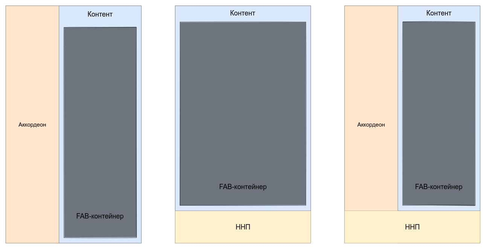
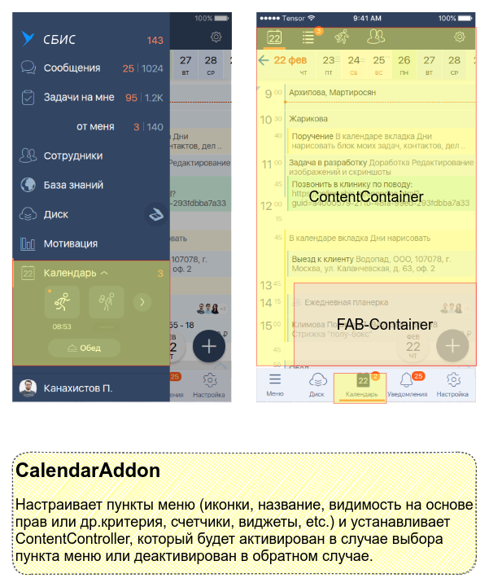
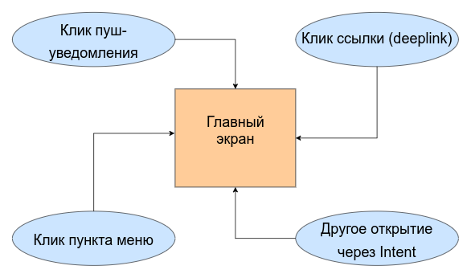

# Компонент главного экрана - MainScreenWidget.

#### Назначение:

Основная задача данного компонента - формирование главного экрана приложения на основе плагинов (
addon), поставляемых прикладными модулями.

#### Исходная проблема:

В старом подходе большое количество логики (навигация, обработка пушей, диплинков и других интентов)
приходится держать на уровне каждого приложения, в результате чего происходит дублирование кода.
Но **самый большой недостаток** - логика может **случайно расходится**, так как забыли скопировать
ее с основного приложения.

#### Обязанности компонента:

- Предоставление *Addon'ам* возможности настраивать меню (*NavView*, *TabNavView*).
- Управление событиями меню (*NavView*, *TabNavView*).
- Управление скрытием/показом *ННП* при необходимости (опция настраиваемая на уровне приложения).
- Управление событиями *back press* (делегирование *Addon'ам* + собственная логика).
- Проверка прав (пачкой) через сервис контроллера.
- Разные вариации сохранения выбранного пункта меню (на время сессии, до рестарта приложения).
- Управление обработкой новых *Intent'ов*.

### Структура главного экрана



Главный экран приложений состоит из следующих элементов:

- Меню (аккордеон, *ННП* или все вместе);
- Контентная область, в которую вставляется хост-фрагмент прикладного модуля;
- Область для *FAB'ов*, в которой прикладной модуль настраивает отображение *FAB*-кнопок.

А также для обеспечения работы необходим доступ к следующим элементам окружения:

- [Context](https://developer.android.com/reference/android/content/Context), причем не приложения,
  а именно экрана, чтобы корректно работала темизация, локаль и др.
- [LifecycleOwner](https://developer.android.com/reference/android/arch/lifecycle/LifecycleOwner)
- [ViewModelStoreOwner](https://developer.android.com/reference/androidx/lifecycle/ViewModelStoreOwner)
- [SavedStateRegistryOwner](https://developer.android.com/reference/androidx/savedstate/SavedStateRegistryOwner)
- [OnBackPressedDispatcherOwner](https://developer.android.com/reference/androidx/activity/OnBackPressedDispatcher)
- [ActivityResultCaller](https://developer.android.com/reference/kotlin/androidx/activity/result/ActivityResultCaller)

MainScreen содержит 2 функциональные зоны: меню и контент. Для каждой зоны задаем свой
обработчик. [*
MainScreenAddon*](main_screen/main_screen_decl/src/main/java/ru/tensor/sbis/main_screen_decl/MainScreenAddon.kt)
настраивает отображение меню и прочую обвязку. А управление контентом занимается [*
ContentController*](main_screen/main_screen_decl/src/main/java/ru/tensor/sbis/main_screen_decl/content/ContentController.kt)
. Никто не запрещает реализовывать эти интерфейсы в виде одного объекта, но физически они умышлено
разделены.
**!** Addon может настраивать отображение меню, при это никак не участвовать во встраивании
контента. Так, например, реализовано отображение информации по профилю в боковом меню.
Чтобы понять что это и для чего нужно, лучше всего рассмотреть на примере.

### Пример прикладного Addon'а



На скрине изображены элементы, которые *Addon* должен настроить. Как именно это он делает - увидим в
коде.

```kotlin
class CalendarMainScreenAddon(  
	// реализация меню элемента по-умолчанию
    private val calendarNavItem: CalendarNavigationItem = CalendarNavigationItem(), 
    // реализация видимости элемента по-умолчанию
    private val visibilitySourceProvider: (ConfigurableMainScreen) -> LiveData<Boolean> = defaultVisibilitySourceProvider(), 
    // реализация фабрики хост-фрагмента по-умолчанию
    private val fragmentFactory: () -> Fragment = {  
        CalendarFeatureImpl().getCalendarMainFragment()  
    }
) : MainScreenAddon, ... {

	override fun setup(mainScreen: ConfigurableMainScreen) {  
		val configuration = ConfigurableMainScreen.MenuItemConfiguration(  
		    content = contentItem,  
			visibilitySource = visibilitySourceProvider(mainScreen) 
		)  
		// настройка элементов меню
		mainScreen.addItem(calendarNavItem, configuration, this)
	    
	    // системный обработчик прав
	    permissionLauncher = mainScreen.host.resultCaller.registerForActivityResult(ActivityResultContracts.RequestMultiplePermissions()) { permissionsInfo ->
		    ...
	    }
    }
  
	override fun reset(mainScreen: ConfigurableMainScreen) {  
		// подчищаем за собой
		mainScreen.removeItem(calendarNavItem)
		
		permissionLauncher.unregister()
	}
}
```

Теперь посмотрим как происходит управление контентной областью (в данном случае на базе [*
SimplifiedContentController*](main_screen/main_screen_decl/src/main/java/ru/tensor/sbis/main_screen_decl/content/SimplifiedContentController.kt)):

```kotlin
class CalendarMainScreenAddon : SimplifiedContentController(), ... {
	...
	// метод для создания хост-фрагмента
	override fun createScreen(selectionInfo: ContentController.SelectionInfo, mainScreen: MainScreen): ContentInfo {  
	    return ContentInfo(fragmentFactory())  
	}  
  
	// метод для подстройки в зависимости от состояния выбран ли элемент в меню
	override fun onSelectionChanged(navigationItem: NavigationItem, isSelected: Boolean, mainScreen: MainScreen, contentContainer: ContentContainer) { 
		// настройка кнопок 
	    adjustFabs(isSelected, mainScreen, contentContainer)  
	}
	...
}
```

Для встраивания фрагмента в контентную область используются
стратегии [FragmentInstallationStrategy](main_screen/main_screen_decl/src/main/java/ru/tensor/sbis/main_screen_decl/content/install/FragmentInstallationStrategy.kt)
. Реализованы 2 базовых варианта:

-
некеширующая [NonCacheFragmentInstallationStrategy](main_screen/main_screen_decl/src/main/java/ru/tensor/sbis/main_screen_decl/content/install/NonCacheFragmentInstallationStrategy.kt)
- применяется по умолчанию. Встраивание фрагмента на основе *`FragmentTransaction#add()`*
/*`FragmentTransaction#remove()`*;
-
кеширующая [CachedFragmentInstallationStrategy](main_screen/main_screen_decl/src/main/java/ru/tensor/sbis/main_screen_decl/content/install/CachedFragmentInstallationStrategy.kt)
- более эффективна, если аккуратно реализована логика фрагмента. Встраивание фрагмента на
основе *`FragmentTransaction#attach()`*/*`FragmentTransaction#detach()`*;

Если нужно больше простора и гибкости для управления контентом, то всегда можно унаследоваться от [*
ContentController*](main_screen/main_screen_decl/src/main/java/ru/tensor/sbis/main_screen_decl/content/ContentController.kt)
и подстроить поведение нужным образом.

### Точки входа на главный экран



Как правило, на главный экран можно попасть не только посредством выбора элемента меню, но и через
получение нового *Intent'а*. Чтобы это учесть, для главного экрана созданы расширения [*
IntentHandleExtension*](main_screen/main_screen_decl/src/main/java/ru/tensor/sbis/main_screen_decl/intent/IntentHandleExtension.kt)
, которые подключаются на уровне приложения и доступны всем *Addon'ам*.
На текущий момент созданы несколько типов расширений:

- Расширения для обработки
  пуш-уведомлений [PushHandleMainScreenExtension](main_screen/main_screen_extensions/main_screen_push_handle_extension/src/main/java/ru/tensor/sbis/main_screen_push_handle_extension/PushHandleMainScreenExtension.kt)
  ;
- Расширения для обработки
  deeplink'ов [DeepLinkHandleMainScreenExtension](main_screen/main_screen_extensions/main_screen_deeplink_handle_extension/src/main/java/ru/tensor/sbis/main_screen_deeplink_handle_extension/DeepLinkHandleMainScreenExtension.kt)
  ;
- Расширения для обработки через
  LinkOpener [LinkOpenMainScreenExtension](main_screen/main_screen_extensions/main_screen_linkopen_handle_extension/src/main/java/ru/tensor/sbis/main_screen_linkopen_handle_extension/LinkOpenMainScreenExtension.kt)
  ;
- Расширение для обработки навигационных событий (на основе
  NavigationItemType) [NavigationEventHandleMainScreenExtension](main_screen/main_screen_extensions/main_screen_navigation_event_handle_extension/src/main/java/ru/tensor/sbis/main_screen_navigation_event_handle_extension/NavigationEventHandleMainScreenExtension.kt)
  ;
- Универсальное расширение для обработки *
  intent'ов* [GenericIntentHandleMainScreenExtension](main_screen/main_screen_extensions/main_screen_generic_intent_handle_extension/src/main/java/ru/tensor/sbis/main_screen_generic_intent_handle_extension/GenericIntentHandleMainScreenExtension.kt)
  .

**Важно**: обработчики вызываются друг за другом в порядке, указанном при инициализации компонента
главного экрана. После того, как будет найден первый заинтересованный (зарегистрированный *
Addon'ом*) обработчик, цепочка прервется.

Использование расширений на примере предыдущего *addon'а*:

 ```kotlin
 class CalendarMainScreenAddon : 
     ...
	 PushHandleMainScreenExtension.PushIntentResolver, 
	 NavigationEventHandleMainScreenExtension.NavTypeIntentResolver {
	
	override fun setup(mainScreen: ConfigurableMainScreen) {
		// установка обработчика навигации по пушу	
		requireNotNull(mainScreen.pushHandleExtension()).registerPushResolver(this)  
	    
		// установка обработчика навигации по диплинку
		requireNotNull(mainScreen.navigationEventHandleExtension()).registerNavResolver(this)
	}

	override fun reset(mainScreen: ConfigurableMainScreen) {  
		// подчищаем за собой		
		requireNotNull(mainScreen.pushHandleExtension()).unregisterPushResolver(this)  
		requireNotNull(mainScreen.navigationEventHandleExtension()).unregisterNavResolver(this)
	}

	// region PushIntentResolver  
	override fun recognizePushCategory(pushContentCategory: PushContentCategory): Boolean {  
	    return pushContentCategory is CalendarContentCategory  
	}  
  
	override fun getAssociatedMenuItemForPush(pushContentCategory: PushContentCategory): NavigationItem {  
	    return calendarNavItem  
	}  
	// endregion  
  
	// region NavTypeIntentResolver  
	override fun recognizeNavType(menuNavigationItemType: MenuNavigationItemType): Boolean {  
	    return menuNavigationItemType == MenuNavigationItemType.CALENDAR  
	}  
  
	override fun getAssociatedMenuItemForNav(menuNavigationItemType: MenuNavigationItemType): NavigationItem {  
	    return calendarNavItem  
	}  
	// endregion
 }
 ```

### Встраивание в приложение

Логика по навигации разнесена по прикладным модулям и Addon'ам.
На уровне приложения настройка осуществляется по принципу конструктора из готовых блоков:

```kotlin
class MainActivity : AppCompatActivity(),
	BottomBarProviderExt {

	override fun onCreate(savedInstanceState: Bundle?) {
		// формируем меню
		val menu = MainScreenMenu.fullMenu(  
		    sideMenu = SideMenu(  
		        navView = binding.navigationMenu,  
				drawerLayout = binding.drawerLayout  
			),  
			bottomMenu = BottomMenu(  
		        navView = binding.bottomNavigation  
			)  
		)
		
		// формируем контент
		val container = ContentContainer(  
		    containerId = binding.containerFrame.id,  
			fragmentManager = supportFragmentManager,  
			scrollHelper = appComponent.scrollHelper,  
			bottomBarProvider = this  
		)

		// формируем компонент главного экрана
		mainScreenWidget = MainScreenWidget(    
			host = MainScreenHost(activity = this),  
			menu = menu,  
			contentContainer = container,  
			permissionChecker = appComponent.permissionFeature.permissionChecker,  
			initialIntent = intent,  
			defaultSelectedItemId = FieldWorkMainScreenAddon.FIELD_WORK_LIST_ITEM_ID,  
			addons = listOf(  
		        NotificationsMainScreenAddon(),  
			    NewsMainScreenAddon(headerLogo = R.drawable.ic_sbis_logo),  
			    MessageMainScreenAddon(),  
			    SettingsMainScreenAddon(fragmentInstallationStrategy = CachedFragmentInstallationStrategy()) { SettingsHostFragment() },
			    MyProfileMainScreenAddon()
			    FieldWorkMainScreenAddon(),  
			),  
			intentHandleExtensions = listOf(  
			    LinkOpenMainScreenExtension(appComponent.openLinkControllerProvider.openLinkController),  
			    PushHandleMainScreenExtension(),  
			    DeepLinkHandleMainScreenExtension(),  
			    NavigationEventHandleMainScreenExtension(),  
			    GenericIntentHandleMainScreenExtension()  
		    )  
		).apply {  
		    manageBy(this@MainActivity)  
		}
		
	}

	override fun onNewIntent(intent: Intent) {
		mainScreenWidget.handleNewIntent(intent)
	}

}
```

#### Используется в приложениях:

- [СБИС Курьер](https://git.sbis.ru/mobileworkspace/apps/droid/courier)
- [СБИС Мобильный официант](https://git.sbis.ru/mobileworkspace/apps/droid/waiter2)
- [СБИС Доки](https://git.sbis.ru/mobileworkspace/apps/droid/storekeeper)

#### Дополнительная информация

-
Ответственный: [Мартышенко К.В.](https://online.sbis.ru/person/7ae2600c-8e7c-4c7a-aafe-7ff6f2fd34ea)