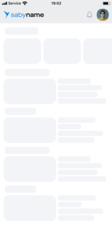
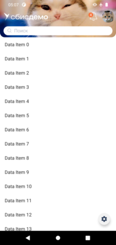
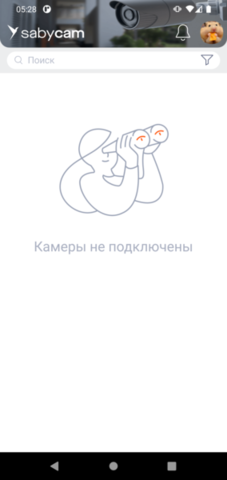

# Навигация страниц без аккордеона
| Ответственность | Ответственные                                                                           |
|-----------------|-----------------------------------------------------------------------------------------|
| Разработка      | [Бессонов Юрий](https://online.sbis.ru/person/0744ffc8-075a-40e7-a1bd-5d6fff8655f2)     |
| Проектирование  | [Кононов Владислав](https://online.sbis.ru/person/ebb226a8-3b68-406f-98c2-d6b9e1c26dd7) |

## Описание
Модель содержит реализацию компонента "Навигация страниц без аккордеона" (или "Раскладка").
Компонент позволяет использовать в приложении базовое представление, состоящее из одного реестра. 
Навигация в таком приложении осуществляется посредством шапки.

## Внешний вид




[Стандарт внешнего вида](https://www.figma.com/proto/timuOEnIjAqAPjjowsQi1N/%E2%9C%94%EF%B8%8F-%D0%9D%D0%B0%D0%B2%D0%B8%D0%B3%D0%B0%D1%86%D0%B8%D1%8F-%D1%81%D1%82%D1%80%D0%B0%D0%BD%D0%B8%D1%86-%D0%B1%D0%B5%D0%B7-%D0%B0%D0%BA%D0%BA%D0%BE%D1%80%D0%B4%D0%B5%D0%BE%D0%BD%D0%B0?page-id=47%3A76558&type=design&node-id=7-62021&viewport=-249%2C738%2C0.2&t=DN2L1AsOVwrhd51p-8&scaling=min-zoom&starting-point-node-id=7%3A62021&hide-ui=1)

## Руководство по подключению и инициализации
Для добавления модуля в проект, в `settings.gradle` проекта должны быть подключены следующие модули:

| Репозиторий                                            | модуль             |  
|--------------------------------------------------------|--------------------|  
| https://git.sbis.ru/mobileworkspace/android-utils.git  | main_screen_decl   |  
| https://git.sbis.ru/mobileworkspace/android-utils.git  | main_screen_common |  
| https://git.sbis.ru/mobileworkspace/android-design.git | design_buttons     |  
| https://git.sbis.ru/mobileworkspace/android-design.git | design_utils       |  
| https://git.sbis.ru/mobileworkspace/android-design.git | input_view         |  
| https://git.sbis.ru/mobileworkspace/android-design.git | design_profile     |  
| https://git.sbis.ru/mobileworkspace/android-design.git | design_counters    |  
| https://git.sbis.ru/mobileworkspace/android-design.git | design_menu        |  

В плагинной системе приложения должен быть зарегистрирован [BasicMainScreenPlugin](src/main/java/ru/tensor/sbis/main_screen_basic/BasicMainScreenPlugin.kt).

##### Руководство по использованию
- В макет хоста (`Activity` или `Fragment`) главного экрана необходимо добавить [BasicMainScreenView](src/main/java/ru/tensor/sbis/main_screen_basic/view/BasicMainScreenView.kt).
- Взаимодействие с компонентом осуществляется посредством [BasicMainScreenViewApi](https://git.sbis.ru/mobileworkspace/android-utils/-/blob/rc-24.4100/main_screen/main_screen_decl/src/main/java/ru/tensor/sbis/main_screen_decl/basic/BasicMainScreenViewApi.kt?ref_type=heads).

- При инициализации хоста, необходимо проинициализировать компонент. Инициализация заключается в 
передаче требуемых компонентов, описании элементов в шапке с указанием их поведения, применении 
дополнительных настроек, и, наконец, в активации компонента:
```kotlin
with(viewBinding.mainScreenView) { // BasicMainScreenView
	// Основной метод инициализации
	setup(
		MainScreenHost(this@BasicMainScreenActivity),
		supportFragmentManager,
		// Провайдер содержимого экрана под шапкой
		SimpleContentController { _, _, _ ->
			DemoContentFragment.newInstance()
		}
	)
	// Настройка компонента Шапка
	configureTopNavigation {
		// Добавляем в шапку иконку со счётчиком
		addScreenEntryPoint(
			// Задаём модель иконки
			ScreenEntryPoint.Icon(
				ScreenId.Navx(NavxId.NOTIFICATIONS),
				SbisMobileIcon.Icon.smi_NotificationBell,
				ServiceCounter(NOTIFICATIONS_COUNTER_ID)
			),
			// Указываем провайдер экрана для проваливания по клику на иконку
			getDemoFragmentContentControllerProvider(getString(CommonR.string.common_notification_segment_title)),
			// Указываем, где должен открываться экран
			InOverlayContainer()
		)
		// Аналогичным образом, добавляем другие экраны (например, фото профиля, пункты меню по клику на три точки)
		addProfileEntryPoint()
		addMenuItemEntryPoint(getString(R.string.design_demo_basic_main_screen_menu_item_1))
		addMenuItemEntryPoint(getString(R.string.design_demo_basic_main_screen_menu_item_2))
		// Настраиваем логотип приложения, отображаемый в шапке слева
		setLogo(
			SbisLogoType.TextIconAppName(
				appName = PlatformSbisString.Res(DemoBaseR.string.design_demo_base_logo_app_name),
				brandName = PlatformSbisString.Res(DemoBaseR.string.design_demo_base_logo_brand_name)
			)
		)
		// Указываем картинку на фоне шапки
		setBackground(
			RawBitmap(BitmapFactory.decodeResource(resources, DemoBaseR.drawable.design_demo_image_cat_2))
		)
	}
	// Поскольку используем фоновую картинку, поддерживаем прозрачный статусбар
	enableTransparentStatusBar()
	// Метод, который необходимо вызвать по окончании инициализации
	activate()
}
```

## Описание публичного API
Рассмотрим основные средства [BasicMainScreenViewApi](https://git.sbis.ru/mobileworkspace/android-utils/-/blob/rc-24.4100/main_screen/main_screen_decl/src/main/java/ru/tensor/sbis/main_screen_decl/basic/BasicMainScreenViewApi.kt?ref_type=heads).
- `setup()` - Основной метод инициализации. В нём необходимо указать [BasicContentController](https://git.sbis.ru/mobileworkspace/android-utils/-/blob/rc-24.4100/main_screen/main_screen_decl/src/main/java/ru/tensor/sbis/main_screen_decl/basic/BasicContentController.kt?ref_type=heads), 
отвечающий за содержимое под шапкой. Опционально, можно задать расширения для обработки 
`Intent`'ов (пуши, deeplink), а также требуется ли проверка разрешений на экраны (согласно 
`StartupPermissionProvider`'ам, доступным через плагинную систему).
- `configureTopNavigation()` - Предоставляет доступ к настройкам шапки, необходимым для данного
представления главного экрана. 
- `enableTransparentStatusBar()` - Устанавливает прозрачный цвет статусбара. Предусматривает 
отображение искусственного фона под статусбара при открытии карточек (для перекрытия фона). Можно 
указать [OverlayStatusBarBackgroundPanelBehavior](https://git.sbis.ru/mobileworkspace/android-utils/-/blob/rc-24.4100/main_screen/main_screen_decl/src/main/java/ru/tensor/sbis/main_screen_decl/basic/data/OverlayStatusBarBackgroundPanelBehavior.kt?ref_type=heads), 
определяющий поведение показа/отображения подложки под статусбаром (при значении `null` используется
поведение по умолчанию, отображая подложку при наличии хотя бы одного экрана с содержимым помимо 
основного контента).  
Нужно иметь в виду, что при использовании прозрачного статусбара корректное отображение при 
проваливании не гарантируется без прикладных правок (например, изменения флага `fitsSystemWindows` 
в макетах).
- `activate()` - Метод должен быть вызван после полного завершения конфигурации компонента.
- `onNewIntent()` - Все новые `Intent`'ы, поступившие в хост `Activity`, должны быть переданы 
компоненту посредством этого метода.
- `findDisplayedScreen()` - позволяет получить доступ к `Fragment`, отображенному средствами 
компонента (через настроенный вызывающий элемент в шапке).
- `monitorPermissionScope()` - Метод для подписки на обновление прав доступа по определённой зоне.

##### Конфигурация открытия прикладных экранов
Для добавления прикладного экрана можно использовать метод `addScreenEntryPoint()` в блоке 
конфигурации шапки в `configureTopNavigation()`: 
- Указать вызывающий элемент ([ScreenEntryPoint](https://git.sbis.ru/mobileworkspace/android-utils/-/blob/rc-24.4100/main_screen/main_screen_decl/src/main/java/ru/tensor/sbis/main_screen_decl/basic/data/ScreenEntryPoint.kt?ref_type=heads)).
- Реализовать `ProvideContentAction` для предоставления `Fragment`'а экрана и управления им.
- Указать [ContentPlacement](https://git.sbis.ru/mobileworkspace/android-utils/-/blob/rc-24.4100/main_screen/main_screen_decl/src/main/java/ru/tensor/sbis/main_screen_decl/basic/data/ContentPlacement.kt?ref_type=heads) - 
контейнер для размещения экрана.
Другой вариант - использовать `addCustomActionEntryPoint()` и открывать экран по клику на 
вызывающий элемент произвольным образом.  

В качестве возможных вызывающих элементов (`ScreenEntryPoint`) доступны:
- `Icon` - Иконка + опциональный счётчик.
- `Profile` - Фото персоны.
- `MenuItem` - Пункт меню. Если задан хоть один пункт, справа в шапке будет показана кнопка для 
вызова меню со всеми указанными `MenuItem`.
- `CustomView` - Произвольный `View`.
- `ViewLocator` - Произвольный `View`, который уже присутствует в иерархии, и может быть найден по 
id.  

Элементы размещаются в шапке в порядке добавления.  

`ProvideContentAction` это функция, возвращающая `BasicContentController`. В общем случае, 
достаточно базовой реализации - [SimpleContentController](src/main/java/ru/tensor/sbis/main_screen_basic/SimpleContentController.kt), 
где нужно указать лишь фабрику для создания `Fragment`.

Возможные варианты размещения контента (`ContentPlacement`):
- `Inside` - Внутри (под шапкой, на месте разводящей).
- `OnTop` - Поверх разводящей и шапки.
- `InOverlayContainer` - В `OverlayFragmentHolder` (для этого его должен реализовывать хост).