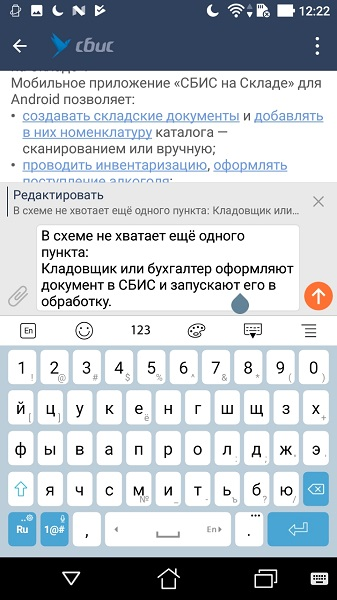
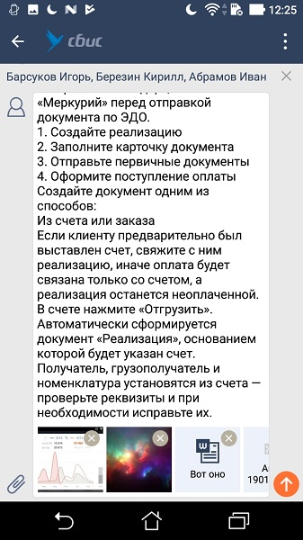
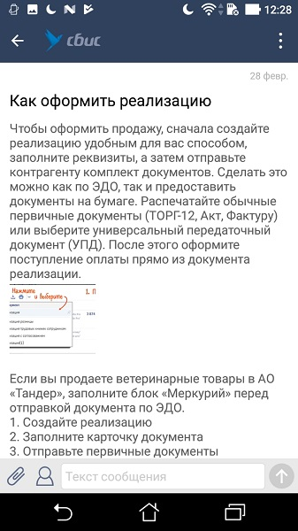

#### Панель ввода сообщения

|Класс|Ответственные|Добавить|
|-----|-------------|--------|
|[MessagePanel](src/main/java/ru/tensor/sbis/message_panel/view/MessagePanel.kt)|[Чекурда В.В.](https://online.sbis.ru/person/0fe3e077-6d50-431c-9353-f630fc789877)|[Задачу/поручение/ошибку](https://online.sbis.ru/area/d5cff451-8688-4af0-970a-8127570b0308)|

#### Использование в приложениях
- [Communicator](https://git.sbis.ru/mobileworkspace/apps/droid/communicator) (message panel + recorder)
- [Tasks](https://git.sbis.ru/mobileworkspace/android-tasks) (message panel + recorder)
- [Courier](https://git.sbis.ru/mobileworkspace/apps/droid/courier) (message panel + recorder)
- [Business](https://git.sbis.ru/mobileworkspace/apps/droid/business) (только message panel)
- [storekeeper](https://git.sbis.ru/mobileworkspace/apps/droid/storekeeper) (только message panel)
- [Sabyget](https://git.sbis.ru/mobileworkspace/apps/droid/sabyget) (только message panel)

##### Внешний вид


  
[Стандарт внешнего вида](http://axure.tensor.ru/MobileStandart8/#p=панель_ввода_сообщения&g=1)   

##### Описание  
*Панель ввода* используется для отправки сообщений и комментариев.  

Помимо поля ввода и кнопки отправки, панель ввода дополнительно может содержать:
* иконки слева от поля ввода (не больше 2)
* иконку для отправки аудиосообщения в поле ввода (пока не поддерживается)
* строку получателей над полем ввода
* строку цитирования/редактирования сообщения
* иконку вызова панели быстрых ответов (только для чатов crm стороны оператора)

###### Использование
1. Добавление View панели ввода. Для корректного отображения панели отправки аудио необходимо задать параметр `android:clipChildren="false"` для контейнера. Пример:
```xml
<RelativeLayout
        android:layout_width="match_parent"
        android:layout_height="match_parent"
        android:clipChildren="false">
        ...
        <ru.tensor.sbis.message_panel.view.MessagePanel
            android:id="@+id/messagePanel"
            style="@style/ConversationMessagePanel"
            android:layout_width="match_parent"
            android:layout_height="wrap_content"
            android:layout_alignParentBottom="true"
            android:topOffset="@dimen/message_panel_default_top_offset"/>
        ...
</RelativeLayout>
```
2. Создать во фрагменте [MessagePanelInitializerDelegate](message_panel/src/main/java/ru/tensor/sbis/message_panel/delegate/MessagePanelInitializerDelegate.kt). Пример:
```kotlin
override fun createView(inflater: LayoutInflater, container: ViewGroup?, savedInstanceState: Bundle?): View? {
    ...
    messagePanelDelegate = MessagePanelInitializerDelegate(context!!, this, savedInstanceState)
    ...
}
```
3. Проинициализировать панель ввода
```kotlin
 messagePanelController = messagePanelDelegate.initMessagePanel(messagePanelView, coreConversationInfo)
```
Метод инициализации взовращает [MessagePanelController](message_panel/src/main/java/ru/tensor/sbis/message_panel/contract/MessagePanelController.kt). Он, в частности, позволяет получать оповещения о редактировании и об отправке сообщения
```kotlin
messagePanelController.onMessageSending = { /** Подписка на отправку сообщения из панели () **/ }
messagePanelController.onMessageSent = { /** Подписка на завершение отправки сообщения из панели (SendMessageResult) **/ }
messagePanelController.onMessageEdit = { /** Обработка результата редактирования сообщения (MessageResult) **/ }
```
4. Для работы с вложениями
    - Сохранять внутреннее состояние панели ввода
        ```kotlin
        messagePanelDelegate.onSaveInstanceState(outState)
        ```
    - Реализовать [MediaSelectionPane.AttachmentsMenuInMessageCallback](sbis-common/src/main/java/ru/tensor/sbis/common/ui/mediaselectionpane/MediaSelectionPane.java) и делегировать вызовы `MessagePanelInitializerDelegate`, в котором предусмотрены соответствующие методы
        - **onItemInAttachmentsMenuClick(Int)** - оповещает панель ввода о выборе пункта меню, открытого по кнопке добавления вложений
        - **onFilesInAttachmentsMenuChosen(MutableList<String>)** - оповещает панель ввода о выборе файлов вложений, передавая список их uri
    - Вызывать **onPermissionsGranted(List<String>)** `MessagePanelInitializerDelegate` для оповещения панели ввода о предоставлении разрешений
    - Вызывать **onActivityResult(Int, Int, Intent?)** `MessagePanelInitializerDelegate` для передачи панели ввода результат запуска Activity (например, успешную съёмку фото, выбор файлов из галереи и т.п.)
5. Для корректного поведения при показе/скрытии клавиатуры делегировать [AdjustResizeHelper.KeyboardEventListener](../sbis-common/src/main/java/ru/tensor/sbis/common/util/AdjustResizeHelper.java) объекту `MessagePanelInitializerDelegate`
6. Переводить панель ввода в требуемый режим. `MessagePanelController` предоставляет методы
- **editMessage(UUID?)** - переводит панель в режим редактирования сообщения с заданным UUID
- **replyComment(UUID, UUID, String, Boolean)** - переводит панель в режим ответа на сообщение, позволяя указать, нужно ли при этом показывать клавиатуру

###### Дополнительные возможности
- **var handleSendClickIfDeactivated: Boolean** в `MessagePanelController` определяет возможность выполнения отправки, когда кнопка отправки неактивна (по умолчанию доступно, например, для напоминания о диалоге)
- **showKeyboard()** и **hideKeyboard()** в `MessagePanel` позволяют изменять видимость клавиатуры, устанавливая/снимая фокус в поле ввода
- Класс [MessagePanelFocusChecker](src/main/java/ru/tensor/sbis/message_panel/helper/MessagePanelFocusChecker.kt) позволяет отслеживать изменение фокуса, определяя его присутствие в `MessagePanel` или ином View
```kotlin
messagePanelFocusChecker = object : MessagePanelFocusChecker(rootView) {
            override fun onFocusStateChanged(state: FocusState, target: FocusTarget) {
                when (state) {
                    FocusState.FOCUS_RELEASED         -> // фокус отпущен
                    FocusState.FOCUS_CHANGED          -> { // фокус переместился на другой объект
                        when (target) {
                            FocusTarget.MESSAGE_PANEL -> { /** MessagePanel **/ }
                            FocusTarget.EDITTEXT      -> { /** любой EditText не из MessagePanel **/ }
                            FocusTarget.VIEW          -> { /** любой другой View **/ }
                            FocusTarget.NO_TARGET     -> { /** фокус отпущен  **/ }
                        }
                    }
                }
            }
        }
messagePanelFocusChecker.startListen()
```

##### xml атрибуты
* `android:topOffset` - определяет отступ сверху от панели ввода, который позволяет предотвратить перекрытие других View (по умолчанию - 0)

##### Стилизация
Компонент поставляется со стандартной темой **MessagePanelDefaultTheme**. Тему компонента можно указать в атрибуте `messagePanelTheme` темы экрана/приложения:
```xml
<style name="AppTheme">
    <item name="messagePanelTheme">@style/MessagePanelDefaultTheme</item>
</style>
```

##### Используется в приложениях:
- [Курьер](https://git.sbis.ru/mobileworkspace/apps/droid/courier)
- [Saby Get](https://git.sbis.ru/mobileworkspace/apps/droid/showcase)