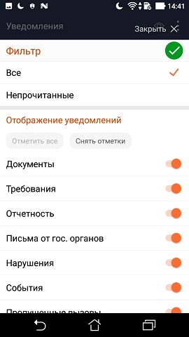
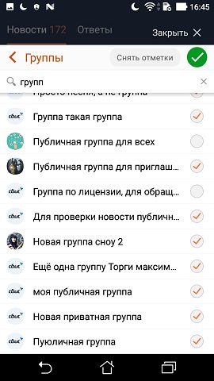

#### Окно выбора

| Класс                                                                                                                  | Ответственные | Добавить                                                                                    |
|------------------------------------------------------------------------------------------------------------------------|---------------|---------------------------------------------------------------------------------------------|
| [SelectionWindowContent](sbis-common/src/main/java/ru/tensor/sbis/common/fragment/selection/SelectionWindowContent.kt) | -             | [Задачу/поручение/ошибку](https://online.sbis.ru/area/d5cff451-8688-4af0-970a-8127570b0308) |

#### Использование в приложениях

- [Коммуникатор](https://git.sbis.ru/mobileworkspace/apps/droid/communicator)
- [Мобильная витрина SabyGet](https://git.sbis.ru/mobileworkspace/apps/droid/showcase)
- [Курьер](https://git.sbis.ru/mobileworkspace/apps/droid/courier)

##### Внешний вид


   
[Стандарт внешнего вида](http://axure.tensor.ru/MobileStandart8/#p=окно_выбора__версия_3_&g=1)

##### Описание

Окно выбора используется для показа сложного выбора одного или нескольких параметров с возможностью
перехода по нескольким уровням вложенности.
Окно выбора включает в себя:

* кнопку "Закрыть"
* шапку
* строку поиска (опционально)
* контентную область

Вызов окна выбора происходит при нажатии на кнопки или другие элементы управления. При появлении
окно всплывает снизу и отображается поверх остального контента с затемнением фона.
Закрытие окна происходит по клику на кнопку "закрыть", "подтвердить" или на области с затемнением.

Компонент представляет собой базовый фрагмент, предназначенный для отображения в произвольных
контейнерах. `SelectionWindowContent` реализует интерфейс `Content`, а контейнер должен
реализовывать интерфейс `Container`. В большинстве случаев достаточно использовать один из
стандартных контейнеров

* `ContainerBottomSheet` для отображения на телефоне в виде выезжающего снизу полноэкранного окна
* `TabletContainerDialogFragment` для отображения в виде всплывающего окна ограниченного размера на
  планшете

См. также:
[Статья о подходе к реализации модальных окон](https://online.sbis.ru/news/79b13d29-accb-41a7-a5fa-8664717f3c8a)

Для реализации экрана в соответствии со стандартом "Окно выбора" необходимо

1. Оформить контракт, расширив интерфейсы `SelectionWindowContract.View`
   и `SelectionWindowContract.Presenter`
2. Реализовать View и Presenter, наследуясь от SelectionWindowContent и SelectionWindowPresenter
   соответственно.
   Во View необходимо реализовать методы
    - **inflateHeaderView(LayoutInflater, ViewGroup)** - создаёт View с содержимым шапки и
      прикрепляет к родительской ViewGroup.
    - **inflateContentView()** - создаёт View с содержимым контентной области и прикрепляет его к
      родительской ViewGroup.
    - **getShadowVisibilityDispatcher(): ShadowVisibilityDispatcher** - возвращает диспетчер,
      отвечающий за видимость тени под шапкой, в зависимости от состояния прокрутки. Если
      используется `RecyclerView`, то можно использовать `RecyclerViewVisibilityDispatcher`. Если
      тень не требуется, нужно возвращать null.
    - **onCloseContent(LayoutInflater, ViewGroup)** - нужен для обработки закрытия окна. Реализация
      может быть пустой, если закрытие не требует дополнительных действий
3. Реализовать во View интерфейс `BaseContentCreator` с единственным методом, служащим для создания
   фрагмента контейнером. Реализация должна быть либо `Serializable`, либо `Parcelable`, для чего
   рекомендуется реализовывать  `BaseContentCreator` косвенно, через `ContentCreator`
   или `ContentCreatorParcelable` соответственно.
4. Открывать окно выбора в требуемом контейнере, сконфигурировав необходимые параметры отображения.
   Пример открытия окна в контейнере, в зависимости от конфигурации (планшет или телефон):

```kotlin
val container: BaseContainerDialogFragment = if (isTablet) {
    TabletContainerDialogFragment()
            .setVisualParams(VisualParamsBuilder()
                    .setBoundingRectFromParentFragment()
                    .gravity(Gravity.TOP)
                    .belowActionBar()
                    .build())
} else {
    ContainerBottomSheet().instant(false)
}
container.setContentCreator(NewsFilterFragment.Creator())
        .show(fragmentManager, NEWS_FILTER_TAG)
```

##### Стилизация

Компонент не поддерживает стилизацию.

##### Описание особенностей работы

* Для переопределения доступны следующие методы
    - **getSearchViewLayoutRes(): Int** - возвращает id ресурса макета со строкой поиска.
      Возвращаемое значение по умолчанию - 0, что предполагает отсутствие строки поиска.
    - **onSearchViewInflated(View)** - в метод передаётся созданный View строки поиска, который
      можно сконфигурировать должным образом.
    - **isAcceptButtonVisible(): Boolean** - определяет видимость кнопки подтверждения выбора в
      шапке (по умолчанию - `false`)
    - **isCloseHoodVisible(): Boolean** - определяет видимость кнопки закрытия окна (по
      умолчанию - `true`)
    - **hasHeader(): Boolean** - определяет видимость шапки (по умолчанию - `true`)
    - **hasHeaderDivider(): Boolean** - определяет видимость разделителя под шапкой (по
      умолчанию - `true`)
* Если видимость кнопки применения или кнопки закрытия требуется изменить позднее, в
  наследниках `SelectionWindowContent` можно использовать методы `setAcceptButtonVisible(Boolean)`
  и `setCloseHoodVisible(Boolean)` соответственно