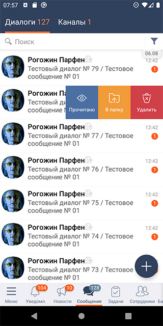
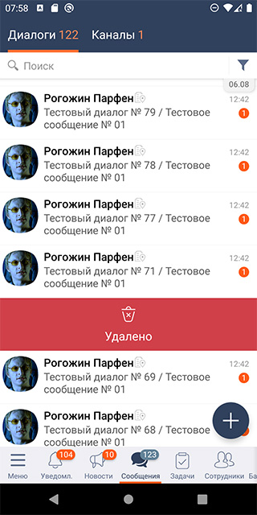
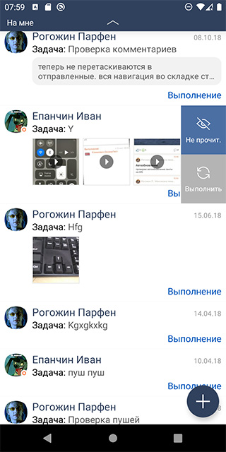

# Свайп и смахивание
| Ответственность | Ответственные |
|-----------------|---------------|
| Участок работ | [Свайп-меню Android (SwipeableLayout)](https://dev.sbis.ru/area/4604aa83-311b-4008-adeb-a6d736133115) |  

## Документация
[ТЗ Свайп меню в МП - редизайн](https://online.sbis.ru/shared/disk/b6bc0228-a9e3-4d6f-8911-78ad13885191)

## Внешний вид




[Стандарт внешнего вида](http://axure.tensor.ru/MobileStandart8/#p=свайп_и_смахивание__версия_2_&g=1)

## Описание
*Свайп* - это специальный жест при работе с сенсорным экраном, при котором палец кладут на экран и проводят в заданном направлении.

*Панель свайпа (свайп-меню)* - это элемент, содержащий набор пунктов меню, позволяющих быстро выполнить с элементом списка те или иные операции. Для вызова панели используется свайп справа налево из любого места строки. Панель свайпа появляется поверх содержимого элемента списка. На экране может быть только одна панель свайпа.  
Компоновка пунктов меню может быть горизонтальной, либо вертикальной. Вертикальная компоновка автоматически применяется для меню с иконкой и текстом, если высота элемента списка достаточна для размещения всех пунктов.

*Смахивание* - длинное движение в заданном направлении. Отрабатывает одну функцию, обычно - удаление. При смахивании содержимое строки скрывается, а на его месте появляется надпись "Удалено", которая через некоторое время также скрывается и элемент удаляется из списка.  
Возможен случай, когда удалённый элемент можно восстановить по клику, пока не истечёт таймаут.

## Руководство по подключению и инициализации
Для добавления модуля в проект, в `settings.gradle` проекта должны быть подключены следующие модули:

| Репозиторий | модуль |  
|-----------------|---------------|  
|https://git.sbis.ru/mobileworkspace/android-design.git |design_utils|  
|https://git.sbis.ru/mobileworkspace/android-design.git |design|  
|https://git.sbis.ru/mobileworkspace/android-utils.git |objectpool|  
|https://git.sbis.ru/mobileworkspace/android-design.git |design_dialogs|  
|https://git.sbis.ru/mobileworkspace/android-design.git |view_factory|  
|https://git.sbis.ru/mobileworkspace/android-design.git |design_view_ext|  
|https://git.sbis.ru/mobileworkspace/android-design.git |design_custom_view_tools|  

## Руководство по использованию компонента
Компонент [SwipeableLayout](src/main/java/ru/tensor/sbis/swipeablelayout/SwipeableLayout.kt) это контейнер для размещения прикладного содержимого, для которого должна быть обеспечена функциональность свайпа.

```xml
<ru.tensor.sbis.swipeablelayout.SwipeableLayout
	android:id="@+id/communicator_contact_swipe_layout"
	android:layout_width="match_parent"
	android:layout_height="wrap_content">
	<!-- Прикладное содержимое -->
	<RelativeLayout
		android:id="@+id/communicator_contact_item_container"
		android:layout_width="match_parent"
		android:layout_height="wrap_content"
		android:background="@drawable/selectable_item_bg_white">
		<!-- ... -->
	</RelativeLayout>
</ru.tensor.sbis.swipeablelayout.SwipeableLayout>
```

По умолчанию, при размещении содержимого в `SwipeableLayout`, активируется возможность смахивать непосредственно содержимое.  
Чтобы задать опции меню и сконфигурировать поведение должным образом, используйте API компонента (выделен в [SwipeableLayoutApi](src/main/java/ru/tensor/sbis/swipeablelayout/api/SwipeableLayoutApi.kt)).
* При привязке данных необходимо установить `itemUuid` для корректной работы восстановления состояния меню.

* Для **задания опций меню** используется метод `setMenu()`, в который нужно передать список элементов. Элементы могут быть одного из следующих типов:
  * `IconItem` - пункт меню с иконкой.
  * `IconWithLabelItem` - пункт меню с иконкой и текстом. Текст должен помещаться в одну строку, но если проектированию очень нужно, то допускается поддержка до двух строк установкой `isLabelSingleLine = false`.
  * `TextItem` - пункт меню только с текстом.
    Не допускается совмещать разные типы элементов в одном списке.  
    Для пунктов с текстом и/или иконкой может быть один из предусмотренных стандартов стилей фона. Для пунктов только с текстом таких стилей два - `DANGER` для операций удаления и прочих, требующих повышенного внимания, и `DEFAULT` для всех остальных.  
    Для всех пунктов меню предусмотрена установка лямбды в качестве обработчика кликов.   

- Для **управления состоянием** меню предусмотрены методы:
  * `openMenu()` - открывает свайп-меню, если оно задано.
  * `close()` - закрывает свайп-меню, если оно задано, иначе возвращает содержимое на исходную позицию.
  * `dismiss()` - программно инициирует смахивание для удаления элемента. Если задано меню, то оно перекроет
    содержимое, а иначе содержимое скроется с экрана, после чего отобразится сообщение об удалении.  
    По умолчанию методы выполняются с анимацией, но предусмотрен параметр для указания её необходимости в конкретном случае.

- Для отслеживания событий изменения состояния можно установить **обработчики**:
  * `addEventListener()` задаёт обработчик всех типов событий.
  * `addSwipeEventListener()` задаёт обработчик событий только конкретного типа.
    По необходимости, обработчик можно удалить посредством `removeEventListener()`.  
    Последнее зафиксированное событие можно получить, используя свойство `lastEvent`.  
    **Типы событий** (`SwipeEvent`) бывают следующие:
  * `Closed` - меню закрыто, элемент в исходном состоянии.
  * `MenuOpening` - меню в процессе открытия.
  * `MenuOpened` - меню полностью видимо.
  * `Dragging` - пользователь коснулся элемента и совершает жест.
  * `Dismissing` - элемент в процессе смахивания (удаления элемента жестом).
  * `Dismissed` - смахивание завершено, элемент можно считать удалённым.
  * `DismissedWithoutMessage` - смахивание частично завершено - содержимое элемента скрыто, но сообщение об удалении не отображено.
  * `DismissedWithTimeout` - смахивание завершено, но по клику, либо путём вызова `SwipeableLayoutApi.close()` может быть отменено.

* `itemDismissType` определяет возможность **смахивания элемента** (удаления пользовательским жестом), и тип её реализации. По умолчанию, смахивание отключено (используется [SwipeItemDismissType](src/main/java/ru/tensor/sbis/swipeablelayout/api/SwipeItemDismissType.kt).`NONE`). Другие доступные варианты это:
  * `DISMISS_IMMEDIATE` - смахивание доступно, и элемент считается удалённым сразу же.
  * `DISMISS_WITHOUT_MESSAGE` - требуется ли при смахивании сначала только скрывать содержимое, без отображения сообщения об
    удалении. В этом случае после события `DismissedWithoutMessage` событие `Dismissed` (с отображением сообщения об удалении) произойдёт только при вызове `SwipeableLayoutApi.dismiss()`. Это даёт возможность запрашивать подтверждение перед удалением, вызывая `SwipeableLayoutApi.dismiss()`, чтобы подтвердить, или `SwipeableLayoutApi.close()`, чтобы отменить удаление.
  * `CANCELLABLE` - устанавливает обработчик события смахивания элемента, которое может быть отменено. Событие `Dismissed` будет наступать не сразу после смахивания, а по истечении фиксированного таймаута, если к тому времени пользователь не кликнет по элементу, либо не будет явно вызван метод `SwipeableLayoutApi.close()`.
  * `LOCKED` - заблокировано ли смахивание элемента (удаление жестом). Опция имеет смысл, если у элемента не задано меню - содержимое можно лишь сдвинуть на небольшое расстояние.

* `isDragLocked` определяет, заблокирована ли **возможность двигать содержимое или меню посредством жестов**. Параметр не влияет на управление состоянием из кода (методы openMenu, dismiss, close работают без изменений.

* `shouldSwipeContentToRight` задаёт необходимость смахивания содержимого вправо. Актуально только если не задано меню. По умолчанию, содержимое смахивается влево.

* `setDismissMessage()` позволяет переопределить стандартное сообщение, отображаемое после удаления элемента по смахиванию.

* `releaseListeners()` используется для **сброса ссылок** на все зарегистрированные обработчики в компоненте, в том числе и назначенные самим компонентом.

##### Пример конфигурации компонента
```kotlin
swipeableLayout.apply {
  // Устанавливаем идентификатор сущности
  itemUuid = item.uuid
  // Задаём список опций меню
  setMenu(
    listOf(
      IconWithLabelItem(
        SwipeIcon(DesignR.string.design_mobile_icon_swipe_message),
        R.string.message,
        SwipeItemStyle.BLUE
      ) {
        writeMessage(item.uuid)
        SwipeHelper.closeAll()
      },
      IconWithLabelItem(
        SwipeIcon(DesignR.string.design_mobile_icon_swipe_call),
        R.string.call,
        SwipeItemStyle.GREEN
      ) {
        makeCall(item.uuid)
        SwipeHelper.closeAll()
      },
      IconWithLabelItem(
        SwipeIcon(DesignR.string.design_mobile_icon_swipe_delete),
        R.string.delete,
        SwipeItemStyle.RED
      ) { deleteContact(item.uuid) }
    )
  )
  // Устанавливаем тип смахивания, при котором удаление может быть отменено
  itemDismissType = SwipeItemDismissType.CANCELLABLE
  // Подписываемся на событие, когда элемент можно считать удалённым
  addSwipeEventListener<Dismissed> {
    deleteContact(item.uuid)
  }
}
```

##### Добавление поддержки свайпа при использовании Databinding
При использовании Databinding для конфигурирования свайпа и смахивания требуется
1. Реализовать во вьюмодели интерфейс [SwipeableVmHolder](src/main/java/ru/tensor/sbis/swipeablelayout/swipeablevm/SwipeableVm.kt), добавив поле `SwipeableVm`
2. Добавить `SwipeableLayout` в xml и задать атрибут для применения `SwipeableVm`.
```xml
 <ru.tensor.sbis.swipeablelayout.SwipeableLayout
        ...
        app:swipeableVm="@{viewModel.swipeableVm}">
 ...
```
3. Конфигурировать `SwipeableVm`, задавая меню, возможность свайпа, слушатели и т.п. Свойства `SwipeableVm` задают параметры `SwipeableLayout`, описанные ранее. Для управления состоянием меню, предусмотрены методы, которые также аналогичны представленным ранее (`openMenu(), close(), dismiss()`).

### Примечания и особенности использования компонента
Свайп-меню автоматически закрывается по клику на любом месте вне элемента, содержащего меню. Если требуется **закрыть активное меню вручную**, используйте [SwipeHelper](src/main/java/ru/tensor/sbis/swipeablelayout/util/SwipeHelper.kt). Это объект, доступный глобально.  
Метод `closeAll()` позволяет закрыть все открытые или открывающиеся меню на экране. Метод `resetAll()` сбрасывает состояния всех элементов, включая считающиеся удалёнными. Параметр `withDismissedWithTimeout` определяет, нужно ли сбрасывать состояния элементов, которые ожидают удаления по таймауту.  
  
Если по клику на меню выполняется тяжёлая операция (например, открытие плохо оптимизированного экрана), которая приводит к подтормаживанию анимации закрытия меню, то в качестве быстрого решения можно отложить выполнение операции по клику до закрытия меню, установив у пункта меню `isClickPostponedUntilMenuClosed`. В дальнейшем желательно принять меры по оптимизации тяжёлой операции.  
  
При использовании свайп-меню в списке, для экономии времени создания `View` пунктов меню, можно установить для `SwipeableLayout` **пул элементов** посредством `setMenuItemViewPool()`.  
Для создания пула элементов с иконкой, либо с текстом и иконкой, используйте [SwipeMenuViewPool](src/main/java/ru/tensor/sbis/swipeablelayout/viewpool/SwipeMenuViewPool.kt)`.createForItemsWithIcon()`, а для элементов только с текстом - `SwipeMenuViewPool.createForItemsWithText()`.  

### xml атрибуты
* `dismissMessage` - определяет текст, отображаемый по окончании смахивания. По умолчанию - "Удалено".
* `SwipeableLayout_hasDismissMessageIcon` - определяет наличие иконки над сообщением об удалении при смахивании. По умолчанию, иконки нет.

### Стилизация
Стиль свайп-меню определяется в атрибуте [swipeableLayoutTheme](src/main/res/values/attr.xml). При необходимости, можно установить собственный стиль для приложения, или конкретного компонента. Собственный стиль должен быть унаследован от [ColorfulSwipeableLayoutTheme](src/main/res/values/themes.xml).  
Для переопределения доступны следующие атрибуты темы:
* `SwipeableLayout_labelTextColor` - цвет текста подписи у пункта с иконкой и текстом.
* `SwipeableLayout_iconTextColor` - цвет иконок.
* `SwipeableLayout_textItemTextColor` - цвет текста у пункта только с текстом.
* `SwipeableLayout_textItemBackgroundDefault` - цвет фона для стандартного стиля пунктов только с текстом.
* `SwipeableLayout_textItemBackgroundDanger` - цвет фона для стиля текстовых пунктов удаления и аналогичных.
* `SwipeableLayout_menuDismissMessageBackground` - цвет фона при смахивании ячейки с меню.
* `SwipeableLayout_menuDismissMessageTextColor` - цвет текста сообщения об удалении при смахивании ячейки с меню.
* `SwipeableLayout_contentDismissMessageTextColor` - цвет текста сообщения об удалении при смахивании содержимого ячейки.
* Цвета фона элементов (`SwipeableLayout_itemBackgroundOrange`, `SwipeableLayout_itemBackgroundOrange`, `SwipeableLayout_itemBackgroundBlue`, `SwipeableLayout_itemBackgroundGreen`, `SwipeableLayout_itemBackgroundRed`, `SwipeableLayout_itemBackgroundGrey`, `SwipeableLayout_itemBackgroundPink`).

##### Трудозатраты внедрения
0.8 ч/д