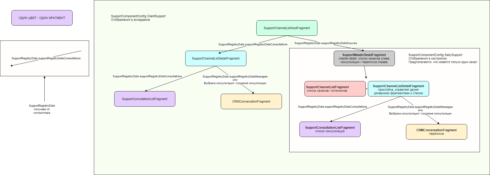
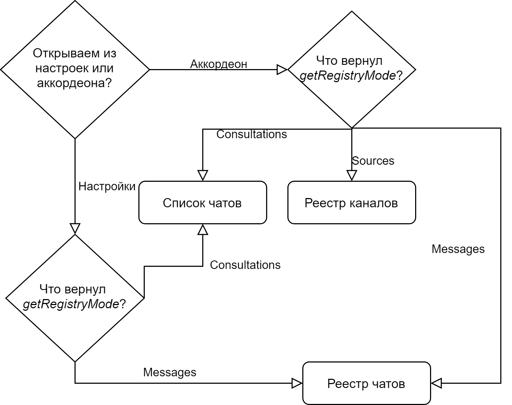

# Модуль реестра каналов тех. поддержки

Модуль содержит реализацию интерфейсной части реестра каналов тех. поддержки

## Дополнительная информация

- [ответственный Петров Р. А.](https://online.sbis.ru/person/6246f9f1-03a4-4d02-aecf-29fcc9a0d0ff)
- [ссылка на макет](http://axure.tensor.ru/mobile_crm/#g=1&p=служба_поддержки_клиента__провал_&c=1)

# Подключение.

Для добавления модуля коммуникатор в проект необходимо выполнить шаги ниже:

## 1. Зависимости
В файле `settings.gradle` проекта должны быть подключены модули коммуникатора из 
файла `$communicator_dir/settings.gradle` а так же все модули, от которых они зависят:


```
include ':communicator_support_channel_list'
project(':communicator_support_channel_list').projectDir = new File(settingsDir, "$communicator_dir/features/communicator_support_channel_list")

include ':communicator_support_consultation_list'
project(':communicator_support_consultation_list').projectDir = new File(settingsDir, "$communicator_dir/features/communicator_support_consultation_list")
```


## 2. Добавить зависимость в список плагинов приложения:
```
pluginManager.registerPlugins(
...
    SupportConsultationListPlugin,
    SupportChannelListPlugin
)
```


## 3. Использовать фичу:
```
object SomeMyPlugin : BasePlugin<Unit>() {
    private var сommunicatorSupportChatListFragmentFactory: FeatureProvider<CommunicatorSupportChatListFragmentFactory>? = null

    override val api: Set<FeatureWrapper<out Feature>> = setOf(
        FeatureWrapper(SomeMyFeature::class.java) { ... }
    )

    override val dependency: Dependency = Dependency.Builder()
        .optional(CommunicatorSupportChatListFragmentFactory::class.java) { сommunicatorSupportChatListFragmentFactory = it }
        .build()

    override val customizationOptions: Unit = Unit

    ...    
}
```

## 4. Использование фичи для получения фрагмента
```
interface CommunicatorSupportChatListFragmentFactory : Feature {
    fun createSupportChatListFragment(): Fragment
}
```

## 5. Схема фрагментов


## 6. Примененить тему
В теме приложения установить стили
```
<style name="SomeAppTheme" parent="AppTheme">
        ...
        <item name="communicatorSupportChannelTheme">@style/CommunicatorSupportChannelTheme</item>
        ...
    </style>
```

## 7. Определение стартового "фрагмента" при открытии
Особенностью работы модуля является то, что в зависимости от условий может быть открыт или реестр источников консультаций (каналов), реестр чатов или сразу чат. Более того, из реестра каналов может быть открыт реестр чатов, а может - сразу чат. На это влияет несколько факторов: "источник открытия", и ответ от контроллера.
### "Источник открытия"
Для открытия службы поддержки из настроек используется метод createSupportChatListFragmentSettingsItem из SupportChannelListFragmentFactory (Feature, см. выше), для открытия из аккордеона - SupportChannelsMainScreenAddon.
SupportChannelsMainScreenAddon возвращается SupportChannelListHostFragment, createSupportChatListFragmentSettingsItem возвращает SupportChannelListDetailFragment (Отображает в себе реестр консультаций и переписку, сам определяет, что из этого отображать). При этом внутри SupportChannelListHostFragment будет определено стоит ли показать реестр каналов или сразу реестр чатов, в последнем случае также будет открыт SupportChannelListDetailFragment.
### Флаг от контроллера
В контроллере есть метод getRegistryMode (как в коллекции каналов, так и чатов). Который возвращает supportRegistryDataNone, supportRegistryDataMessages, supportRegistryDataConsultations или supportRegistryDataSources


