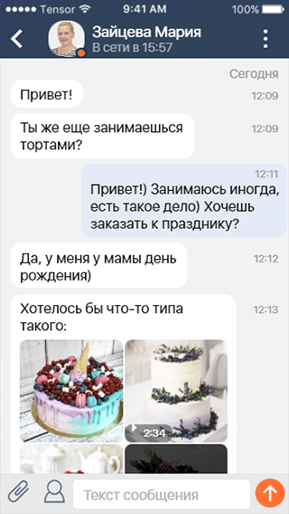
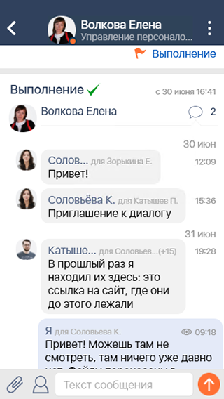

#### Ячейка-облако

|Класс|Ответственные|Добавить|
|-----|-------------|--------|
|[CloudView](src/main/java/ru/tensor/sbis/design/cloud_view/CloudView.kt)|[Бубенщиков С.В.](https://online.sbis.ru/person/1fb93b8c-350f-4785-8589-b0ff2edfbfa7)|[Задачу/поручение/ошибку](https://online.sbis.ru/area/d5cff451-8688-4af0-970a-8127570b0308)|

#### Использование в приложениях
- [Коммуникатор](https://git.sbis.ru/mobileworkspace/apps/droid/communicator)
- [Мобильная витрина SabyGet](https://git.sbis.ru/mobileworkspace/apps/droid/showcase)
- [СБИС на складе](https://git.sbis.ru/mobileworkspace/apps/droid/storekeeper)
- [Бизнес](https://git.sbis.ru/mobileworkspace/apps/droid/business)
- [Курьер](https://git.sbis.ru/mobileworkspace/apps/droid/courier)

##### Внешний вид



[Стандарт внешнего вида](http://axure.tensor.ru/MobileStandart8/#g=1&p=ячейка-облако_сообщения)

##### Описание
Ячейка-облако используется для отображения входящих и исходящий сообщений в переписке. Например в диалогах и чатах (в сообщениях), ленте событий (в задачах) и в ленте уведомлений (в нарушениях).
Существует два вида ячеек сообщения:
- входящее сообщение
- исходящее сообщение

##### xml атрибуты
- `CloudView_outcome` - является ли сообщение исходящим, а не входящим (по умолчанию входящее)

##### Стилизация
Предусмотрена установка глобальных тем для ячейки входящего и исходящего сообщения посредством атрибутов `incomeCloudViewTheme` и `outcomeCloudViewTheme`, а также точечного применения специфичной темы в атрибуте `android:theme`. По умолчанию для входящего сообщения используется тема `DefaultCloudViewTheme.Income`, а для исходящего - `DefaultCloudViewTheme.Outcome`

###### Переопределение темы
При определении пользовательской темы доступны следующие атрибуты:

|Атрибут|Описание|
|-------|--------|
|CloudView_backgroundColor|Цвет фона ячейки|
|CloudView_undeliveredBackgroundColor|Цвет фона ячейки недоставленого сообщения|
|CloudView_titleColor|Цвет основного заголовка|
|CloudView_subtitleColor|Цвет подзаголовка|
|CloudView_iconColor|Цвет иконок (карандаш, часы, глаз)|
|CloudView_dateColor|Цвет даты|
|CloudView_editIcon|Иконка отметки о редактировании|
|CloudView_sendingIcon|Иконка состояния отправки сообщения|
|CloudView_subtitleColor|Цвет подзаголовка|
|CloudView_readIcon|Иконка отметки о прочтении|
|CloudView_deliveryIcon|Иконка отметки об ошибке доставки|
|CloudView_errorIconColor|Цвет иконки с информацией об ошибке|

##### Описание особенностей работы
- Для программной установки типа сообщения предусмотрено свойство `outcome`
- Для управления видимостью фото автора входящего сообщения используется свойство `isPersonal`
- Дата и время отправки сообщения устанавливаются независимо, посредством `date` и `time` соответственно
- Для установки отметки о том, что сообщение было отредактировано, используется свойство `edited`
- Для индикации состояния отправки исходящего сообщения необходимо указать одно из следующих значений `sendingState`:
	- **SENT** - отправлено
	- **SENDING** - в процессе отправки
	- **NEEDS_MANUAL_SEND** - во время отправки произошла ошибка; необходима повторная отправка вручную
	- **IS_READ** - прочитано
- Для установки сведений об авторе сообщения (фото, ФИО) используется свойство `author`
- Непосредственно содержимое сообщения устанавливается посредством `data`. Помимо текста в нём могут присутствовать другие типы содержимого (`QuoteCloudContent` - цитата, `ServiceCloudContent` - сервисное сообщение, `SignatureCloudContent` - подписи, `SigningButtonsCloudContent` - кнопки подписания, `ContainerCloudContent` - контейнер дочерних элементов, `AttachmentCloudContent` - вложения)
- Для указания сведений о получателях сообщения используется свойство `receiverInfo`. Значение `count` в `RecieverInfo` должно содержать общее число получателей, включая упомянутого в `reciever`
- За отображение прогресса отклонения подписи отвечает флаг `showRejectSigningProgress`
- Для обновления статуса активности автора сообщения, отображаемого у фото, предусмотрен метод `setSenderActivityStatus`
- Установка обработчиков:
    - `linkClickListener` - обработчик нажатий на ссылки
    - `contentLongClickListener` - обработчик долгих нажатий на область содержимого
    - `setOnMessageClickListener` - обработчик нажатий на сообщение
    - `setOnStatusClickListener` - обработчик нажатий на статус сообщения
    - `setOnAuthorClickListener` - обработчик нажатия на фото и имя автора сообщения
    - `setGestureDetector` - обработчик жестов для содержимого
- Для эффективного использования компонента рекомендуется устанавливать пул содержимого ячеек `MessagesViewPool` посредством `setViewPool`. Для возможности переиспользования `View` содержимого необходимо своевременно освобождать его посредством `recycleViews`

- Пример макета с ячейкой-облаком входящего сообщения:
```xml
<?xml version="1.0" encoding="utf-8"?>
<ru.tensor.sbis.design.cloud_view.CloudView
    xmlns:android="http://schemas.android.com/apk/res/android"
    xmlns:app="http://schemas.android.com/apk/res-auto"
    android:id="@+id/communicator_message_cloud"
    android:layout_width="match_parent"
    android:layout_height="wrap_content"
    app:CloudView_outcome="false"/>
```
- Пример конфигурации входящего сообщения:
```kotlin
private fun configureIncomingCloudView(cloudView: CloudView, message: MessageData) {
    cloudView.time = message.sendDateTime
    cloudView.date = message.sendDateTime.takeIf(::isDateDifferentThanPrevious)
    val data = DefaultCloudViewData(
        text = richTextConverter.convert(message.text),
        content = message.attachments.map(::toAttachmentCloudContent)
    )
    cloudView.data = data
    cloudView.edited = message.edited
    cloudView.author = getCloudSenderPersonModel(message)
    cloudView.receiverInfo = getCloudReceiverInfo(message)
    cloudView.isPersonal = true
}
```
- Пример конфигурации исходящего сообщения:
```kotlin
private fun configureOutgoingCloudView(cloudView: CloudView, message: MessageData) {
    cloudView.time = message.sendDateTime
    cloudView.date = message.sendDateTime.takeIf(::isDateDifferentThanPrevious)
    cloudView.data = getCloudViewDataFromMessage(message)
    cloudView.edited = message.edited
    cloudView.sendingState = getSendingState(message)
    cloudView.receiverInfo = getCloudReceiverInfo(message)
}

private fun getCloudViewDataFromMessage(message: MessageData): CloudViewData = DefaultCloudViewData(
    richTextConverter.convert(message.text),
    message.content.map {
        when (it.type) {
            QUOTE           -> QuoteCloudContent(...)
            ATTACHMENT      -> AttachmentCloudContent(...)
            SERVICE         -> ServiceCloudContent(...)
            SIGNATURE       -> SignatureCloudContent(...)
            CONTAINER       -> ContainerCloudContent(...)
            SIGNING_BUTTONS -> SigningButtonsCloudContent(...)
            TEXT, LINK      -> EmptyCloudContent(...)
        }
    },
    message.rootElements
)
```

##### Трудозатраты внедрения
1 ч/д