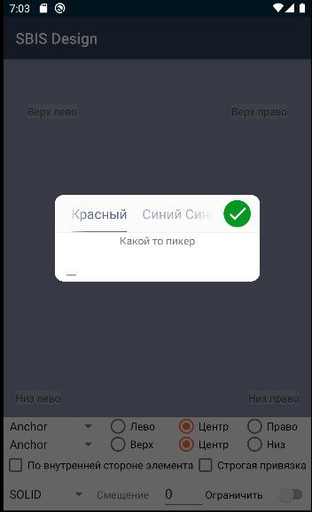
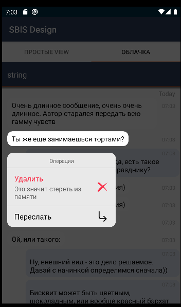

----
#### Контейнер

|Класс|Ответственные|Добавить|
|-----|-------------|--------|
|[SbisContainerImpl](container/src/main/java/ru/tensor/sbis/design/container/SbisContainerImpl.kt)|[Колпаков M.A.](https://online.sbis.ru/Person/6b7e7802-6118-4fe4-9ec3-1db87bc0853c)|[Задачу/поручение/ошибку](https://online.sbis.ru/area/d5cff451-8688-4af0-970a-8127570b0308)|

##### Внешний вид



[Стандарт внешнего вида](http://axure.tensor.ru/MobileStandart8/#p=%D0%BA%D0%BE%D0%BD%D1%82%D0%B5%D0%B9%D0%BD%D0%B5%D1%80&g=1)

##### Описание
Контейнер представляет собой всплывающее окно, внутри которого можно расположить любой контент.
Контент под контейнером может быть затемнен, при этом, не зависимо от наличия затемнения, контент под контейнером становится недоступным для взаимодействия и скроллирования.
В отличие от диалоговых окон:
- расположение контейнера задается прикладником и может быть выровнено по центру, либо зависеть от положения вызывающего элемента.
- возможности компоновки содержимого контейнера не ограничены так жестко системой.
- контейнер не требует от пользователя обязательного взаимодействия со своим содержимым, пользователь в любой момент может закрыть контейнер по клику на область вне контейнера.

##### Стилизация
Тема компонента задаётся атрибутом `sbisContainerTheme`. По умолчанию используется тема [SbisContainer](src/main/res/values/themes.xml).

###### Переопределение темы
При необходимости можно оформить собственную тему, в частности, основываясь на теме по умолчанию. Предусмотрены следующие атрибуты:

|Атрибут|Описание|
|-------|--------|
|ContainerBackground|Цвет фона контейнера|
|SbisContainerHeaderView_theme|Стиль шапки контейнереа|

##### Стиль шапки
|Атрибут|Описание|
|-------|--------|
|android:background|Цвет фона шапки|
|ToolbarTabLayout_theme|Тема вкладок в шапке список атрибутов вкладок можно посомтреть в компоеннете [ToolbarTabLayoutTheme](design/src/main/res/values/themes.xml)|

##### Описание особенностей работы
- Для создания контейнера используется набор фабричных методв из класса [Factories](container/src/main/java/ru/tensor/sbis/design/container/Factories.kt).
- Для предоставления контентна необходимо реализовать ContentCreator типизированный одним из вариантов контента [ViewContent](src/main/java/ru/tensor/sbis/design/container/BaseContent.kt)|[FragmentContent](src/main/java/ru/tensor/sbis/design/container/BaseContent.kt). Если необходимо восстанавливать контейнер после поворота, ContentCreator должен реализовать Parcelable.
```kotlin
@Parcelize
class DemoHeaderFragmentCreator : ContentCreator<DemoHeaderFragmentContent>, Parcelable {
    override fun createContent(): DemoHeaderFragmentContent = DemoHeaderFragmentContent()
}
```
Независимо от типа контента его можно расширить с помощью комбинации интрефесов задающих шапку контейнра
1. [AcceptableHeader](container/src/main/java/ru/tensor/sbis/design/container/HeaderContent.kt#L17) - Добаляет кнопку подтверждения в шапку контейнера
2. [TitleHeaderContent](container/src/main/java/ru/tensor/sbis/design/container/HeaderContent.kt#L27) - Добавлет заголовок в шапку контейнера
3. [TabbedHeaderContent](container/src/main/java/ru/tensor/sbis/design/container/HeaderContent.kt) - Добавляет влкдки в шапку контейнера

```kotlin
class DemoHeaderViewContent : ViewContent, TabbedHeaderContent, AcceptableHeader {
    //region ViewContent
    override fun getView(context: Context, container: ViewGroup): View = TODO()
    override fun onDismiss() = TODO()
    //endregion

    //region AcceptableHeader
    override fun onAccept() = TODO()
    //endregion

    //region TabbedHeaderContent
    override fun onTabChanged(tabId: Int) = TODO()
    override fun getTabs(): LinkedHashMap<Int, ToolbarTabLayout.ToolbarTab> = TODO()
    override fun getSelectedTab(): Int = TODO()
    //endregion
}
```
- Для отображения контейнера используется метод 'show(fragmentManager, horizontalLocator, verticalLocator) ' горизонтальный и вертикальный локаторы - это абстаркция отвечающая за настройки позиционирования конетейнера независимо по горизонтали и вертикали. Они могут быть двух видов

1. ScreenLocator - позицианирование отосительно экрана 
например верхний левый угол экрана 
```kotlin
fun show(fragmentManager: FragmentManager) {
    val menuContainer = createFragmentContainer(MyContentCreator(this))
    menuContainer.show(
        fragmentManager,
        ScreenHorizontalLocator(
            HorizontalAlignment.LEFT
        ),
        ScreenVerticalLocator(
            VerticalAlignment.TOP
        ),
    )
}

```
2. AnchorLocator - позицианирование отосительно вызывающего элемента
например горизонтально по центру вертикально снизу вызывающего элемента
```kotlin
fun show(fragmentManager: FragmentManager) {
    val menuContainer = createFragmentContainer(MyContentCreator(this))
    menuContainer.show(
        fragmentManager,
        AnchorHorizontalLocator(
            HorizontalAlignment.CENTER,
            force = false,
            offsetRes = R.dimen.context_menu_anchor_margin
        ).apply { anchorView = anchor },
        AnchorVerticalLocator(
            VerticalAlignment.BOTTOM,
            force = false,
            offsetRes = R.dimen.context_menu_anchor_margin
        ).apply { anchorView = anchor }
    )
}
```
Пример комбинирования разных локаторов. Пложение горзонтально по центру экрана, ветрикально снизу от вызывающего элемента
```kotlin
 сontainer.show(
        fragmentManager,
        ScreenHorizontalLocator(
            HorizontalAlignment.CENTER
        ),
        AnchorVerticalLocator(
            VerticalAlignment.BOTTOM,
            force = false,
            offsetRes = R.dimen.context_menu_anchor_margin
        ).apply { anchorView = anchor }
    )
```
- Для корректного отображения затенения с вырезом в списочных представлениях необходимо чтобы кликабельные элементы списка в своих прикладных ViewHolder'ах реализовали интерфейс [ItemIdProvider](container/src/main/java/ru/tensor/sbis/design/container/locator/watcher/ItemIdProvider.kt), который предоставляет уникальный идентификитор записи в модели.

##### Трудозатраты внедрения
0.7 ч/д