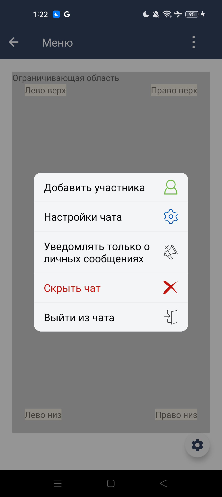
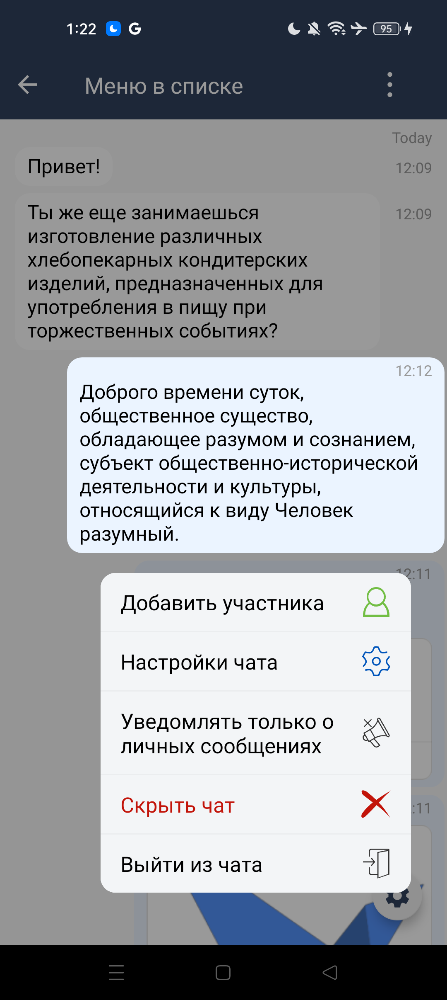

----
#### Меню

| Класс                                                                    | Ответственные                                                                       | Добавить                                                                                    |
|--------------------------------------------------------------------------|-------------------------------------------------------------------------------------|---------------------------------------------------------------------------------------------|
| [SbisMenu](src/main/java/ru/tensor/sbis/design/context_menu/SbisMenu.kt) | [Колпаков M.A.](https://online.sbis.ru/Person/6b7e7802-6118-4fe4-9ec3-1db87bc0853c) | [Задачу/поручение/ошибку](https://online.sbis.ru/area/63ffe6b3-193f-4d77-91c5-3bafeef9cf49) |

##### Внешний вид



[Стандарт внешнего вида](http://axure.tensor.ru/MobileStandart8/#p=%D0%BC%D0%B5%D0%BD%D1%8E&g=1)

##### Описание
Меню предназначено для простого выбора одного параметра или действия из списка.
Сделан на основе компонента "Контейнер" и имеет те же свойства поведения.

##### Руководство по подключению и инициализации
Для добавления модуля в проект, в `settings.gradle` проекта должны быть подключены следующие модули:

| Репозиторий                                             | Модуль                |
|---------------------------------------------------------|-----------------------|
| https://git.sbis.ru/mobileworkspace/android-design.git  | design                |
| https://git.sbis.ru/mobileworkspace/android-design.git  | design_sbis_text_view |
| https://git.sbis.ru/mobileworkspace/android-design.git  | design_utils          |
| https://git.sbis.ru/mobileworkspace/android-utils.git   | common                |

##### Стилизация
Тема компонента основана на глобальных атрибутах и не имеет отдельного атрибута для переопределения темы.

##### Описание особенностей работы
- Для создания меню используется набор фабричных методов, аналогичных методам отображения контейнера, из класса [SbisMenu](src/main/java/ru/tensor/sbis/design/context_menu/SbisMenu.kt#L123).
Пример отображения меню:
```kotlin
fun showMenu(anchor: View) {
   val itemsList = mutableListOf<MenuItem>()

   items.forEach { item ->
      val isEnable = it == selected
      itemsList.add(
         MenuItem(
            resources.getString(item.label),
            state = if (isEnable) MenuItemState.ON else MenuItemState.OFF
         ) {
            if (!isEnable) item.clickListener()
         }
      )
   }
   SbisMenu(children = itemsList).showMenu(childFragmentManager, anchor, dimType = DimType.SHADOW)
}
```

##### Трудозатраты внедрения
0.9 ч/д