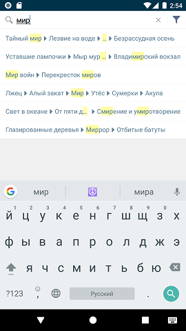

#### Хлебные крошки

|Класс|Ответственные|Добавить|
|-----|-------------|--------|
|[BreadCrumbsView](src/main/java/ru/tensor/sbis/design/breadcrumbs/breadcrumbs/BreadCrumbsView.kt)|[Бессонов Ю.С.](https://online.sbis.ru/person/0744ffc8-075a-40e7-a1bd-5d6fff8655f2)|[Задачу/поручение/ошибку](https://online.sbis.ru/area/d5cff451-8688-4af0-970a-8127570b0308)|

##### Внешний вид
 

[Стандарт внешнего вида](http://axure.tensor.ru/MobileStandart8/#p=кнопка_назад&g=1)  
[Стандарт для Web](http://axure.tensor.ru/standarts/v7/хлебные_крошки__версия_02_.html)

##### Описание
Компонент предназначен для отображения пути от корня до некоторого дочернего элемента в иерархии. При навигации позволяет вернуться в корень, либо на один из промежуточных экранов. Поддерживает подсветку совпадений в элементах, если они представляют результаты поиска.
Компонент состоит из опциональной иконки "Домик" и текстовых элементов, разделённых иконками стрелок. При невозможности отображения пути полностью, текст некоторых элементов может быть усечён, либо скрыт.

##### xml атрибуты
- `BreadCrumbsView_homeIconVisible` - определяет видимость иконки "Домик" (по умолчанию иконка видна)  

##### Стилизация
Тема компонента задаётся атрибутом `breadCrumbsViewTheme`. По умолчанию используется тема [BreadCrumbsViewDefaultTheme](src/main/res/values/theme_bread_crumbs_view.xml).

###### Переопределение темы
При необходимости можно оформить собственную тему, задав требуемые значения следующих атрибутов:

|Атрибут|Описание|
|-------|--------|
|BreadCrumbsView_homeIconStyle|Стиль иконки "Домик"|  
|BreadCrumbsView_arrowIconStyle|Стиль иконки стрелки, разделяющей элементы|  
|BreadCrumbsView_textStyle|Стиль текста элементов|  

##### Описание особенностей работы
- Для задания хлебных крошек нужно использовать метод `setItems(List<BreadCrumb>)`  
- Для изменения видимости иконки "Домик" помимо [атрибута](#xml-атрибуты) можно использовать метод `setHomeIconVisible(Boolean)`
- Для обработки нажатий следует передать в `setItemClickListener((item: BreadCrumb) -> Unit)` лямбду, в которой доступен нажатый элемент  
- Обработчик нажатия на иконку "Домик" устанавливается отдельно, методом `setHomeIconClickListener(() -> Unit)`  
- При использовании хлебных крошек в результатах поиска, может потребоваться подсвечивать совпадения в тексте элементов. Для этого при создании `BreadCrumb` нужно перечислить список подсвеченных регионов в виде `IntRange`

- Пример использования:
```xml
<?xml version="1.0" encoding="utf-8"?>
<LinearLayout xmlns:android="http://schemas.android.com/apk/res/android"
    xmlns:app="http://schemas.android.com/apk/res-auto"
    android:layout_width="match_parent"
    android:layout_height="match_parent"
    android:orientation="vertical">

    <!-- ... -->

    <ru.tensor.sbis.design.breadcrumbs.breadcrumbs.BreadCrumbsView
        android:id="@+id/bread_crumbs"
        android:layout_width="match_parent"
        android:layout_height="wrap_content"
        android:paddingStart="@dimen/bread_crumbs_view_preview_padding_horizontal"
        android:paddingEnd="@dimen/bread_crumbs_view_preview_padding_horizontal"
        app:BreadCrumbsView_homeIconVisible="false"/>

    <!-- ... -->

</LinearLayout>

```

```kotlin
// Пример установки обработчиков нажатий
fun initBreadCrumbsViewListeners() {
    bread_crumbs.setHomeIconClickListener {
        // по нажатию на "Домик" переходим в корневой раздел
        setCurrentFolder(getRootFolder())
    }
    bread_crumbs.setItemClickListener {
        // по нажатию на элемент открываем соответствующий раздел
        setCurrentFolder(getFolderById(it.id))
    }
}

// Пример установки текущего раздела. Вместо Folder может быть произвольный тип эл-та иерархической структуры
fun setCurrentFolder(folder: Folder) {
    //...
    // формируем путь до текущего раздела
    val breadCrumbs = createBreadCrumbs(folder)
    // устанавливаем список элементов хлебных крошек
    bread_crumbs.setItems(breadCrumbs)
    // для корневого раздела имеет смысл скрывать хлебные крошки  
    bread_crumbs.isVisible = folder.parent != null
    //...
}
```