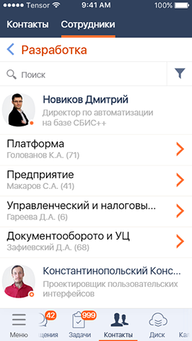

#### Разделитель-заголовок "Назад"

|Класс|Ответственные|Добавить|
|-----|-------------|--------|
|[CurrentFolderView](src/main/java/ru/tensor/sbis/design/breadcrumbs/CurrentFolderView.kt)|[Бессонов Ю.С.](https://online.sbis.ru/person/0744ffc8-075a-40e7-a1bd-5d6fff8655f2)|[Задачу/поручение/ошибку](https://online.sbis.ru/area/d5cff451-8688-4af0-970a-8127570b0308)|

##### Внешний вид
 

[Стандарт внешнего вида](http://axure.tensor.ru/MobileStandart8/#p=кнопка_назад&g=1)

##### Описание
Компонент предназначен для навигации в реестрах с иерархической структурой и позволяет вернуться на уровень выше.  
В мобильных приложениях компонент имеет два стиля оформления: с рыжим и синим текстом.

##### Стилизация
Тема компонента задаётся атрибутом `currentFolderViewTheme`. По умолчанию используется тема с рыжим заголовком [CurrentFolderViewGingerTitleTheme](src/main/res/values/theme_current_folder_view.xml).

###### Переопределение темы
При необходимости можно оформить собственную тему, задав требуемые значения следующих атрибутов:

|Атрибут|Описание|
|-------|--------|
|CurrentFolderView_titleStyle|Стиль текста заголовка|
|CurrentFolderView_iconStyle|Стиль иконки стрелки|  
|CurrentFolderView_backgroundColor|Цвет фона (распространяется на [FolderPathView](src/main/java/ru/tensor/sbis/design/breadcrumbs/folderpath/FolderPathView.kt))|
|CurrentFolderView_dividerColor|Цвет фона разделителя (распространяется на [FolderPathView](src/main/java/ru/tensor/sbis/design/breadcrumbs/folderpath/FolderPathView.kt))|

##### Описание особенностей работы
- Задать текст заголовка можно в xml, посредством атрибута `CurrentFolderView_title`, либо в коде, используя метод `setTitle(String)`
- Для скрытия разделителя можно использовать атрибут `CurrentFolderView_showDivider`. По умолчанию значение `true`. Атрибут актуален и для [FolderPathView](src/main/java/ru/tensor/sbis/design/breadcrumbs/folderpath/FolderPathView.kt)
- При интеграции компонента нужно соблюдать требования из спецификации компонента, в частности, не скрывать заголовок при прокрутке, и обеспечить отображение тени под ним при наличии возможности прокрутки списка вверх (можно использовать [ListHeaderElevationHelper](src/main/java/ru/tensor/sbis/design/util/ListHeaderElevationHelper.kt))  

- Пример использования:
```xml
<?xml version="1.0" encoding="utf-8"?>
<LinearLayout xmlns:android="http://schemas.android.com/apk/res/android"
    android:layout_width="match_parent"
    android:layout_height="match_parent"
    android:orientation="vertical"
    xmlns:app="http://schemas.android.com/apk/res-auto">

    <ru.tensor.sbis.design.breadcrumbs.CurrentFolderView
        android:id="@+id/current_folder"
        android:layout_width="match_parent"
        android:layout_height="wrap_content"
        app:CurrentFolderView_title="Торговое оборудование"/>

    <!-- ... -->

</LinearLayout>
```

```kotlin
// программное задание текста
current_folder.setTitle(getString(R.string.second_level_title))
// установка обработчика нажатий для возврата на уровень выше
current_folder.setOnClickListener { goBack() }
```

##### Трудозатраты внедрения
0.5 ч/д
