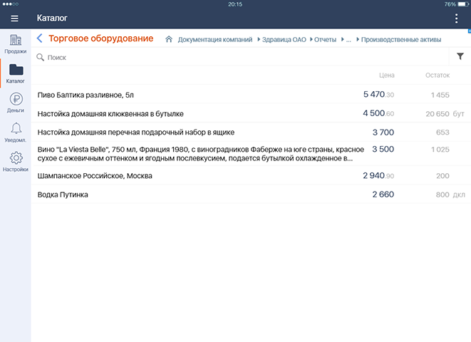
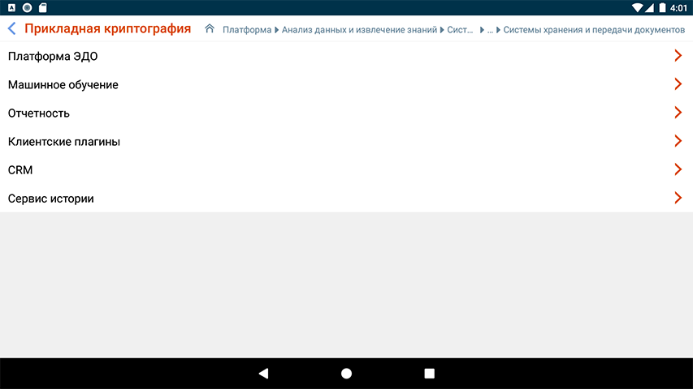

#### Разделитель-заголовок "Назад" с хлебными крошками

|Класс|Ответственные|Добавить|
|-----|-------------|--------|
|[FolderPathView](src/main/java/ru/tensor/sbis/design/breadcrumbs/folderpath/FolderPathView.kt)|[Бессонов Ю.С.](https://online.sbis.ru/person/0744ffc8-075a-40e7-a1bd-5d6fff8655f2)|[Задачу/поручение/ошибку](https://online.sbis.ru/area/d5cff451-8688-4af0-970a-8127570b0308)|

##### Внешний вид
 

[Стандарт внешнего вида](http://axure.tensor.ru/MobileStandart8/#p=кнопка_назад&g=1)  
[Стандарт для Web](http://axure.tensor.ru/standarts/v7/хлебные_крошки__версия_02_.html)

##### Описание
Компонент предназначен для совмещённого отображения в планшетной конфигурации [заголовка текущего раздела](README_current_folder_view.md) и [хлебных крошек](README_bread_crumbs_view.md) - пути от корня до текущего элемента в иерархии, с возможностью возврата в один из родительских разделов.

##### xml атрибуты
- `FolderPathView_homeIconVisible` - определяет видимость иконки "Домик" (по умолчанию иконка скрыта)  
- `FolderPathView_title` - текст заголовка  

##### Стилизация
Для [заголовка](README_current_folder_view.md#стилизация) и [хлебных крошек](README_bread_crumbs_view.md#стилизация) применяются стили из атрибутов, предусмотренных для соответствующих компонентов.

###### Переопределение темы
См. описание для [заголовка](README_current_folder_view.md#переопределение-темы) и [хлебных крошек](README_bread_crumbs_view.md#переопределение-темы)

##### Описание особенностей работы
- Установка текста заголовка аналогична [CurrentFolderView](README_current_folder_view.md#описание-особенностей-работы)
- Обработчик нажатия на view является обработчиком нажатий на заголовок
- Установка хлебных крошек, изменение видимости иконки "Домик", установка обработчиков нажатий на элементы и "Домик" аналогичны [BreadCrumbsView](README_bread_crumbs_view.md#описание-особенностей-работы)

- Пример использования:
```xml
<?xml version="1.0" encoding="utf-8"?>
<LinearLayout xmlns:android="http://schemas.android.com/apk/res/android"
    xmlns:app="http://schemas.android.com/apk/res-auto"
    android:layout_width="match_parent"
    android:layout_height="match_parent"
    android:orientation="vertical">

    <!-- ... -->

     <ru.tensor.sbis.design.breadcrumbs.folderpath.FolderPathView
        android:id="@+id/folder_path"
        android:layout_width="match_parent"
        android:layout_height="wrap_content"
        app:FolderPathView_homeIconVisible="true"/>

    <!-- ... -->

</LinearLayout>

```

```kotlin
// Пример установки обработчиков нажатий
fun initFolderPathViewListeners() {
    folder_path.setHomeIconClickListener {
        // по нажатию на "Домик" переходим в корневой раздел
        setCurrentFolder(getRootFolder())
    }
    folder_path.setItemClickListener {
        // по нажатию на элемент хлебных крошек открываем соответствующий раздел
        setCurrentFolder(getFolderById(it.id))
    }
    folder_path.setOnClickListener { 
        // по нажатию на заголовок возвращаемся к предыдущему разделу
        setCurrentFolder(currentFolder.parent!!)
    }
}

// Пример установки текущего раздела. Вместо Folder может быть произвольный тип эл-та иерархической структуры
fun setCurrentFolder(folder: Folder) {
    //...
    // обновляем название текущего раздела
    folder_path.setTitle(folder.title)
    // формируем путь до текущего раздела
    val breadCrumbs = createBreadCrumbs(folder)
    // устанавливаем список элементов хлебных крошек
    folder_path.setItems(breadCrumbs)
    // не показываем заголовок для корневого раздела
    folder_path.isVisible = folder.isRoot()
    //...
}
```