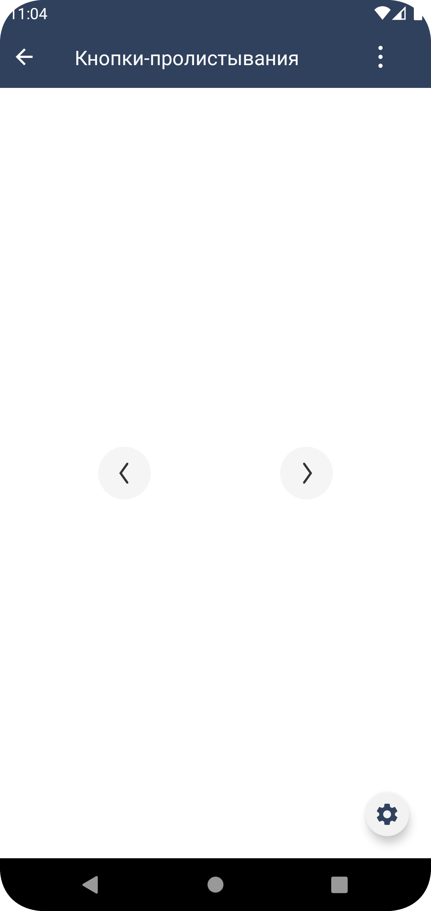

#### Кнопки-пролистывания

| Класс                                                                             |Ответственные|
|-----------------------------------------------------------------------------------|-------------|
| [SbisArrowButton](src/main/java/ru/tensor/sbis/design/buttons/SbisArrowButton.kt) |[Круглова М.Б.](https://online.sbis.ru/person/8a7248e7-b4b2-4c2e-a988-3534eab414f8)|

##### Внешний вид


[Стандарт внешнего вида Figma](https://www.figma.com/proto/5Pe2zULs2pZ4bRtZmOOiev/%D0%9A%D0%BD%D0%BE%D0%BF%D0%BA%D0%B8-%D1%81%D1%82%D1%80%D0%B5%D0%BB%D0%BA%D0%B8?page-id=0%3A1&node-id=1%3A3185&viewport=649%2C477%2C1&scaling=min-zoom&hide-ui=1)

##### Описание
Круглые кнопки переключения. 

##### xml атрибуты

- `SbisArrowButton_mode` - атрибут для указания режима отображения иконки.
    - `arrow_left` - стрелка влево (по умолчанию).
    - `arrow_right` - стрелка вправо.

- `SbisArrowButton_type` - атрибут для указания типа кнопки.
  - `filled` - кнопка с заливкой (по умолчанию). Соответствует SbisRoundButtonType.Filled.
  - `transparent` - кнопка без заливки. Соответствует SbisRoundButtonType.Transparent.

- `SbisArrowButton_style` - атрибут для указания стиля кнопки.
  - `pale` - кнопка с заливкой pale (по умолчанию). Соответствует SbisArrowButtonStyle.PALE.
  - `default_contrast` - кнопка с заливкой default (ля контрастного фона). Соответствует SbisArrowButtonStyle.DEFAULT.

- `SbisArrowButton_size` - атрибут для указания размера кнопки.
  - `medium` - основной размер (по умолчанию). Соответствует SbisRoundButtonSize.S.
  - `large` - большой размер. Соответствует SbisRoundButtonSize.M.
  - `extra_large` - очень большой размер. Соответствует SbisRoundButtonSize.L.

##### Описание особенностей работы

Кнопки-пролистывания унаследованы от SbisRoundButton.
- Пример использования:
```xml
<ru.tensor.sbis.design.buttons.SbisArrowButton
        android:id="@+id/short_period_picker_header_button_right"
        android:layout_width="wrap_content"
        android:layout_height="wrap_content"
        app:SbisArrowButton_type="transparent"
        app:SbisArrowButton_mode="arrow_right"
        app:SbisArrowButton_style="default_contrast"
        app:SbisArrowButton_size="large"/>
```
```kotlin
// Программное создание кнопки
val button = SbisArrowButton(requireContext()).apply {
  type = SbisRoundButtonType.Transparent
  mode = HorizontalPosition.RIGHT
  size = SbisRoundButtonSize.L
  arrowButtonStyle = SbisArrowButtonStyle.DEFAULT
}
```