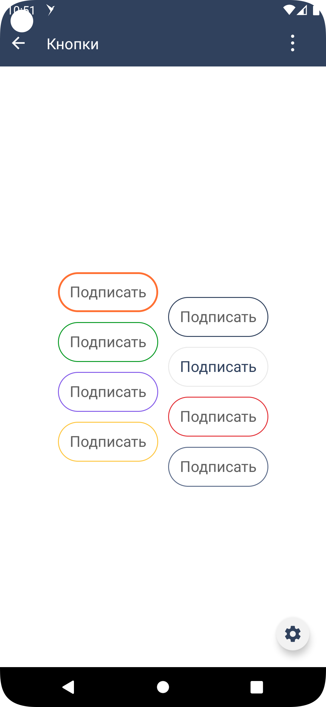
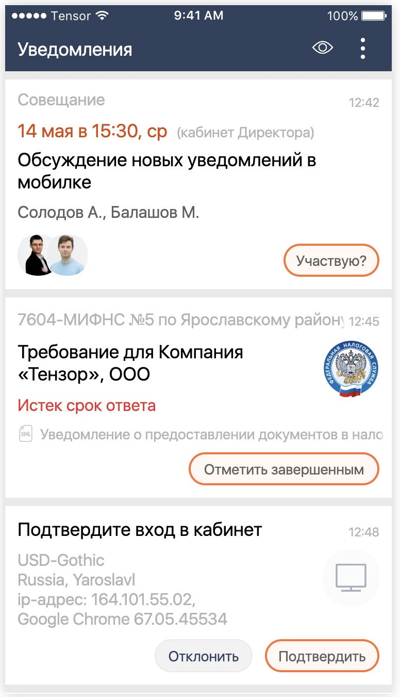

#### Кнопка

|Класс|Ответственные|
|-----|-------------|
|[SbisButton](src/main/java/ru/tensor/sbis/design/buttons/SbisButton.kt)|[Круглова М.Б.](https://online.sbis.ru/person/8a7248e7-b4b2-4c2e-a988-3534eab414f8)|

#### Использование в приложениях

- [Коммуникатор](https://git.sbis.ru/mobileworkspace/apps/droid/communicator)
- [Saby Get](https://git.sbis.ru/mobileworkspace/apps/droid/sabyget)
- [Сбис смс](https://git.sbis.ru/mobileworkspace/apps/droid/sms)
- [Сбис на складе](https://git.sbis.ru/mobileworkspace/apps/droid/storekeeper)
- [Мобильный официант](https://git.sbis.ru/mobileworkspace/apps/droid/waiter2)
- [Курьер](https://git.sbis.ru/mobileworkspace/apps/droid/courier)
- [Сбис касса](https://git.sbis.ru/mobileworkspace/apps/droid/retail)
- [Бизнес](https://git.sbis.ru/mobileworkspace/apps/droid/business)
- [Saby brand](https://git.sbis.ru/mobileworkspace/apps/droid/brand)

##### Внешний вид




[Стандарт внешнего вида](http://axure.tensor.ru/MobileStandart8/#p=%D0%BA%D0%BD%D0%BE%D0%BF%D0%BA%D0%B8&g=1)

[Стандарт внешнего вида Розница](http://axure.tensor.ru/MobileStandart8/#p=%D1%80%D0%BE%D0%B7%D0%BD%D0%B8%D1%86%D0%B0_%D0%BA%D0%BD%D0%BE%D0%BF%D0%BA%D0%B8&g=1)

[Стандарт внешнего вида Figma](https://www.figma.com/proto/jiBHWKdBGD4sv7RDIOvIrw/%D0%9A%D0%BD%D0%BE%D0%BF%D0%BA%D0%B8?page-id=29537%3A22725&node-id=37841%3A29073&viewport=-993%2C2902%2C0.55&scaling=min-zoom&starting-point-node-id=37841%3A29073)

[Ссылка на API](https://n.sbis.ru/article/be90af72-5c43-4362-9584-aa564aceec05#toc_803b6c12-b0b4-4567-b468-f4250f588665)

##### Описание

Кнопка может использоваться самостоятельно, в составе
группы [SbisButtonGroup](src/main/java/ru/tensor/sbis/design/buttons/SbisButtonGroup.kt)
или плавающей панели [SbisFloatingButtonPanel](src/main/java/ru/tensor/sbis/design/buttons/SbisFloatingButtonPanel.kt).

##### xml атрибуты

- 'SbisButton_style' - атрибут для указания цвета кнопки (цвета фона, обводки, текста и иконки)
    - 'primary'
    - 'secondary'
    - 'success'
    - 'pale'
    - 'bonus'
    - 'danger'
    - 'warning'
    - 'info'
    - 'def' <- default зарезервированное слово
    - 'navigation'
    - 'pale'
    - 'brand'


- 'SbisButton_size' - атрибут для указания размера кнопки (по высоте). Данный атрибут предопределяет размеры иконки и
  текста в кнопке. Ширину кнопки можно задать явно через атрибут "android:layout_width" либо не задавать, тогда она
  вычислится автоматически, исходя из ширины компонентов внутри кнопки (текста, иконки, счетчика), расстояния между ними
  (innerSpacing равен значению атрибута offset_xs) и отступов.
    - 'xs' - высота кнопки X3S(R.attr.inlineHeight_3xs), размер иконки XS(R.attr.iconSize_xs), размер текста M(R.attr.fontSize_xs_scaleOff)
    - 's' - высота кнопки X2S(R.attr.inlineHeight_2xs), размер иконки XL(R.attr.iconSize_xl), размер текста M(R.attr.fontSize_xs_scaleOff)
    - 'm' - высота кнопки M(R.attr.inlineHeight_m), размер иконки X2L(R.attr.iconSize_2xl), размер текста X2L(R.attr.fontSize_xl_scaleOff)
    - 'l' - высота кнопки XL(R.attr.inlineHeight_xl), размер иконки X4L(R.attr.iconSize_4xl), размер текста X3L(R.attr.fontSize_2xl_scaleOff)
    - 'xl' - высота кнопки X3L(R.attr.inlineHeight_3xl), размер иконки X5L(R.attr.iconSize_5xl), размер текста X3L(R.attr.fontSize_2xl_scaleOff)


- 'SbisButton_state' - атрибут для указания состояния кнопки
    - 'enabled' - кнопка доступна
    - 'disabled' - кнопка недоступна
    - 'in_progress' - кнопка недоступна, ожидает выполнения операции, крутится значок загрузки


- 'SbisButton_backgroundType' - атрибут для указания типа отображения кнопки
    - 'common' - непрозрачный фон, обводка
    - 'contrast' - непрозрачный фон без обводки
    - 'border_only' - прозрачный фон, обводка
    - 'transparent' - прозрачный фон без обводки
    - 'gradient_left_to_right' - градиент слева направо
    - 'gradient_right_to_left' - градиент справа налево
    - 'gradient_top_to_bottom' - градиент сверху вниз
    - 'gradient_bottom_to_top' - градиент снизу вверх


- 'SbisButton_icon' - атрибут для указания шрифтовой иконки

- 'SbisButton_iconSize' - атрибут для указания размера иконки в кнопке (по умолчанию берется из размера кнопки)
    - 'xs' - равен глобальному атрибуту iconSize_xs
    - 's' - равен глобальному атрибуту iconSize_s
    - 'xl' - равен глобальному атрибуту iconSize_xl
    - 'x2l' - равен глобальному атрибуту iconSize_2xl
    - 'x3l' - равен глобальному атрибуту iconSize_3xl
    - 'x4l' - равен глобальному атрибуту iconSize_4xl
    - 'x5l' - равен глобальному атрибуту iconSize_5xs
    - 'x7l' - равен глобальному атрибуту iconSize_7xs


- 'SbisButton_title' - атрибут для указания текста внутри кнопки

- 'SbisButton_titleSize' - атрибут для указания размера текста внутри кнопки (по умолчанию берется из размера кнопки)
    - 'xs' - равен глобальному атрибуту fontSize_3xs_scaleOff
    - 'm' - равен глобальному атрибуту fontSize_xs_scaleOff
    - 'xl' - равен глобальному атрибуту fontSize_l_scaleOff
    - 'x2l' - равен глобальному атрибуту fontSize_xl_scaleOff
    - 'x3l' - равен глобальному атрибуту fontSize_2xl_scaleOff


- 'SbisButton_titlePosition' - атрибут для указания положения текста в кнопке относительно иконки (по умолчанию right)
    - 'left' - текст слева от иконки
    - 'right' - текст справа от иконки


- 'SbisButton_borderWidth' - атрибут для указания толщины обводки кнопки

- 'SbisButton_cornerRadius' - атрибут для указания скругления краев кнопки

- 'SbisButton_hasHorizontalPadding' - атрибут для указания наличия горизонтальных отступов от края кнопки. 
  По умолчанию true.

Следующие атрибуты берутся из темы, если указан стиль кнопки 'SbisButton_style'

- 'SbisButton_backgroundColor' - атрибут для указания цвета фона кнопки для состояния по умолчанию

- 'SbisButton_backgroundColorPressed' - атрибут для указания цвета фона кнопки для состояния нажата

- 'SbisButton_backgroundColorDisabled' - атрибут для указания цвета фона кнопки для состояния выключена

- 'SbisButton_contrastBackgroundColor' - атрибут для указания цвета фона контрастной кнопки для состояния по умолчанию

- 'SbisButton_contrastBackgroundColorPressed' - атрибут для указания цвета фона контрастной кнопки для состояния нажата

- 'SbisButton_contrastBackgroundColorDisabled' - атрибут для указания цвета фона контрастной кнопки для состояния
  выключена

- 'SbisButton_startGradientBackgroundColor' - атрибут для указания "cтартового" цвета фона градиентной кнопки.

- 'SbisButton_endGradientBackgroundColor' - атрибут для указания "финишного" цвета фона градиентной кнопки.

- 'SbisButton_borderColor' - атрибут для указания цвета обводки кнопки для состояния по умолчанию

- 'SbisButton_borderColorPressed' - атрибут для указания цвета обводки кнопки для состояния нажата

- 'SbisButton_borderColorDisabled' - атрибут для указания цвета обводки кнопки для состояния выключена

- 'SbisButton_titleColor' - атрибут для указания цвета текста кнопки для состояния по умолчанию

- 'SbisButton_titleDisabledColor' - атрибут для указания цвета текста кнопки для выключенного состояния

- 'SbisButton_titleContrastColor' - атрибут для указания цвета текста для кнопки c контрастным фоном

- 'SbisButton_titleTransparentColor' - атрибут для указания цвета текста для кнопки c прозрачным фоном

- 'SbisButton_iconColor' - атрибут для указания цвета иконки кнопки для состояния по умолчанию

- 'SbisButton_iconDisabledColor' - атрибут для указания цвета иконки кнопки для выключенного состояния

- 'SbisButton_iconContrastColor' - атрибут для указания цвета иконки для кнопки c контрастным фоном

- 'SbisButton_iconTransparentColor' - атрибут для указания цвета иконки для кнопки c прозрачным фоном

- 'SbisButton_progressColor' - атрибут для указания цвета индикатора прогресса

- 'SbisButton_progressContrastColor' - атрибут для указания цвета индикатора прогресса для кнопки с контрастным фоном

##### Стилизация
Тема компонента по умолчанию [SbisButtonDefaultsTheme](src/main/res/values/theme_sbis_button.xml).
Тема компонента задаётся через атрибут 'SbisButton_style', который соответствует одной из тем
- 'SbisButtonDefaultPrimaryTheme'
- 'SbisButtonDefaultSecondaryTheme'
- 'SbisButtonDefaultSuccessTheme'
- 'SbisButtonDefaultUnaccentedTheme'
- 'SbisButtonDefaultBonusTheme'
- 'SbisButtonDefaultDangerTheme'
- 'SbisButtonDefaultWarningTheme'
- 'SbisButtonDefaultInfoTheme'
- 'SbisButtonDefaultDefaultTheme'
- 'SbisButtonDefaultNavigationTheme'
- 'SbisButtonDefaultPaleTheme'
- 'SbisButtonDefaultBrandTheme'

Глобально в теме приложения можно задать
- скругление краев кнопок через атрибут 'sbisButtonCornerRadius'
- тип отображения кнопки через атрибут 'sbisButtonBackgroundType'
- определенные цвета для unaccented кнопок через атрибуты 'sbisRoundButtonUnaccentedButtonIconColor',
  'sbisButtonUnaccentedProgressColor', 'sbisButtonUnaccentedProgressContrastColor'

```xml
<style name="DesignDemoTheme" parent="ExtendedBaseAppTheme">
        <item name="sbisButtonCornerRadius">?borderRadius_2xs</item>
        <item name="sbisButtonBackgroundType">contrast</item>
        <item name="sbisButtonUnaccentedButtonTextColor">?infoTextColor</item>
        <item name="sbisButtonUnaccentedProgressColor">?progressColor</item>
        <item name="sbisButtonUnaccentedProgressContrastColor">?contrastProgressColor</item>
    </style>
```

###### Переопределение темы

При необходимости можно оформить собственную тему, задав требуемые значения необходимых атрибутов.

##### Описание особенностей работы

- Параметры, которые можно установить программно:

    - Стиль [SbisButtonStyle](src/main/java/ru/tensor/sbis/design/buttons/base/models/style/SbisButtonStyle.kt)
        - PrimaryButtonStyle
        - SecondaryButtonStyle
        - SuccessButtonStyle
        - UnaccentedButtonStyle
        - BonusButtonStyle
        - DangerButtonStyle
        - WarningButtonStyle
        - InfoButtonStyle
        - DefaultButtonStyle
        - NavigationButtonStyle
        - PaleButtonStyle
        - BrandButtonStyle

    - Состояние [SbisButtonState](src/main/java/ru/tensor/sbis/design/buttons/base/models/state/SbisButtonState.kt)
        - ENABLED
        - DISABLED
        - IN_PROGRESS

    - Размер кнопки (предопределяет размер текста и иконки) [SbisButtonSize](src/main/java/ru/tensor/sbis/design/buttons/button/models/SbisButtonSize.kt)
        - XS
        - S
        - M
        - L
        - XL

    - Модель кнопки [SbisButtonModel](src/main/java/ru/tensor/sbis/design/buttons/button/models/SbisButtonModel.kt)
      Включает в себя настройку следующих компонентов:

        - Иконка [SbisButtonIcon](src/main/java/ru/tensor/sbis/design/buttons/base/models/icon/SbisButtonIcon.kt)
            - SbisButtonTextIcon - модель текстовой иконки
            - SbisButtonDrawableIcon - модель иконки из ресурсов
              Иконке можно настроить
            - Размер [SbisButtonIconSize](src/main/java/ru/tensor/sbis/design/buttons/base/models/icon/SbisButtonIconSize.kt)
            - Стиль, передав в конструктор ColorStateList [SbisButtonIconStyle](src/main/java/ru/tensor/sbis/design/buttons/base/models/style/SbisButtonIconStyle.kt)

        - Текст [SbisButtonTitle](src/main/java/ru/tensor/sbis/design/buttons/base/models/title/SbisButtonTitle.kt)
          Можно настроить
            - Значение текста
            - Позиция текста относительно иконки (справа(RIGHT) или слева(LEFT)) ru.tensor.sbis.design.theme.HorizontalPosition
            - Размер [SbisButtonTitleSize](src/main/java/ru/tensor/sbis/design/buttons/base/models/title/SbisButtonTitleSize.kt)
            - Стиль [SbisButtonTitleStyle](src/main/java/ru/tensor/sbis/design/buttons/base/models/style/SbisButtonTitleStyle.kt)
                - Primary - соответствует PrimaryButtonStyle
                - Secondary - соответствует SecondaryButtonStyle
                - Success - соответствует SuccessButtonStyle
                - Unaccented - соответствует UnaccentedButtonStyle
                - Bonus - соответствует BonusButtonStyle

        - Счётчик [SbisButtonCounter](src/main/java/ru/tensor/sbis/design/buttons/base/models/counter/SbisButtonCounter.kt)
          Можно настроить
            - Значение счетчика
            - Стиль счетчика [SbisCounterStyle][design_counters/src/main/java/ru/tensor/sbis/design/counters/sbiscounter/SbisCounterStyle.kt]
                - PrimarySbisCounterStyle
                - InfoSbisCounterStyle

        - Состояние [SbisButtonState](src/main/java/ru/tensor/sbis/design/buttons/base/models/state/SbisButtonState.kt)
            - ENABLED
            - DISABLED
            - IN_PROGRESS

        - Стиль [SbisButtonStyle](src/main/java/ru/tensor/sbis/design/buttons/base/models/style/SbisButtonStyle.kt)
            - PrimaryButtonStyle
            - SecondaryButtonStyle
            - SuccessButtonStyle
            - UnaccentedButtonStyle
            - BonusButtonStyle
            - DangerButtonStyle
            - WarningButtonStyle
            - InfoButtonStyle
            - DefaultButtonStyle
            - NavigationButtonStyle
            - PaleButtonStyle 
            - BrandButtonStyle

        - Тип фона и обводки кнопки [SbisButtonBackground](src/main/java/ru/tensor/sbis/design/buttons/button/models/SbisButtonBackground.kt)
            - Default - непрозрачный фон, обводка
            - Contrast - непрозрачный фон без обводки
            - BorderOnly - прозрачный фон, обводка
            - Transparent - прозрачный фон без обводки
            - Gradient - градиент (первый цвет берется применяется из обычного состояния, другой из нажатого),
              в качестве параметра передается [Direction](design/src/main/java/ru/tensor/sbis/design/theme/Direction.kt)
                - LEFT_TO_RIGHT
                - RIGHT_TO_LEFT
                - TOP_TO_BOTTOM
                - BOTTOM_TO_TOP
            - InGroup - прозрачный фон без обводки для отображения в группе кнопок

        - Обработчик нажатия на кнопку clickListener: ((button: SbisButton) -> Unit)?

    - Выравнивание по горизонтали контента в кнопке или кнопок в контейнерах ru.tensor.sbis.design.theme.HorizontalAlignment.
        - LEFT - размещение контента слева
        - CENTER - размещение контента по центру в горизонтали
        - RIGHT - размещение контента справа

    - Тип фона и обводки кнопки [SbisButtonBackground](src/main/java/ru/tensor/sbis/design/buttons/button/models/SbisButtonBackground.kt)
        - Default - непрозрачный фон, обводка
        - Contrast - непрозрачный фон без обводки
        - BorderOnly - прозрачный фон, обводка
        - Transparent - прозрачный фон без обводки
        - Gradient - градиент (первый цвет берется применяется из обычного состояния, другой из нажатого),
          в качестве параметра передается [Direction](design/src/main/java/ru/tensor/sbis/design/theme/Direction.kt)
            - LEFT_TO_RIGHT
            - RIGHT_TO_LEFT
            - TOP_TO_BOTTOM
            - BOTTOM_TO_TOP
        - InGroup - прозрачный фон без обводки для отображения в группе кнопок

    - Скругление кнопки

- Для установки текста в кнопке можно использовать методы setTitle и setTitleRes
- Для установки иконки в кнопке можно использовать методы setIcon, setIconChar, setIconDrawable и setIconSpannable.
- Пример использования:
```xml
<ru.tensor.sbis.design.buttons.SbisButton
    android:id="@+id/design_demo_primary_button"
    android:layout_width="?inlineHeight_m"
    android:layout_height="wrap_content"
    app:SbisButton_style="primary"
    app:SbisButton_size="m"
    app:SbisButton_state="disabled"
    app:SbisButton_backgroundType="contrast"
    app:SbisButton_title="@string/design_demo_sbis_button_default_text"
    app:SbisButton_titleSize="xs"
    app:SbisButton_cornerRadius="8dp"
    app:SbisButton_hasHorizontalPadding="false"
/>
```

```kotlin
viewBinding.designDemoPrimaryButton.size = SbisButtonSize.M
viewBinding.designDemoPrimaryButton.state = SbisButtonState.IN_PROGRESS
viewBinding.designDemoPrimaryButton.model = SbisButtonModel(
    title = SbisButtonTitle(
        text = "Подписать",
        position = HorizontalPosition.LEFT,
        size = SbisButtonTitleSize.M
    ),
    icon = SbisButtonTextIcon(
        icon = "\ue93c",
        size = SbisButtonIconSize.S
    ),
    backgroundType = SbisButtonBackground.Contrast
)
viewBinding.designDemoPrimaryButton.setTitle("Согласовать")
viewBinding.designDemoPrimaryButton.hasHorizontalPadding = false
```

```kotlin
// Программное создание кнопки
val button = SbisButton(this.requireContext()).apply {
    // View property
    tag = "SbisButton"
    visibility = View.VISIBLE
    setOnClickListener { presenter.onButtonClick() }

    // AbstractButtonApi
    style = PrimaryButtonStyle
    size = SbisButtonSize.M
    state = SbisButtonState.ENABLED

    // SbisButtonIconAndTextApi
    model = SbisButtonModel(
        icon = SbisButtonTextIcon("\ue93c"),
        title = SbisButtonTitle("Подписать"),
        counter = SbisButtonCounter(26),
        state = SbisButtonState.ENABLED,
        style = PrimaryButtonStyle,
        backgroundType = SbisButtonBackground.Contrast,
        clickListener = { presenter.onButtonClick() }
    )
    align = HorizontalAlignment.LEFT

    // SbisButtonApi
    backgroundType = SbisButtonBackground.Contrast
    cornerRadiusValue = 20F
}
```