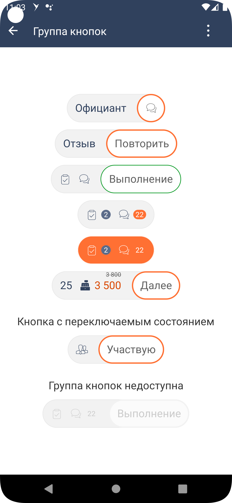

#### Группа кнопок

|Класс|
|-----|
|[SbisButtonGroup](src/main/java/ru/tensor/sbis/design/buttons/SbisButtonGroup.kt)|

#### Использование в приложениях

- [Коммуникатор](https://git.sbis.ru/mobileworkspace/apps/droid/communicator)
- [Saby Get](https://git.sbis.ru/mobileworkspace/apps/droid/sabyget)

##### Внешний вид



[Стандарт внешнего вида](http://axure.tensor.ru/MobileStandart8/#p=%D0%BA%D0%BD%D0%BE%D0%BF%D0%BA%D0%B8&g=1)
[Ссылка на API](https://n.sbis.ru/article/be90af72-5c43-4362-9584-aa564aceec05#toc_440dbe47-ca27-4285-9cfb-e4a315cc10ad)

##### Описание

Группа кнопок

##### xml атрибуты

- 'SbisButtonGroup_size' - атрибут для указания размера группы (по высоте)
    - 's' - группа малого размера, высота кнопки X2S(R.attr.inlineHeight_2xs), размер иконки XL(R.attr.iconSize_xl), размер текста M(R.attr.fontSize_m_scaleOff)
    - 'm' - группа среднего размера (значение по умолчанию), высота кнопки M(R.attr.inlineHeight_m), размер иконки X2L(R.attr.iconSize_2xl), размер текста X2L(R.attr.fontSize_2xl_scaleOff)

- 'SbisButtonGroup_state' - атрибут для указания состояния компонента
    - 'enabled' - группа включена (значение по умолчанию)
    - 'disabled' - группа выключена
    - 'in_progress' - группа выключена, ожидает выполнения операции. Собственного индикатора нет.

- 'SbisButtonGroup_backgroundColor' - атрибут для указания цвета фона группы для состояния по умолчанию

- 'SbisButtonGroup_backgroundColorPressed' - атрибут для указания цвета фона группы для состояния нажата

- 'SbisButtonGroup_backgroundColorDisabled' - атрибут для указания цвета фона группы для состояния выключена

- 'SbisButtonGroup_borderColor' - атрибут для указания цвета обводки группы для состояния по умолчанию

- 'SbisButtonGroup_borderColorPressed' - атрибут для указания цвета обводки группы для состояния нажата

- 'SbisButtonGroup_borderColorDisabled' - атрибут для указания цвета обводки группы для состояния выключена

- 'SbisButtonGroup_borderWidth' - атрибут для указания толщины обводки группы

- 'SbisButtonGroup_buttonStyle' - атрибут для указания стиля кнопки внутри группы
    - 'standard' - стандартый стиль кнопки для ButtonViewGroup
    - 'main' - стиль "главной" кнопки в группе. Оставляет изначальный стиль кнопки

##### Стилизация

Тема компонента задаётся атрибутом `paleSbisButtonGroupTheme`. По умолчанию используется
тема [SbisButtonGroupDefaultPaleTheme](src/main/res/values/theme_sbis_button_group.xml).

##### Описание особенностей работы

- Пример использования:
```xml
<ru.tensor.sbis.design.buttons.SbisButtonGroup
        android:layout_width="wrap_content"
        android:layout_height="wrap_content">

  <ru.tensor.sbis.design.buttons.SbisButton
          android:id="@+id/design_demo_waiter"
          android:layout_width="wrap_content"
          android:layout_height="wrap_content"
          app:SbisButton_title="Официант"/>

  <ru.tensor.sbis.design.buttons.SbisButton
          android:id="@+id/design_demo_waiter_dialog"
          android:layout_width="wrap_content"
          android:layout_height="wrap_content"
          app:SbisButton_icon="@string/design_mobile_icon_menu_messages"
          app:SbisButton_style="primary"/>

</ru.tensor.sbis.design.buttons.SbisButtonGroup>
```