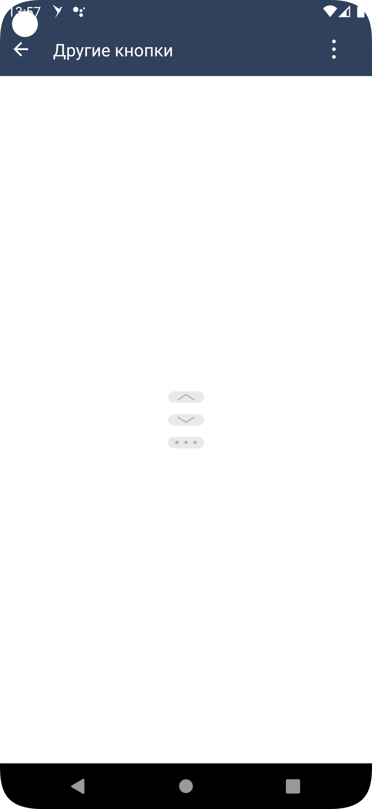

#### Кнопка для разворачивания блока(КАТ)

|Класс|
|-----|
|[SbisCutButton](src/main/java/ru/tensor/sbis/design/buttons/SbisCutButton.kt)|

#### Использование в приложениях

- [Коммуникатор](https://git.sbis.ru/mobileworkspace/apps/droid/communicator)
- [Saby Get](https://git.sbis.ru/mobileworkspace/apps/droid/sabyget)

##### Внешний вид


[Стандарт внешнего вида Figma](https://www.figma.com/proto/ZjoldjLAEEWwxpY2UArE4q/%D0%9A%D0%BD%D0%BE%D0%BF%D0%BA%D0%B0-%22%D0%9F%D0%BE%D0%BA%D0%B0%D0%B7%D0%B0%D1%82%D1%8C-%D0%B1%D0%BE%D0%BB%D1%8C%D1%88%D0%B5%22?page-id=0%3A1&node-id=1-3185&viewport=273%2C408%2C0.56&scaling=min-zoom&hide-ui=1)

##### Описание
Кнопка для разворачивания контента (КАТ)

##### xml атрибуты

- 'SbisCutButton_mode' - атрибут для указания режима отображения иконки
    - 'arrow_up' - стрелка вверх (свернуть)
    - 'arrow_down' - стрелка вниз (развернуть)
    - 'more' - троеточие (развернуть)

- 'SbisCutButton_type' - атрибут для указания типа отображения кнопки.
  - 'accented' - акцентная кнопка.
  - 'unaccented' - неакцентная кнопка.
  - 'active' - с заливкой по клику.

- 'SbisCutButton_backgroundColor' - атрибут для указания цвета фона кнопки
- 'SbisCutButton_backgroundColorPressed' - атрибут для указания цвета фона кнопки при нажатии (только для типа `active`)

- 'SbisCutButton_iconColor' - атрибут для указания цвета иконки 
- 'SbisCutButton_iconColorPressed' - атрибут для указания цвета иконки при нажатии (только для типа `active`)

##### Стилизация

Тема компонента задаётся атрибутом `defaultSbisCutButtonTheme`. 
Для `accented` кнопки используется тема [SbisCutButtonDefaultTheme](src/main/res/values/theme_sbis_cut_button.xml).
Для `unaccented` кнопки используется тема [SbisCutButtonUnaccentedTheme](src/main/res/values/theme_sbis_cut_button.xml).
Для `active` кнопки используется тема [SbisCutButtonActiveTheme](src/main/res/values/theme_sbis_cut_button.xml).

##### Описание особенностей работы

- Пример использования:
```xml
<ru.tensor.sbis.design.buttons.SbisCutButton
        android:id="@+id/design_demo_cut_button_arrow_up"
        android:layout_width="wrap_content"
        android:layout_height="wrap_content"
        app:SbisCutButton_mode="arrow_up"
        app:SbisCutButton_type="active"/>
```