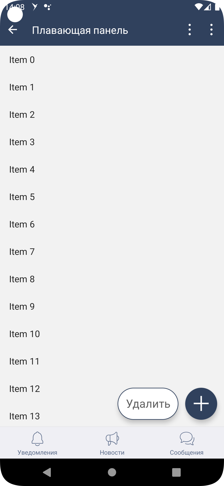

#### Плавающая панель кнопок

|Класс|
|-----|
[SbisFloatingButtonPanel](src/main/java/ru/tensor/sbis/design/buttons/SbisFloatingButtonPanel.kt)|

#### Использование в приложениях

- [Коммуникатор](https://git.sbis.ru/mobileworkspace/apps/droid/communicator)
- [Saby Get](https://git.sbis.ru/mobileworkspace/apps/droid/sabyget)
- [Сбис смс](https://git.sbis.ru/mobileworkspace/apps/droid/sms)
- [Сбис на складе](https://git.sbis.ru/mobileworkspace/apps/droid/storekeeper)
- [Мобильный официант](https://git.sbis.ru/mobileworkspace/apps/droid/waiter2)
- [Курьер](https://git.sbis.ru/mobileworkspace/apps/droid/courier)
- [Сбис касса](https://git.sbis.ru/mobileworkspace/apps/droid/retail)
- [Бизнес](https://git.sbis.ru/mobileworkspace/apps/droid/business)
- [Saby brand](https://git.sbis.ru/mobileworkspace/apps/droid/brand)
- [Saby lite](https://git.sbis.ru/mobileworkspace/apps/droid/sabylite)

##### Внешний вид



[Стандарт внешнего вида](http://axure.tensor.ru/MobileStandart8/#p=%D0%BA%D0%BD%D0%BE%D0%BF%D0%BA%D0%B8&g=1)
[Ссылка на API](https://n.sbis.ru/article/be90af72-5c43-4362-9584-aa564aceec05#toc_a2601554-35f3-4d88-9558-9ea31ff5fff1)

##### Описание

Плавающий контейнер, который отвечает за размещение и движение одиночных кнопок и групп при прокрутке.

##### xml атрибуты

- 'SbisFloatingButtonPanel_content_align' - атрибут для указания выравнивания контента внутри плавающей панели
    - 'left' - размещение контента слева
    - 'center_horizontal' - размещение контента по горизонтальному центру
    - 'right' - размещение контента справа (значение по умолчанию) 

##### Описание особенностей работы
- Пример использования:
```xml
<ru.tensor.sbis.design.buttons.SbisFloatingButtonPanel
        android:id="@+id/design_demo_floating_panel"
        android:layout_width="wrap_content"
        android:layout_height="wrap_content"
        android:layout_gravity="bottom|end">

        <ru.tensor.sbis.design.buttons.SbisRoundButton
            android:layout_width="wrap_content"
            android:layout_height="wrap_content"
            app:SbisRoundButton_icon="@string/design_mobile_icon_action_add"/>

    </ru.tensor.sbis.design.buttons.SbisFloatingButtonPanel>
```

