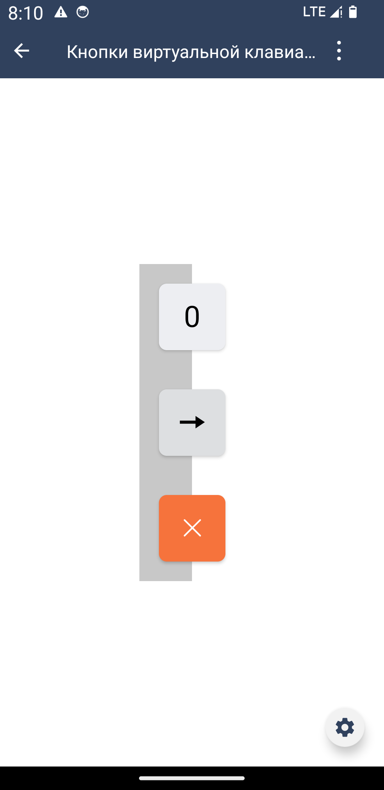

#### Кнопка виртуальной клавиатуры

| Класс                                                                                   | Ответственные                                                                    |
|-----------------------------------------------------------------------------------------|----------------------------------------------------------------------------------|
| [SbisKeyboardButton](src/main/java/ru/tensor/sbis/design/buttons/SbisKeyboardButton.kt) | [Гераськин Р.А](https://dev.sbis.ru/person/45883fa3-9b14-458b-97b3-3f55f527230d) |

##### Внешний вид



[Стандарт внешнего вида на экране ввода пинкода](https://n.sbis.ru/article/d0f6426e-af1a-4174-b89f-9da7839b96c5)  
[Стандарт внешнего вида Figma](https://www.figma.com/proto/wUCuO81jCiTFLAFsiiSXWA/%D0%AD%D0%BA%D1%80%D0%B0%D0%BD-%D1%80%D0%B0%D0%B7%D0%B1%D0%BB%D0%BE%D0%BA%D0%B8%D1%80%D0%BE%D0%B2%D0%BA%D0%B8?page-id=4%3A20&type=design&node-id=11-1512&t=wXllPAmFAXTlGXoJ-0&scaling=min-zoom&starting-point-node-id=11%3A1512&hide-ui=1)  
[Web спецификация](https://n.sbis.ru/article/86f22243-f964-45ac-8471-3f6ed2c9c83d)  
[Ссылка на API](https://dev.sbis.ru/shared/disk/fd165e70-ce7b-493e-b40e-304461e43898)

##### Описание

Кнопка для использования в составе виртуальной клавиатуры. Внутри компонента применяется
метод `clipOutlineShadow()`, позволяющий использовать тень с полупрозрачным фоном кнопки (Large
темы).

##### xml атрибуты

- `SbisKeyboardButton_need_setup_shadow` - атрибут переключателя тени
  - `true` - тень включена
  - `false` - тень выключена


- `SbisKeyboardButton_item_type` - атрибут типа кнопки
  - `input` - кнопка ввода
  - `action` - кнопка действия
  - `action_main` - кнопка основного действия


- `SbisKeyboardButton_icon` - атрибут для указания строкового ресурса иконки. Для данной кнопки
  иконка может быть задана как обычной строкой, так и шрифтовой мобильной иконкой. Для одного и того
  же размера кнопки, размер мобильной иконки и текстовой будут различными. См. макет.


- `SbisKeyboardButton_icon_color` - атрибут для указания цвета иконки кнопки


- `SbisKeyboardButton_icon_size` - атрибут для указания размера кнопки


- `SbisKeyboardButton_size` - атрибут для указания размера кнопки. Высота равна ширине. Данный
  атрибут предопределяет размеры иконки в кнопке.
  - 
    | Размер | Размер самой кнопки     | Размер иконки  | Размер текста (цифры буквы) |
    |--------|-------------------------|----------------|-----------------------------|
    | `s`    | `itemSizeKeyboardViewS` | `iconSize_7xl` | `fontSize_5xl`              |
    | `m`    | `itemSizeKeyboardViewM` | `iconSize_7xl` | `fontSize_5xl`              |
    | `l`    | `itemSizeKeyboardViewL` | `iconSize_7xl` | `fontSize_5xl`              |


##### Описание особенностей работы

- Параметры, которые можно установить программно:

  - Размер кнопки `size` (предопределяет размер
    иконки и текста (цифры/буквы)) [SbisKeyboardButtonSize](src/main/java/ru/tensor/sbis/design/buttons/keyboard/model/SbisKeyboardButtonSize.kt)
    - S
    - M
    - L

  - Иконка `keyboardIcon` (имеет 4 конструктора для создания иконки различными
    способами) [SbisKeyboardIcon](src/main/java/ru/tensor/sbis/design/buttons/keyboard/model/SbisKeyboardIcon.kt)

  - Тип
    кнопки `itemType` [SbisKeyboardButtonItemType](src/main/java/ru/tensor/sbis/design/buttons/keyboard/model/SbisKeyboardButtonItemType.kt)
    - `INPUT` - основная кнопка
    - `ACTION` - дополнительная кнопка
    - `ACTION_MAIN` - кнопка главного действия


- Пример использования:

```xml
<ru.tensor.sbis.design.buttons.SbisKeyboardButton
    android:id="@+id/design_demo_keyboard_main_action_button"
    android:layout_width="wrap_content"
    android:layout_height="wrap_content"
    app:SbisKeyboardButton_item_type="input" 
    app:SbisKeyboardButton_icon_size="m" 
    app:SbisKeyboardButton_need_setup_shadow="true" 
    app:SbisKeyboardButton_icon_color="@color/sbis_gray" 
    app:SbisKeyboardButton_icon="@string/sbis_keyboard_button_default_text_main_action"
    app:SbisKeyboardButton_iconSize="l"/>
```

```kotlin
// Программное создание кнопки
val button = SbiskyboardButton(this.requireContext()).apply {
  needSetupShadow = true
  size = SbisKeyboardButtonSize.L
  itemType = SbisKeyboardButtonItemType.INPUT
  keyboardIcon = SbisKeyboardIcon(
    SbisMobileIcon.Icon.smi_Enter,
    SbisKeyboardIconSize.L,
    ColorStateList.valueOf(Color.RED)
  )
}
```