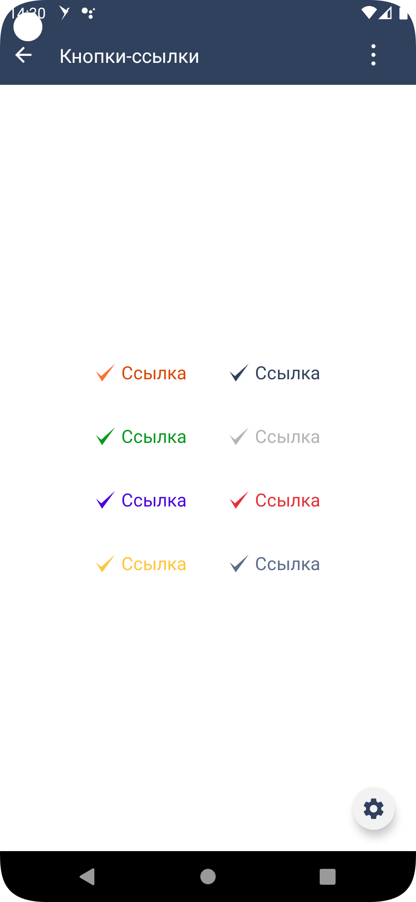

#### Кнопка-ссылка

|Класс|Ответственные|
|-----|-------------|
|[SbisLinkButton](src/main/java/ru/tensor/sbis/design/buttons/SbisLinkButton.kt)|[Круглова М.Б.](https://online.sbis.ru/person/8a7248e7-b4b2-4c2e-a988-3534eab414f8)|

#### Использование в приложениях

##### Внешний вид



[Стандарт внешнего вида Figma](https://www.figma.com/proto/jiBHWKdBGD4sv7RDIOvIrw/%D0%9A%D0%BD%D0%BE%D0%BF%D0%BA%D0%B8?page-id=29537%3A22725&node-id=37841%3A29073&viewport=-993%2C2902%2C0.55&scaling=min-zoom&starting-point-node-id=37841%3A29073)
[Ссылка на API](https://n.sbis.ru/article/be90af72-5c43-4362-9584-aa564aceec05#toc_803b6c12-b0b4-4567-b468-f4250f588665)

##### Описание

Кнопка-ссылка

##### xml атрибуты

- 'SbisLinkButton_style' - атрибут для указания цвета кнопки (цвета иконки и текста)
    - 'primary'
    - 'secondary'
    - 'success'
    - 'pale'
    - 'bonus'
    - 'danger'
    - 'warning'
    - 'info'
    - 'def' <- default зарезервированное слово
    - 'link'
    - 'label'
  
- 'SbisLinkButton_size' - атрибут для указания размера кнопки. Данный атрибут предопределяет размеры иконки и
  текста в кнопке. Ширина кнопки вычисляется исходя из ширины компонентов внутри кнопки (текста и иконки) и расстояния между ними
  (innerSpacing равен значению атрибута offset_xs).
    - 'xs' - высота кнопки X3S(R.attr.inlineHeight_3xs), размер иконки XS(R.attr.iconSize_xs), размер текста M(R.attr.fontSize_xs_scaleOff)
    - 's' - высота кнопки X2S(R.attr.inlineHeight_2xs), размер иконки XL(R.attr.iconSize_xl), размер текста M(R.attr.fontSize_xs_scaleOff)
    - 'm' - высота кнопки M(R.attr.inlineHeight_m), размер иконки X2L(R.attr.iconSize_2xl), размер текста X2L(R.attr.fontSize_xl_scaleOff)
    - 'l' - высота кнопки XL(R.attr.inlineHeight_xl), размер иконки X4L(R.attr.iconSize_4xl), размер текста X3L(R.attr.fontSize_2xl_scaleOff)
    - 'xl' - высота кнопки X3L(R.attr.inlineHeight_3xl), размер иконки X5L(R.attr.iconSize_5xl), размер текста X3L(R.attr.fontSize_2xl_scaleOff)
  
- 'SbisLinkButton_state' - атрибут для указания состояния кнопки
  - 'enabled' - кнопка доступна
  - 'disabled' - кнопка недоступна

- 'SbisLinkButton_icon' - атрибут для указания шрифтовой иконки

- 'SbisLinkButton_iconSize' - атрибут для указания размера иконки в кнопке (по умолчанию берется из размера кнопки)
  - 'xs' - равен глобальному атрибуту iconSize_xs
  - 's' - равен глобальному атрибуту iconSize_s
  - 'xl' - равен глобальному атрибуту iconSize_xl
  - 'x2l' - равен глобальному атрибуту iconSize_2xl
  - 'x3l' - равен глобальному атрибуту iconSize_3xl
  - 'x4l' - равен глобальному атрибуту iconSize_4xl
  - 'x5l' - равен глобальному атрибуту iconSize_5xs
  - 'x7l' - равен глобальному атрибуту iconSize_7xs
  
- 'SbisLinkButton_title' - атрибут для указания текста внутри кнопки

- 'SbisLinkButton_titleSize' - атрибут для указания размера текста внутри кнопки (по умолчанию берется из размера кнопки)
  - 'xs' - равен глобальному атрибуту fontSize_3xs_scaleOff
  - 'm' - равен глобальному атрибуту fontSize_xs_scaleOff
  - 'xl' - равен глобальному атрибуту fontSize_l_scaleOff
  - 'x2l' - равен глобальному атрибуту fontSize_xl_scaleOff
  - 'x3l' - равен глобальному атрибуту fontSize_2xl_scaleOff
  
- 'SbisLinkButton_titlePosition' - атрибут для указания положения текста в кнопке относительно иконки (по умолчанию right)
  - 'left' - текст слева от иконки
  - 'right' - текст справа от иконки

Следующие атрибуты берутся из темы, если указан стиль кнопки 'SbisLinkButton_style'
  
- 'SbisLinkButton_titleColor' - атрибут для указания цвета текста кнопки для состояния по умолчанию

- 'SbisLinkButton_titleDisabledColor' - атрибут для указания цвета текста кнопки для выключенного состояния

- 'SbisLinkButton_iconColor' - атрибут для указания цвета иконки кнопки для состояния по умолчанию

- 'SbisLinkButton_iconDisabledColor' - атрибут для указания цвета иконки кнопки для выключенного состояния

##### Стилизация
Тема компонента по умолчанию [SbisLinkButtonDefaultsTheme](src/main/res/values/theme_sbis_link_button.xml).
Тема компонента задаётся через атрибут 'SbisLinkButton_style', который соответствует одной из тем
- 'SbisLinkButtonDefaultPrimaryTheme'
- 'SbisLinkButtonDefaultSecondaryTheme'
- 'SbisLinkButtonDefaultSuccessTheme'
- 'SbisLinkButtonDefaultUnaccentedTheme'
- 'SbisLinkButtonDefaultBonusTheme'
- 'SbisLinkButtonDefaultDangerTheme'
- 'SbisLinkButtonDefaultWarningTheme'
- 'SbisLinkButtonDefaultInfoTheme'
- 'SbisLinkButtonDefaultDefaultTheme'
- 'SbisLinkButtonDefaultLinkTheme'
- 'SbisLinkButtonDefaultLabelTheme'

Глобально в теме приложения можно задать
- цвет для unaccented кнопки через атрибут 'sbisButtonUnaccentedButtonTextColor'

###### Переопределение темы

При необходимости можно оформить собственную тему, задав требуемые значения необходимых атрибутов.

##### Описание особенностей работы
- Параметры, которые можно установить программно:

  - Стиль [SbisButtonStyle](src/main/java/ru/tensor/sbis/design/buttons/base/models/style/SbisButtonStyle.kt)
    - PrimaryButtonStyle
    - SecondaryButtonStyle
    - SuccessButtonStyle
    - UnaccentedButtonStyle
    - BonusButtonStyle
    - DangerButtonStyle
    - WarningButtonStyle
    - InfoButtonStyle
    - DefaultButtonStyle
    - LinkButtonStyle
    - LabelButtonStyle

  - Состояние [SbisButtonState](src/main/java/ru/tensor/sbis/design/buttons/base/models/state/SbisButtonState.kt)
    - ENABLED
    - DISABLED
    - IN_PROGRESS

  - Размер кнопки (предопределяет размер текста и иконки) [SbisButtonSize](src/main/java/ru/tensor/sbis/design/buttons/button/models/SbisButtonSize.kt)
    - XS
    - S
    - M
    - L
    - XL

  - Модель кнопки [SbisButtonModel](src/main/java/ru/tensor/sbis/design/buttons/button/models/SbisButtonModel.kt)
    Включает в себя настройку следующих компонентов:

    - Иконка [SbisButtonIcon](src/main/java/ru/tensor/sbis/design/buttons/base/models/icon/SbisButtonIcon.kt)
      - SbisButtonTextIcon - модель текстовой иконки
      - SbisButtonDrawableIcon - модель иконки из ресурсов
        Иконке можно настроить
      - Размер [SbisButtonIconSize](src/main/java/ru/tensor/sbis/design/buttons/base/models/icon/SbisButtonIconSize.kt)
      - Стиль, передав в конструктор ColorStateList [SbisButtonIconStyle](src/main/java/ru/tensor/sbis/design/buttons/base/models/style/SbisButtonIconStyle.kt)

    - Текст [SbisButtonTitle](src/main/java/ru/tensor/sbis/design/buttons/base/models/title/SbisButtonTitle.kt)
      Можно настроить
      - Значение текста
      - Позиция текста относительно иконки (справа(RIGHT) или слева(LEFT)) ru.tensor.sbis.design.theme.HorizontalPosition
      - Размер [SbisButtonTitleSize](src/main/java/ru/tensor/sbis/design/buttons/base/models/title/SbisButtonTitleSize.kt)
      - Стиль [SbisButtonTitleStyle](src/main/java/ru/tensor/sbis/design/buttons/base/models/style/SbisButtonTitleStyle.kt)
        - Primary - соответствует PrimaryButtonStyle
        - Secondary - соответствует SecondaryButtonStyle
        - Success - соответствует SuccessButtonStyle
        - Unaccented - соответствует UnaccentedButtonStyle
        - Bonus - соответствует BonusButtonStyle

    - НЕ ПРИМЕНЯЕТСЯ счётчик [SbisButtonCounter](src/main/java/ru/tensor/sbis/design/buttons/base/models/counter/SbisButtonCounter.kt)

    - Состояние [SbisButtonState](src/main/java/ru/tensor/sbis/design/buttons/base/models/state/SbisButtonState.kt)
      - ENABLED
      - DISABLED
      - IN_PROGRESS

    - Стиль [SbisButtonStyle](src/main/java/ru/tensor/sbis/design/buttons/base/models/style/SbisButtonStyle.kt)
      - PrimaryButtonStyle
      - SecondaryButtonStyle
      - SuccessButtonStyle
      - UnaccentedButtonStyle
      - BonusButtonStyle
      - DangerButtonStyle
      - WarningButtonStyle
      - InfoButtonStyle
      - DefaultButtonStyle

    - НЕ ПРИМЕНЯЕТСЯ тип фона и обводки кнопки [SbisButtonBackground](src/main/java/ru/tensor/sbis/design/buttons/button/models/SbisButtonBackground.kt)

    - НЕ ПРИМЕНЯЕТСЯ обработчик нажатия на кнопку clickListener: ((button: SbisButton) -> Unit)?

  - Выравнивание по горизонтали контента в кнопке или кнопок в контейнерах ru.tensor.sbis.design.theme.HorizontalAlignment.
    - LEFT - размещение контента слева
    - CENTER - размещение контента по центру в горизонтали
    - RIGHT - размещение контента справа
    
- Для установки текста в кнопке можно использовать методы setTitle и setTitleRes
- Для установки иконки в кнопке можно использовать методы setIcon, setIconChar, setIconDrawable и setIconSpannable.
- Пример использования:
```xml
<ru.tensor.sbis.design.buttons.SbisLinkButton
        android:id="@+id/design_demo_primary_button"
        android:layout_width="wrap_content"
        android:layout_height="wrap_content"
        app:SbisLinkButton_style="primary"
        app:SbisLinkButton_iconSize="xl"
        app:SbisLinkButton_title="@string/design_demo_sbis_link_button_default_text"
        app:SbisLinkButton_titleSize="m"/>
```

```kotlin
viewBinding.designDemoPrimaryButton.apply {
            setTitle("Ссылка")
            setIconChar('\ue530')
}

// Программное создание кнопки
val button = SbisLinkButton(this.requireContext()).apply {
  // View property
  tag = "SbisLinkButton"
  visibility = View.VISIBLE

  // AbstractButtonApi
  style = PrimaryButtonStyle
  size = SbisButtonSize.M
  state = SbisButtonState.ENABLED

  //SbisButtonIconAndTextApi
  model = SbisButtonModel(
    icon = SbisButtonTextIcon("\ue93c"),
    title = SbisButtonTitle("Подписать",
      style = SbisButtonTitleStyle.Secondary),
    state = SbisButtonState.ENABLED,
    style = PrimaryButtonStyle
  )
  align = HorizontalAlignment.LEFT
}
```

