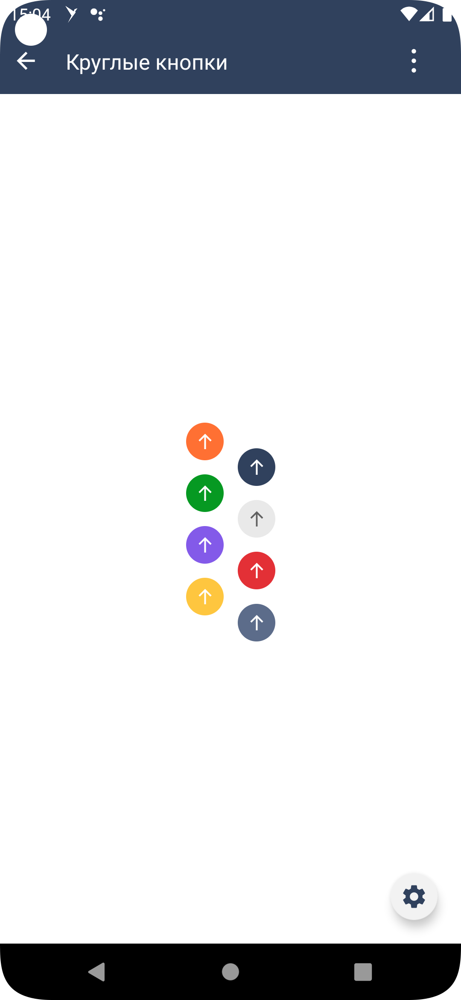

#### Круглая кнопка

|Класс|Ответственные|
|-----|-------------|
|[SbisRoundButton](src/main/java/ru/tensor/sbis/design/buttons/SbisRoundButton.kt)|[Круглова М.Б.](https://online.sbis.ru/person/8a7248e7-b4b2-4c2e-a988-3534eab414f8)|

#### Использование в приложениях

- [Коммуникатор](https://git.sbis.ru/mobileworkspace/apps/droid/communicator)
- [Saby Get](https://git.sbis.ru/mobileworkspace/apps/droid/sabyget)
- [Сбис смс](https://git.sbis.ru/mobileworkspace/apps/droid/sms)
- [Сбис на складе](https://git.sbis.ru/mobileworkspace/apps/droid/storekeeper)
- [Мобильный официант](https://git.sbis.ru/mobileworkspace/apps/droid/waiter2)
- [Курьер](https://git.sbis.ru/mobileworkspace/apps/droid/courier)
- [Сбис касса](https://git.sbis.ru/mobileworkspace/apps/droid/retail)
- [Бизнес](https://git.sbis.ru/mobileworkspace/apps/droid/business)
- [Saby brand](https://git.sbis.ru/mobileworkspace/apps/droid/brand)
- [Saby lite](https://git.sbis.ru/mobileworkspace/apps/droid/sabylite)

##### Внешний вид



[Стандарт внешнего вида](http://axure.tensor.ru/MobileStandart8/#p=%D0%BA%D0%BD%D0%BE%D0%BF%D0%BA%D0%B8&g=1)
[Стандарт внешнего вида Figma](https://www.figma.com/proto/jiBHWKdBGD4sv7RDIOvIrw/%D0%9A%D0%BD%D0%BE%D0%BF%D0%BA%D0%B8?page-id=29537%3A22725&node-id=37841%3A29073&viewport=-993%2C2902%2C0.55&scaling=min-zoom&starting-point-node-id=37841%3A29073)
[Ссылка на API](https://n.sbis.ru/article/be90af72-5c43-4362-9584-aa564aceec05#toc_0ac3b4e1-8a4b-4f75-8c75-6dfed2d2de50)

##### Описание

Кнопка-иконка

##### xml атрибуты

- 'SbisRoundButton_style' - атрибут для указания цвета кнопки (цвета фона и иконки)
  - 'primary'
  - 'secondary'
  - 'success'
  - 'pale'
  - 'bonus'
  - 'danger'
  - 'warning'
  - 'info'
  - 'def' <- default зарезервированное слово
  - 'navigation'
  - 'pale'
  - 'brand'

- 'SbisRoundButton_size' - атрибут для указания размера кнопки. Высота равна ширине. Данный атрибут предопределяет
  размеры иконки в кнопке.
  - 'xs' - высота кнопки X3S(R.attr.inlineHeight_3xs), размер иконки S(R.attr.iconSize_s)
  - 's' - высота кнопки X2S(R.attr.inlineHeight_2xs), размер иконки XL(R.attr.iconSize_xl)
  - 'm' - высота кнопки M(R.attr.inlineHeight_m), размер иконки X2L(R.attr.iconSize_2xl)
  - 'l' - высота кнопки XL(R.attr.inlineHeight_xl), размер иконки X4L(R.attr.iconSize_4xl)
  - 'xl' - высота кнопки X3L(R.attr.inlineHeight_3xl), размер иконки X5L(R.attr.iconSize_5xl)

- 'SbisRoundButton_state' - атрибут для указания состояния кнопки
  - 'enabled' - кнопка доступна
  - 'disabled' - кнопка недоступна
  - 'in_progress' - кнопка недоступна, ожидает выполнения операции, крутится значок загрузки

- 'SbisRoundButton_type' - атрибут для указания типа отображения кнопки
  - 'common' - непрозрачный фон, обводка, не используется
  - 'contrast' - с заливкой
  - 'border_only' - прозрачный фон, обводка, не используется
  - 'transparent' - без заливки
  - 'gradient_left_to_right' - градиент слева направо
  - 'gradient_right_to_left' - градиент справа налево
  - 'gradient_top_to_bottom' - градиент сверху вниз
  - 'gradient_bottom_to_top' - градиент снизу вверх

- 'SbisRoundButton_icon' - атрибут для указания шрифтовой иконки

- 'SbisRoundButton_iconSize' - атрибут для указания размера иконки в кнопке (по умолчанию берется из размера кнопки)
  - 'xs' - равен глобальному атрибуту iconSize_xs
  - 's' - равен глобальному атрибуту iconSize_s
  - 'xl' - равен глобальному атрибуту iconSize_xl
  - 'x2l' - равен глобальному атрибуту iconSize_2xl
  - 'x4l' - равен глобальному атрибуту iconSize_4xl
  - 'x5l' - равен глобальному атрибуту iconSize_5xs
  - 'x7l' - равен глобальному атрибуту iconSize_7xs

- 'SbisRoundButton_cornerRadius' - атрибут для указания скругления краев кнопки

Следующие атрибуты берутся из темы, если указан стиль кнопки 'SbisRoundButton_style'

- 'SbisRoundButton_backgroundColor' - атрибут для указания цвета фона кнопки для состояния по умолчанию

- 'SbisRoundButton_backgroundColorPressed' - атрибут для указания цвета фона кнопки для состояния нажата

- 'SbisRoundButton_backgroundColorDisabled' - атрибут для указания цвета фона кнопки для состояния выключена

- 'SbisRoundButton_iconColor' - атрибут для указания цвета иконки кнопки для состояния по умолчанию

- 'SbisRoundButton_iconDisabledColor' - атрибут для указания цвета иконки кнопки для выключенного состояния

- 'SbisRoundButton_iconTransparentColor' - атрибут для указания цвета иконки для кнопки c прозрачным фоном

- 'SbisRoundButton_progressColor' - атрибут для указания цвета индикатора прогресса

- 'SbisRoundButton_progressContrastColor' - атрибут для указания цвета индикатора прогресса для кнопки с контрастным фоном

- 'SbisRoundButton_startGradientBackgroundColor' - атрибут для указания "cтартового" цвета фона градиентной кнопки.

- 'SbisRoundButton_endGradientBackgroundColor' - атрибут для указания "финишного" цвета фона градиентной кнопки.

##### Стилизация
Тема компонента по умолчанию [SbisRoundButtonDefaultsTheme](src/main/res/values/theme_sbis_round_button.xml).
Тема компонента задаётся через атрибут 'SbisRoundButton_style', который соответствует одной из тем
- 'SbisRoundButtonDefaultPrimaryTheme'
- 'SbisRoundButtonDefaultSecondaryTheme'
- 'SbisRoundButtonDefaultSuccessTheme'
- 'SbisRoundButtonDefaultUnaccentedTheme'
- 'SbisRoundButtonDefaultBonusTheme'
- 'SbisRoundButtonDefaultDangerTheme'
- 'SbisRoundButtonDefaultWarningTheme'
- 'SbisRoundButtonDefaultInfoTheme'
- 'SbisRoundButtonDefaultDefaultTheme'
- 'SbisRoundButtonDefaultNavigationTheme'
- 'SbisButtonDefaultPaleTheme'
- 'SbisButtonDefaultBrandTheme'

Глобально в теме приложения можно задать
- скругление краев кнопок через атрибут 'sbisButtonCornerRadius'
- цвет для unaccented кнопки через атрибут 'sbisRoundButtonUnaccentedButtonIconColor'

###### Переопределение темы

При необходимости можно оформить собственную тему, задав требуемые значения необходимых атрибутов.

##### Описание особенностей работы

- Параметры, которые можно установить программно:

  - Стиль [SbisButtonStyle](src/main/java/ru/tensor/sbis/design/buttons/base/models/style/SbisButtonStyle.kt)
    - PrimaryButtonStyle
    - SecondaryButtonStyle
    - SuccessButtonStyle
    - UnaccentedButtonStyle
    - BonusButtonStyle
    - DangerButtonStyle
    - WarningButtonStyle
    - InfoButtonStyle
    - DefaultButtonStyle
    - NavigationButtonStyle
    - PaleButtonStyle
    - BrandButtonStyle

  - Состояние [SbisButtonState](src/main/java/ru/tensor/sbis/design/buttons/base/models/state/SbisButtonState.kt)
    - ENABLED
    - DISABLED
    - IN_PROGRESS

  - Размер кнопки (предопределяет размер иконки) [SbisRoundButtonSize](src/main/java/ru/tensor/sbis/design/buttons/round/model/SbisRoundButtonSize.kt)
    - XS
    - S
    - M
    - L
    - XL

  - Иконка [SbisButtonIcon](src/main/java/ru/tensor/sbis/design/buttons/base/models/icon/SbisButtonIcon.kt)
    - SbisButtonTextIcon - модель текстовой иконки
    - SbisButtonDrawableIcon - модель иконки из ресурсов
      Иконке можно настроить
    - Размер [SbisButtonIconSize](src/main/java/ru/tensor/sbis/design/buttons/base/models/icon/SbisButtonIconSize.kt)
    - Стиль, передав в конструктор ColorStateList [SbisButtonIconStyle](src/main/java/ru/tensor/sbis/design/buttons/base/models/style/SbisButtonIconStyle.kt)

  - Тип кнопки [SbisRoundButtonType](src/main/java/ru/tensor/sbis/design/buttons/round/model/SbisRoundButtonType.kt)
    - Filled - с заливкой
    - Transparent - без заливки
    - Gradient - градиентная, в качестве параметра передается [SbisButtonGradientBackgroundDirection](src/main/java/ru/tensor/sbis/design/buttons/button/models/SbisButtonGradientBackgroundDirection.kt)
      - LEFT_TO_RIGHT
      - RIGHT_TO_LEFT
      - TOP_TO_BOTTOM
      - BOTTOM_TO_TOP

  - Скругление кнопки
  - Позиция счётчика `counterPosition:HorizontalPosition`
  - Значение счётчика `counter:SbisButtonCounter?`
    - **ВАЖНО! Для корректного отображения счётчика необходимо для родителя применить флаг `View.clipChildren = false`.**


- Для установки иконки в кнопке можно использовать методы setIcon, setIconChar, setIconDrawable и setIconSpannable.
- Пример использования:
```xml
<ru.tensor.sbis.design.buttons.SbisRoundButton
    android:id="@+id/design_demo_primary_button"
    android:layout_width="wrap_content"
    android:layout_height="wrap_content"
    app:SbisRoundButton_style="primary"
    app:SbisRoundButton_type="transparent"
    app:SbisRoundButton_iconSize="x2l"/>
```

```kotlin
viewBinding.designDemoPrimaryButton.apply {
    setIconChar('\ue930')
}

// Программное создание кнопки
val button = SbisRoundButton(this.requireContext()).apply {
  // View property
  tag = "SbisRoundButton"
  visibility = View.VISIBLE

  // AbstractButtonApi
  style = PrimaryButtonStyle
  size = SbisRoundButtonSize.M
  state = SbisButtonState.ENABLED

  //SbisRoundButtonApi
  icon = SbisButtonTextIcon("\ue93c")
  type = SbisRoundButtonType.Filled
  cornerRadiusValue = 20F
}
```