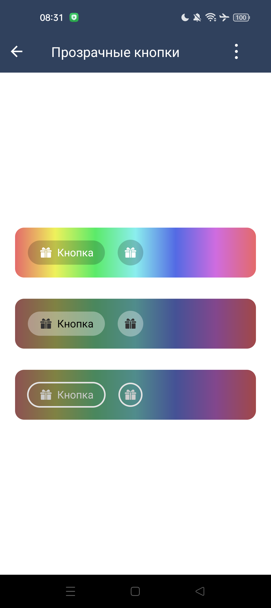

#### Прозрачные кнопки

| Класс                                                                                                   | Ответственные                                                                       |
|---------------------------------------------------------------------------------------------------------|-------------------------------------------------------------------------------------|
| [SbisTranslucentButton](src/main/java/ru/tensor/sbis/design/buttons/SbisTranslucentButton.kt)           | [Круглова М.Б.](https://online.sbis.ru/person/8a7248e7-b4b2-4c2e-a988-3534eab414f8) |
| [SbisTranslucentRoundButton](src/main/java/ru/tensor/sbis/design/buttons/SbisTranslucentRoundButton.kt) | [Круглова М.Б.](https://online.sbis.ru/person/8a7248e7-b4b2-4c2e-a988-3534eab414f8) |

##### Внешний вид


[Стандарт внешнего вида Figma](https://www.figma.com/proto/jiBHWKdBGD4sv7RDIOvIrw/%D0%9A%D0%BD%D0%BE%D0%BF%D0%BA%D0%B8-%26-Property-Grid?page-id=78330%3A31422&type=design&node-id=88535-72459&t=DhuMe2mLzeB6jHIK-0&scaling=min-zoom&starting-point-node-id=88535%3A72459&show-proto-sidebar=1&hide-ui=1)

##### Описание
Обычные и круглые кнопки с поддержкой полупрозрачного стиля оформления.

##### xml атрибуты

- `SbisTranslucentButton_translucentStyle` - атрибут для указания стиля прозрачности у [SbisTranslucentButton](src/main/java/ru/tensor/sbis/design/buttons/SbisTranslucentButton.kt).
    - `light` - светлый стиль прозрачности. Соответствует [SbisTranslucentButtonStyle.LIGHT](src/main/java/ru/tensor/sbis/design/buttons/translucent/models/SbisTranslucentButtonStyle.kt).
    - `dark` - темный стиль прозрачности (по умолчанию). Соответствует [SbisTranslucentButtonStyle.DARK](src/main/java/ru/tensor/sbis/design/buttons/translucent/models/SbisTranslucentButtonStyle.kt).

- `SbisTranslucentRoundButton_translucentStyle` - атрибут для указания стиля прозрачности у [SbisTranslucentRoundButton](src/main/java/ru/tensor/sbis/design/buttons/SbisTranslucentRoundButton.kt).
    - `light` - светлый стиль прозрачности. Соответствует [SbisTranslucentButtonStyle.LIGHT](src/main/java/ru/tensor/sbis/design/buttons/translucent/models/SbisTranslucentButtonStyle.kt).
    - `dark` - темный стиль прозрачности (по умолчанию). Соответствует [SbisTranslucentButtonStyle.DARK](src/main/java/ru/tensor/sbis/design/buttons/translucent/models/SbisTranslucentButtonStyle.kt).

##### Описание особенностей работы

`SbisTranslucentButton` унаследованы от `SbisButton`.
`SbisTranslucentRoundButton` унаследованы от `SbisRoundButton`.
У прозрачных кнопок, в отличие от обычных, нельзя менять стиль кнопок и тип фона.

- Пример использования:
```xml
        <ru.tensor.sbis.design.buttons.SbisTranslucentButton
        android:id="@+id/design_demo_translucent_button_dark"
        android:layout_width="wrap_content"
        android:layout_height="wrap_content"
        app:SbisButton_icon="@string/design_mobile_icon_birthday"
        app:SbisButton_title="@string/design_demo_sbis_translucent_button_default_title"
        app:SbisButton_size="s"
        app:SbisTranslucentButton_translucentStyle="dark"/>
```
```kotlin
// Программное создание кнопки
val button = SbisTranslucentButton(requireContext()).apply {
  size = SbisButtonSize.S
  translucentStyle = SbisTranslucentButtonStyle.DARK
}
```