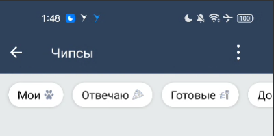

#### Компонент чипсы

| Класс                                                                                    | Ответственные                                                                    |
|------------------------------------------------------------------------------------------|----------------------------------------------------------------------------------|
| [SbisChipsItemView](src/main/java/ru/tensor/sbis/design/chips/item/SbisChipsItemView.kt) | [Смирных Павел](https://dev.sbis.ru/person/9bbcd3ea-ccea-4c94-a883-19c0d1d0ce0f) |
| [SbisChipsView](src/main/java/ru/tensor/sbis/design/chips/SbisChipsView.kt)              | [Смирных Павел](https://dev.sbis.ru/person/9bbcd3ea-ccea-4c94-a883-19c0d1d0ce0f) |

#### Используется в приложениях

Используется только в компоненте папок.

##### Внешний вид



##### Ссылки

[Стандарт внешнего вида](https://www.figma.com/proto/AEK2ocfsXgM31YUalhoMkm/%D0%A7%D0%B8%D0%BF%D1%81%D1%8B-(Web%2C-Mobile%2C-Retail)?page-id=0%3A1&node-id=3543-8202&viewport=588%2C477%2C0.42&scaling=min-zoom&hotspot-hints=0&hide-ui=1&starting-point-node-id=2138%3A5582)
[Документ API](https://online.sbis.ru/shared/disk/965c61c2-ed25-4723-96fb-1f931b655176)

##### Описание

SbisChipsView - набор из нескольких взаимосвязанных между собой кнопок. Используется для выбора одного или нескольких значений. 

##### Описание особенностей работы

Добавление в разметку:
```xml
<ru.tensor.sbis.sbis_chips.SbisChipsView
    android:layout_width="match_parent"
    android:layout_height="wrap_content"/>
```

Для управления видом и поведением списка чипсов нужно использовать поле `configuration`.
С помощью конфигурации можно изменять такие настройки как:
- Режим выбора элементов (одиночный, множественный и кастомный)
- Размещение элементов в одну строку или несколько, если они не помещаются
- Контрастный режим отображения фона элементов
- Read only режим элементов
- Стиль выбранных элементов (default, primary, secondary и т.д.)
- Режим отображения фона элементов (отображается всегда или только при выборе)
- Размер элементов

```kotlin
val sbisChipsView = SbisChipsView(context).apply {
    configuration = configuration.copy(
        selectionMode = SbisChipsSelectionMode.Multiple,
        multiline = true,
        contrastBackground = true,
        selectedStyle = SbisChipsStyle.SUCCESS
    )
}
```

Для установки списка элементов есть поле `items`. Туда передается список моделей `SbisChipsItem`.
В модели можно задать `id`, заголовок `SbisChipsCaption`, значение счетчика `counter` и
иконку `SbisChipsIcon`.
Для заголовка и иконки можно настроить кастомные размер и цвет.
Для заголовка еще настраивается положение относительно иконки (справа или слева от иконки).

```kotlin
val sbisChipsView = SbisChipsView(context).apply {
    items = listOf(
        SbisChipsItem(
            id = 0,
            caption = ChisChipsCaption("Zero"),
            counter = 1,
            icon = SbisChipsIcon(PlatformSbisString.Icon(SbisMobileIcon.Icon.smi_sabyPizza))
        )
    )
}
```

Выбранные элементы можно задать и получить через поле `selectedKeys`.
Для отслеживания изменения выбранных элементов нужно задать свой инстанс `SbisChipsSelectionDelegate`
в поле `selectionDelegate`.
У делегата есть три метода:
- onChange(selectedItems: List<Int>) - вызывается при любом изменении выбранных элементов. В параметр
приходит список выбранных элементов.
- onSelect(id: Int) - вызывается при единичном выборе чипса пользователем при нажатии. В параметр
приходит `id` выбранного элемента.
- onDeselect(id: Int) - вызывается при единичном снятии выбора с элемента пользователем. В параметр
приходит `id` элемента, который больше не является выбранным.
Для создания делегата есть несколько фабричных методов, которые позволяют быстро получить инстанс
делегата, если нет необходимости реализовывать все методы отслеживания.

```kotlin
val sbisChipsView = SbisChipsView(context).apply {
    // Создание делегата с реализацией всех методов
    selectionDelegate = object: SbisChipsSelectionDelegate() {
        override fun onChange(selectedItems: List<Int>) {
            TODO()
        }

        override fun onSelect(id: Int) {
            TODO()
        }

        override fun onDeselect(id: Int) {
            TODO()
        }
    }
    
    // Создание делегата с реализацией метода onChange
    selectionDelegate = sbisChipsChangeDelegate { selectedItems ->
        TODO()
    }
    
    // Создание делегата с реализацией методов отслеживания изменения отдельных элементов
    selectionDelegate = sbisChipsSingleChangeDeletate(
        onSelect = { id -> TODO() },
        onDeselect = { id -> TODO() }
    )
}
```

##### Стилизация

Стандартная тема `SbisChipsItemViewStyle`.

Для изменения темы SbisChipsItemView во всём приложении нужно переопределить тему собственной и прописать её в атрибут `SbisChipsItemViewTheme` в теме приложения:

```xml
<resources>

    <style name="AppTheme" parent="Theme.AppCompat.Light.DarkActionBar">
        <item name="sbisChipsItemViewTheme">@style/MySbisChipTheme</item>
    </style>

    <style name="MySbisChipTheme" parent="SbisChipsItemViewStyle">
        <item name="SbisChipsItemView_backgroundColor">@color/custom_color</item>
        <item name="SbisChipsItemView_titleColor">@color/custom_color</item>
        <item name="SbisChipsItemView_iconColor">@color/custom_color</item>
        <item name="SbisChipsItemView_clickedColor">@color/custom_color</item>
        <item name="SbisChipsItemView_cornerRadius">@dimen/custom_dimen</item>
    </style>

</resources>
```

##### xml атрибуты

- `SbisChipsItemView_titleColor` - цвет текста
- `SbisChipsItemView_iconColor` - цвет иконки
- `SbisChipsItemView_clickedColor` - цвет при нажатии (берется 10% от атрибута)
- `SbisChipsItemView_cornerRadius` - радиус скругления
- `SbisChipsItemView_backgroundColor` - цвет фона