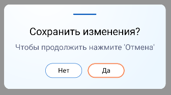

# Информационные сообщения

| Класс    | Класс | Ответственные                                                                         |
|----------|-------|---------------------------------------------------------------------------------------|
| [Информационные сообщения](https://online.sbis.ru/area/38d10bac-6619-4dc3-9e71-fa8066d2350a) |[ConfirmationDialog](https://git.sbis.ru/mobileworkspace/android-design/-/blob/rc-23.7100/design_confirmation_dialog/src/main/java/ru/tensor/sbis/design/confirmation_dialog/ConfirmationDialog.kt)|[Колпаков Михаил](https://online.sbis.ru/person/6b7e7802-6118-4fe4-9ec3-1db87bc0853c) |

## Документация

[Спецификация](https://n.sbis.ru/article/0f43727a-f045-4026-a926-4f9f6d3e837c)
[Макет](https://www.figma.com/proto/jR1RQPZka7deK3ecwCdGvx/%D0%98%D0%BD%D1%84%D0%BE%D1%80%D0%BC%D0%B0%D1%86%D0%B8%D0%BE%D0%BD%D0%BD%D1%8B%D0%B5-%D1%81%D0%BE%D0%BE%D0%B1%D1%89%D0%B5%D0%BD%D0%B8%D1%8F?page-id=830%3A4783&node-id=10416-27629&viewport=276%2C48%2C0.58&scaling=min-zoom&hotspot-hints=0&hide-ui=1)

## Описание

Информационное сообщение это окно, которое ожидает подтверждения или другой реакции от пользователя. При нажатии на кнопку окно закрывается.
## Внешний вид



## Описание публичного API

Для отображения окна создается модель с настройками окна, и вызывается метод с параметрами
расположения окна. Обратите внимание, что модель должна сериализоваться, поэтому список кнопок передается не
напрямую, а через лямбду.

Для обработки нажатий на кнопки родительский фрагмент или активити должны реализовать интерфейс ```ConfirmationButtonHandler```

```kotlin
class TestFragment : Fragment(), ConfirmationButtonHandler {

    fun showConfirmation() {
        val dialog = ConfirmationDialog(
            contentProvider = BaseContentProvider("message", "comment"),
            buttons = { listOf(CANCEL_BUTTON, OK_BUTTON) },
            style = ConfirmationDialogStyle.WARNING,
            tag = CONFIRMATION_TAG
        )
        // Показать информационное окно
        dialog.show(childFragmentManager)
    }

    override fun onButtonClick(tag: String?, id: String, sbisContainer: SbisContainerImpl) {
        when (tag) {
            CONFIRMATION_TAG ->  //some button action
        }
    }
}

private const val CONFIRMATION_TAG = "test dialog"
```

##### Трудозатраты внедрения
1 ч/д