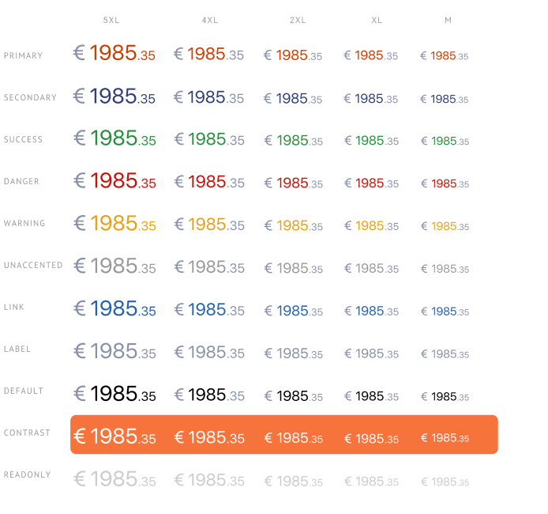
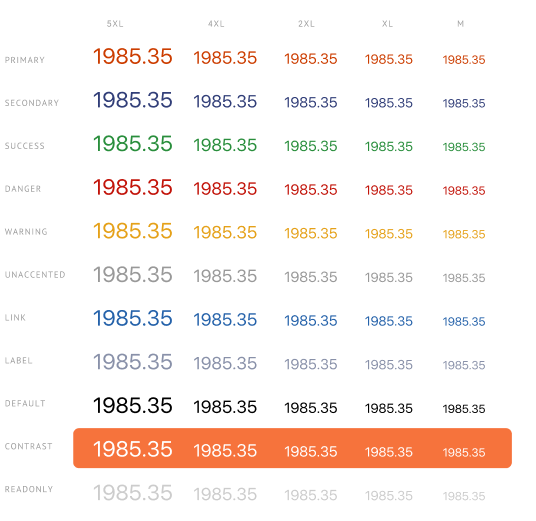

# Декораторы
| Ответственность | Ответственные                                                                    |
|-----------------|----------------------------------------------------------------------------------|
| Числовой        | [Смирных Павел](https://dev.sbis.ru/person/9bbcd3ea-ccea-4c94-a883-19c0d1d0ce0f) |
| Денежный        | [Смирных Павел](https://dev.sbis.ru/person/9bbcd3ea-ccea-4c94-a883-19c0d1d0ce0f) |

## Использование в приложениях
Не используется.

## Документация
Пока не реализовано.

## Описание

Декоратор — это красивая "обертка", которая позволяет пользователю видеть числа в читабельном формате.

## Описание публичного API


Значение можно задать как при создании декоратора, так и через методы `changeValue`.
Для изменения параметров стилизации, без изменения самого значения, нужно использовать метод `configure`,
который возвращает `Boolean`, который указывает на изменение настроек стилизации.
Для отображения значения нужно использовать `formattedValue`, где содержится уже отформатированное значение.

Пример использования:
```kotlin

val numberDecorator: NumberDecorator = NumberDecorator(context, 1905) {
    fontSize = NumberDecoratorFontSize.XL
    fontColorStyle = FontColorStyle.SECONDARY
    fontWeight = FontWeight.DEFAULT
    precision = 2u
    roundMode = RoundMode.ROUND
    useGrouping = true
    showEmptyDecimals = false
    abbreviationType = AbbreviationType.NONE
}
numberDecorator.changeValue("2005")
numberDecorator.configure {
    fontWeight = FontWeight.BOLD
    abbreviationType = AbbreviationType.LONG
}

sbisTextView.text = numberDecorator.formattedValue

```

```kotlin

val moneyDecorator: MoneyDecorator = MoneyDecorator(context, 1905) {
    fontSize = NumberDecoratorFontSize.XL
    fontColorStyle = FontColorStyle.SECONDARY
    fontWeight = FontWeight.DEFAULT
    precision = 2u
    roundMode = RoundMode.ROUND
    useGrouping = true
    showEmptyDecimals = false
    abbreviationType = AbbreviationType.NONE
    currency = MoneyDecoratorCurrency.Dollar
    currencyPosition = HorizontalPosition.LEFT
    currencySize = null
    currencyStyle = FontColorStyle.READ_ONLY
}

sbisTextView.text = moneyDecorator.formattedValue

```


##### Внешний вид


[Стандарт внешнего вида](https://www.figma.com/proto/9gNeGciO6aEWjk1vPs0ru1/%D0%A7%D0%B8%D1%81%D0%BB%D0%BE%D0%B2%D1%8B%D0%B5-%D0%B8-%D0%B4%D0%B5%D0%BD%D0%B5%D0%B6%D0%BD%D1%8B%D0%B5-%D0%B4%D0%B5%D0%BA%D0%BE%D1%80%D0%B0%D1%82%D0%BE%D1%80%D1%8B?node-id=1554-146148&scaling=min-zoom&page-id=47%3A431&starting-point-node-id=1554%3A146148)

##### Стилизация
Стилизация осуществляется через глобальные атрибуты темы.

##### Трудозатраты внедрения 
0.6 ч/д