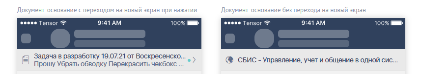

# Документ-основание
| Ответственность | Ответственные |
|-----------------|---------------|
|Документ-основание (Android)|[Документ-основание](https://dev.sbis.ru/area/8a9424d7-781c-496e-86b5-d94a03134be6)|

## Описание

Документ-основание - это панель, отражающая информацию о связанном документе. Есть два варианта использования компонента:
- DocumentLinkView.kt - view
- DocumentLinkDrawable.kt - drawable

## Руководство по подключению и инициализации
Для добавления модуля в проект необходимо settings.gradle проекта должны быть подключены следующие модули

| Репозиторий | модуль |
|-----------------|---------------|
|https://git.sbis.ru/mobileworkspace/android-design.git|design|
|https://git.sbis.ru/mobileworkspace/android-design.git|design_custom_view_tools|
|https://git.sbis.ru/mobileworkspace/android-design.git|design_utils|

Для подключения необходимо имплементировать зависимость:

| Репозиторий | модуль |
|-----------------|---------------|
|https://git.sbis.ru/mobileworkspace/android-design.git|design_document_link|

## Описание публичного API
Для занесения информации в компонент используется DocumentLinkModel.kt. В модель обязательно нужно передать title или comment.
```kotlin
val documentLinkView = view.findViewById<DocumentLinkView>(R.id.doc)
documentLinkView.documentLinkModel = DocumentLinkModel()
```

##### Внешний вид

[Стандарт внешнего вида](http://axure.tensor.ru/MobileStandart8/#g=1&p=документ-основание)


##### xml атрибуты
- `DocumentLink_titleColor` - цвет заголовка
- `DocumentLink_commentColor` - цвет комментария
- `DocumentLink_iconColor` - Цвет иконки документа
- `DocumentLink_bottomBorderColor` - Цвет разделителя
- `DocumentLink_backgroundColor` - Цвет фона виджета
- `DocumentLink_titleTextSize` - Размер текста заголовка
- `DocumentLink_commentTextSize` - Размер текста комментария
- `DocumentLink_arrowIconSize` - Размер иконки стрелки
- `DocumentLink_iconSize` - Размер иконки документа

##### Стилизация
Есть один стиль DocumentLinkDefaultStyle, его переопределение происходит, путем изменения глобальных переменных.

##### Трудозатраты внедрения
0.5 ч/д