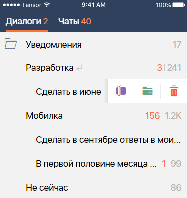

#### Компонент папок

|Класс|Ответственные|Добавить|
|-----|-------------|--------|
|[FoldersView](src/main/java/ru/tensor/sbis/design/folders/FoldersView.kt)|[Занин Артём](https://online.sbis.ru/person/84fbb56a-153a-41cd-8b3d-e74078742252)|[Задачу/поручение/ошибку](https://online.sbis.ru/area/d5cff451-8688-4af0-970a-8127570b0308)|
|[FolderListView](src/main/java/ru/tensor/sbis/design/folders/view/full/FolderListView.kt)|[Занин Артём](https://online.sbis.ru/person/84fbb56a-153a-41cd-8b3d-e74078742252)|[Задачу/поручение/ошибку](https://online.sbis.ru/area/d5cff451-8688-4af0-970a-8127570b0308)|

#### Используется в приложениях

- [Коммуникатор](https://git.sbis.ru/mobileworkspace/apps/droid/communicator)

##### Внешний вид

 

 

##### Ссылки

[Стандарт внешнего вида](http://axure.tensor.ru/MobileStandart8/#p=папки_техрешение&g=1)  
[Ссылка на API](https://n.sbis.ru/shared/disk/f37b6257-2214-4583-a946-be0c5a396804) 

##### Описание

Панель папок предназначена для группировки записей по папкам. По умолчанию список папок располагается в свернутом состоянии. В развернутом состоянии список папок располагается вертикально и может отображать максимум 20 папок. Если папок больше, отображается кнопка "Ещё", при нажатии на которую нужно отобразить всплывающую панель со всеми папками.

##### Отображение компонента

Добавление в разметку:
```xml
<ru.tensor.sbis.design.folders.FoldersView
    android:id="@+id/my_folders"
    android:layout_width="match_parent"
    android:layout_height="wrap_content"
    app:layout_constraintEnd_toEndOf="parent"
    app:layout_constraintTop_toTopOf="parent"/>
```

Для отображения данных нужно в метод _FoldersView.setFolders()_ передать список объектов [Folder](src/main/java/ru/tensor/sbis/design/folders/data/model/FolderItem.kt):
```kotlin
myFolders.setFolders(myFolders)
```

Добавление дополнительной команды(она может быть только одна) [AdditionalCommand](src/main/java/ru/tensor/sbis/design/folders/data/model/FolderItem.kt):
```kotlin
myFolders.setAdditionalCommand(AdditionalCommand("Title", AdditionalCommandType.DEFAULT) {
    showToast("Simple Command")
})
```

Для обработки действий: кликов по самой папке и кликов выдвижному меню нужно в метод _setActionHandler_ передать реализацию интерфейса [FolderActionHandler](src/main/java/ru/tensor/sbis/design/folders/data/FolderActionHandler.kt):

```kotlin
val actionHandler = object : FolderActionHandler {
    override fun handleAction(actionType: FolderActionType, folderId: String) {
        toast("$folderId ${actionType.name}")
    }
}

myFolders.setActionHandler(actionHandler)
```

Для обработки клика по кнопке "Ещё" нужно в метод _onMoreClicked_ передать реализацию интерфейса [MoreClickHandler](src/main/java/ru/tensor/sbis/design/folders/data/MoreClickHandler.kt) или лямбду:

```kotlin
myFolders.onMoreClicked {
    toast("More Button Clicked")
}
```

Настройка возможности разверуть панель только при наличии доп команды или папок второго уровня и глубже

```kotlin
myFolders.isExpandable = false
```

```xml
<ru.tensor.sbis.design.folders.FoldersView
    android:id="@+id/my_folders"
    android:layout_width="match_parent"
    android:layout_height="wrap_content"
    app:FoldersView_isExpandable="false"
/>
```

##### Стилизация

Стандартная тема `FoldersDefaultTheme`.

Для изменения темы FoldersView/FolderListView во всём приложении нужно переопределить тему собственной и прописать её в атрибут `foldersViewTheme` в теме приложения:

```xml
<resources>

    <style name="AppTheme" parent="Theme.AppCompat.Light.DarkActionBar">
        <item name="foldersViewTheme">@style/MyFoldersViewTheme</item>
    </style>

    <style name="MyFoldersTheme" parent="FoldersDefaultTheme">
        <item name="FoldersView_backgroundColor">@color/palette_color_gray3</item>
        <item name="FoldersView_folderButtonColor">@color/text_color_accent_2</item>
        <item name="FoldersView_moreButtonColor">@color/text_color_link_2</item>
        <item name="FoldersView_folderTitleColor">@color/text_color_black_1</item>
        <item name="FoldersView_additionalCommandColor">@color/design_folders_additional_command_text_color</item>
        <item name="FoldersView_folderIconColor">@color/text_color_black_4</item>
        <item name="FoldersView_folderUnreadCountColor">@color/text_color_accent_3</item>
        <item name="FoldersView_folderTotalCountColor">@color/text_color_black_3</item>
        <item name="FoldersView_folderCountsDividerColor">@color/text_color_black_4</item>
    </style>

</resources>
```

Атрибуты для изменения цветов отдельных элементов компонента:
 - `FoldersView_backgroundColor` - цвет фона
 - `FoldersView_folderButtonColor` - цвет кнопки в виде контурной папки, которая сворачивает\разворачивает компонент
 - `FoldersView_moreButtonColor` - цвет кнопки "Ещё"
 - `FoldersView_folderTitleColor` - цвет текста названия папки
 - `FoldersView_additionalCommandColor` - цвет текста дополнительной команды
 - `FoldersView_folderIconColor` - цвет иконки, расположенной справа от текста названия папки
 - `FoldersView_folderTotalCountColor` - цвет счётчика общего количества содержимого папки
 - `FoldersView_folderUnreadCountColor` - цвет счётчика непрочитанных
 - `FoldersView_folderCountsDividerColor` - цвет разделителя общего количества и непрочитанных (небольшая вертикальная линия)
 
 ##### Особенности работы
 
 Компонент состоит из двух частей:
 
 - [FoldersView](src/main/java/ru/tensor/sbis/design/folders/FoldersView.kt) - отображает свёрнутое и развёрнутое состояние, но в развёрнутом может показать не больше 20 папок. Если папок больше 20, отображается кнопка "Ещё", при нажатии на которую нужно показать всплывающую панель со всеми папками - это задача прикладного разработчика;
 - [FolderListView](src/main/java/ru/tensor/sbis/design/folders/view/full/FolderListView.kt) - отображает только развёрнутое состояние и может показать любое количество папок, но не может отображать дополнительные команды. Нужно использовать во всплывающей панели для отображения всех папок.

##### Трудозатраты внедрения
2 ч/д