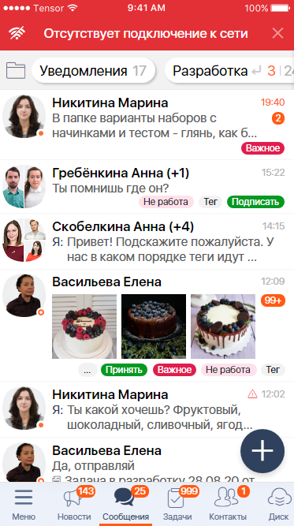
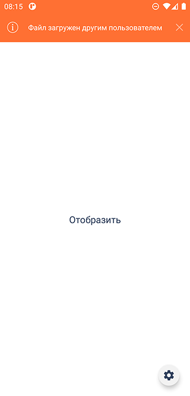
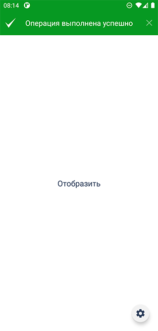

# Компоненты всплывающих уведомлений
| Ответственность | Ответственные |
|-----------------|---------------|
| Участок работ | [Панель-информер, снекбар, тост Android (Toast, SnackBar)](https://online.sbis.ru/area/fd03cdf4-3ba8-4606-b6e0-2b412fcedc30) |  

## Описание
Модель содержит компоненты для отображения всплывающих информационных уведомлений, а именно:
- [Панель-информер](#панель-информер)

## Руководство по подключению и инициализации
Для добавления модуля в проект, в `settings.gradle` проекта должны быть подключены следующие модули:

| Репозиторий | модуль |  
|-----------------|---------------|  
|https://git.sbis.ru/mobileworkspace/android-design.git |design|  
|https://git.sbis.ru/mobileworkspace/android-design.git |design_view_ext|  
|https://git.sbis.ru/mobileworkspace/android-design.git |design_utils|  
|https://git.sbis.ru/mobileworkspace/android-design.git |design_custom_view_tools|  
|https://git.sbis.ru/mobileworkspace/android-design.git |toolbar|  

## Описания UI компонентов
### Панель-информер
Панель-информер представляет собой панель с коротким информационным сообщением, уведомляющим 
пользователя о важном событии или ошибке.

Панель-информер следует использовать для отображения уведомлений, которые не требуют обратной связи 
от пользователя.  

При наступлении события, вызывающего отображение панели-информера, панель появляется вверху 
экрана, отображается в течение 3 секунд, затем автоматически скрывается. Панель можно закрыть до 
истечения таймера показа, нажав на крестик закрытия.

##### Внешний вид


  

[Стандарт внешнего вида](http://axure.tensor.ru/MobileStandart8/#p=панель-информер_v2&g=1)

##### Руководство по использованию
Для отображения компонента необходимо использовать [SbisPopupNotification](src/main/java/ru/tensor/sbis/design_notification/SbisPopupNotification.kt), указав стиль панели, 
отображаемое сообщение и иконку:
```kotlin
SbisPopupNotification.push(
	requireContext(),
	SbisPopupNotificationStyle.WARNING,
	getString(result.messageRes),
	SbisMobileIcon.Icon.smi_Undo.character.toString()
)
```
Наличие иконки опционально.  
В качестве стиля можно установить один из следующих вариантов:
- `INFORMATION` - акцентный стиль для информационных сообщений
- `SUCCESS` - стиль для сообщений об успешном действии
- `WARNING` - стиль для предупреждений о проблеме
- `ERROR` - стиль для сообщений об ошибке
- `NOTIFICATION` - стиль для уведомлений

Если стандартная компоновка панели не отвечает заданным требованиям, то имеется возможность 
предоставить собственную реализацию фабрики для создания `View` (по умолчанию используется 
`SbisInfoNotificationFactory`):
```kotlin
SbisPopupNotification.push(requireContext(), object : SbisNotificationFactory {

	override fun createView(context: Context, closeCallback: (() -> Unit)?): View {
		return CustomPopupNotificationView(context, closeCallback)
	}
})
```
Аргумент `closeCallback` должен быть вызван по клику на элемент, предназначенный для ручного 
скрытия панели.

##### Стилизация
Для каждого из описанных ранее стилей панели можно переопределить оформление. Достаточно 
переопределить в теме приложения соответствущие атрибуты:
- `sbisPopupNotificationInfoTheme`
- `sbisPopupNotificationSuccessTheme`
- `sbisPopupNotificationWarningTheme`
- `sbisPopupNotificationErrorTheme`
- `sbisPopupNotificationNotificationTheme`

Собственную тему можно унаследовать от `SbisPopupNotificationInfoBaseTheme`, а к переопределению 
доступны следующие атрибуты:
- `sbisPopupNotificationBackground` - цвет фона панели
- `sbisPopupNotificationTextColor` - цвет текста сообщения
- `sbisPopupNotificationIconColor` - цвет иконки
- `sbisPopupNotificationCloseIconAlpha` - прозрачность кнопки закрытия
- `sbisPopupNotificationCloseIconColor` - цвет кнопки закрытия
- `sbisPopupNotificationDividerColor` - цвет полосы разделителя снизу

##### Трудозатраты внедрения
0.5 ч/д