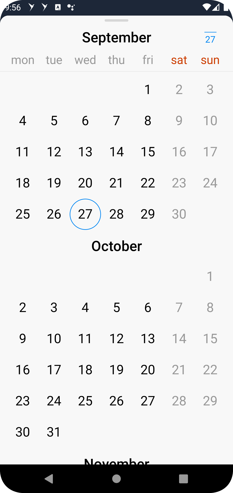
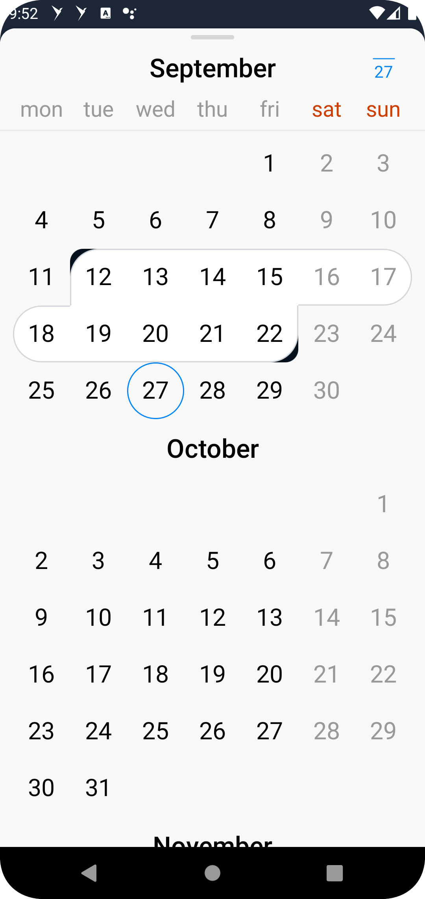
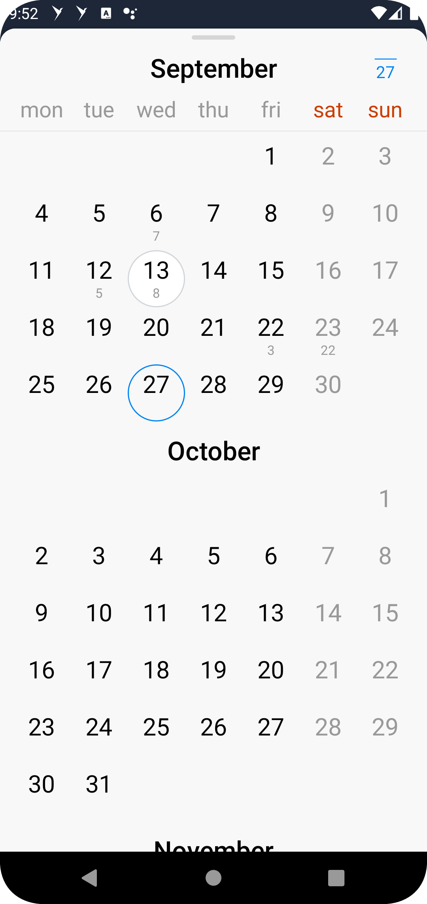
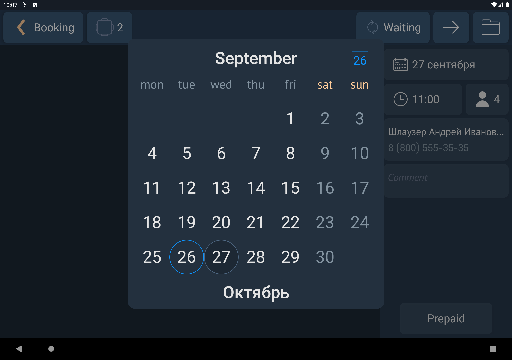

# Компактный выбор периода

|Модуль|Ответственные|
|--|-------------|
[compact_period_picker](design_period_picker/src/main/kotlin/ru/tensor/sbis/design/period_picker/view/period_picker/details/ui/mode/month)|[Круглова М.Б.](https://online.sbis.ru/person/8a7248e7-b4b2-4c2e-a988-3534eab414f8)

## Использование в приложениях
- [Коммуникатор](https://git.sbis.ru/mobileworkspace/apps/droid/communicator)
- [СБИС Presto](https://git.sbis.ru/mobileworkspace/apps/droid/retail)

## Внешний вид






## Стандарт
[Стандарт внешнего вида](http://axure.tensor.ru/StandardsV8/%D0%BA%D0%BE%D0%BC%D0%BF%D0%B0%D0%BA%D1%82%D0%BD%D1%8B%D0%B9_%D0%B2%D1%8B%D0%B1%D0%BE%D1%80_%D0%BF%D0%B5%D1%80%D0%B8%D0%BE%D0%B4%D0%B0_23_3100.html)
[Спецификация](https://n.sbis.ru/article/3dad3ee3-59e4-4831-ae39-b8ef9b9d12e6)
[Ссылка на API](https://online.sbis.ru/article/87e638c8-c31e-4c55-bf5c-201823775574)

## Описание
Компонент позволяет выбрать в календаре дату, либо период. Подходит для участков системы, где требуется выбор даты
в пределах месяца.
Может располагаться в окне, либо быть встроенным в страницу.
В календаре можно включить пометку рядом с датой (точку, счетчик).

## Подключение
В плагинной системе приложения необходимо зарегистрировать `SbisPeriodPickerPlugin`.
Для модуля, в котором компактный выбор периода будет использоваться, должна быть объявлена зависимость в файле
build.gradle implementation project(':design_period_picker')
- SbisPeriodPickerFeature - для отображения компонента в шторке (для смартфонов) или в контейнере (для планшетов).
- SbisCompactPeriodPickerFragmentFeature - для отображения компонента, встроенным в страницу (в виде фрагмента).

## Стилизация
Тема компонента по умолчанию SbisPeriodPickerViewTheme.
Для Розницы/Престо используется тема SbisPeriodPickerViewLargeTheme.
Тема компонента может задаваться через атрибут `sbisPeriodPickerViewTheme`.

При необходимости можно оформить собственную тему, задав требуемые значения следующих атрибутов:

|Атрибут|Описание|
|-------|--|
|HeaderLabel_monthLabelHeight|Высота заголовка с наименованием месяца|  
|HeaderLabel_weekDaysHeight|Высота элемента с днями недели|
|DayView_textSize|Размер текста для дня в календаре|  
|DayView_counterTextSize|Размер текста для счётчика в календаре|  
|DayView_counterMargin|Отступ от дня до счётчика в календаре|  
|DayView_borderRadius|Радиус скругления для начального и конечного значения периода (черный уголок)|  
|MonthLabel_textSize|Размер текста месяца в календаре|
|DayLabel_textSize|Размер текста для дней недели|

## Описание особенностей работы
Для отображения самого компонента необходимо воспользоваться методом `showCompactPeriodPicker` соответсующей
фичи SbisPeriodPickerFeature/SbisCompactPeriodPickerFragmentFeature, передав ему обязательные и желаемые параметры
отображения (с учетом способа отображения - в окне или через встраивание).

Для получение результата выбора периода используется Fragment Result API. Поэтому чтобы получить результата выбора
периода необходимо подписаться на setFragmentResultListener. Результатом будет SbisPeriodPickerRange.
Ключ запроса и ключ результата лежат в интерфейсе SbisPeriodPickerFeature.
Также можно использовать собственные ключи, передав их в качестве параметра в метод `showCompactPeriodPicker`.
```kotlin
/** Ключ запроса для получения выбранного периода через Fragment Result API. */
const val periodPickerRequestKey = "compactPeriodPickerRequestKey"

/** Ключ результата для получения выбранного периода через Fragment Result API. */
const val periodPickerResultKey = "compactPeriodPickerResultKey"
```

```kotlin
setFragmentResultListener(periodPickerRequestKey) { _, bundle ->
    val result = bundle.getParcelable(periodPickerResultKey) as? SbisPeriodPickerRange
    result?.let {
        // Do something with the result.
    }
}
```

### Пример использования
- Отображения компонента в окне:
```kotlin
setFragmentResultListener(periodPickerRequestKey) { _, bundle ->
    val result = bundle.getParcelable(periodPickerResultKey) as? SbisPeriodPickerRange
    result?.let {
        // Do something with the result.
    }
}

periodPickerFeature.showCompactPeriodPicker(
    view.context,
    parentFragmentManager,
    startValue = currentPeriod?.startDate,
    endValue = currentPeriod?.endDate,
    isEnabled = settingsViewModel.isEnabled,
    selectionType = getSelectionType(settingsViewModel.selectionTypePosition),
    dayType = getMarkerType(settingsViewModel.markerTypePosition),
    customView = if (settingsViewModel.isCustomViewVisible) {
        { context -> 
            SbisButton(context).apply { 
                style = PrimaryButtonStyle
                model = SbisButtonModel(
                    title = SbisButtonTitle(
                        resources.getString(R.string.design_demo_period_picker_custom_button)
                    )
                )
            }
        }
    } else { null }
)
```
- Отображения компонента, встроенного в страницу:
```kotlin
    periodPickerFragmentFeature.showCompactPeriodPicker(
        this@CompactPeriodPickerFragmentFeatureFragment,
        R.id.design_demo_show_period_picker_fragment,
        startValue = null,
        endValue = null,
        dayType = SbisPeriodPickerDayType.Simple
)
```

##### Трудозатраты внедрения
1 ч/д