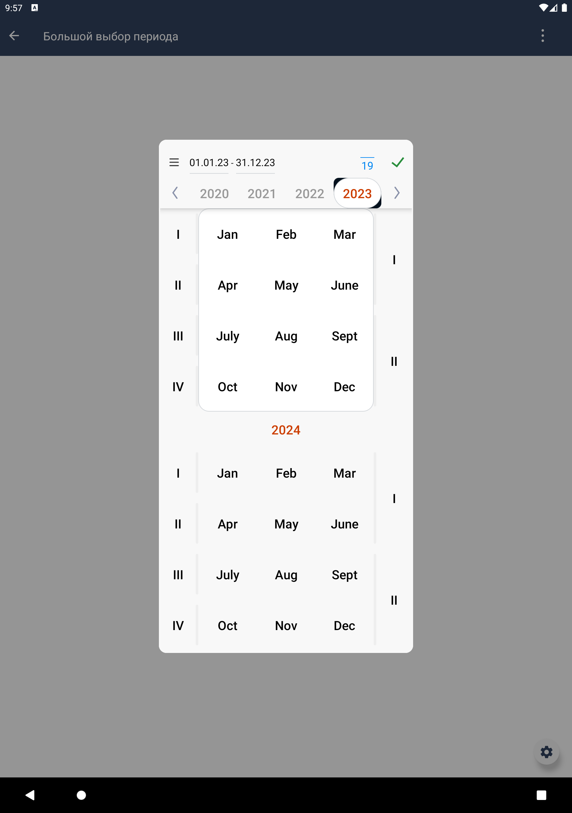

# Большой выбор периода

|Модуль|Ответственные|
|--|-------------|
[period_picker](design_period_picker/src/main/kotlin/ru/tensor/sbis/design/period_picker/view/period_picker/big)|[Круглова М.Б.](https://online.sbis.ru/person/8a7248e7-b4b2-4c2e-a988-3534eab414f8)

## Использование в приложениях
- [Коммуникатор](https://git.sbis.ru/mobileworkspace/apps/droid/communicator)
- [СБИС Presto](https://git.sbis.ru/mobileworkspace/apps/droid/retail)

## Внешний вид





## Стандарт
[Стандарт внешнего вида](http://axure.tensor.ru/StandardsV8/%D0%B1%D0%BE%D0%BB%D1%8C%D1%88%D0%BE%D0%B9_%D0%B2%D1%8B%D0%B1%D0%BE%D1%80_%D0%BF%D0%B5%D1%80%D0%B8%D0%BE%D0%B4%D0%B0.html)
[Спецификация](https://n.sbis.ru/article/df292ff7-1469-418d-8dce-fe2e63ac5d8e)
[Ссылка на API](https://n.sbis.ru/mobile/knowledge?folder=87e638c8-c31e-4c55-bf5c-201823775574)

## Описание
Компонент позволяет выбрать любой диапазон дат: от нескольких лет до одного дня. Подходит для участков системы, 
где требуется произвольный выбор периода. Располагается в окне. Работает в двух режимах: список лет и список месяцев. 
Режимы переключаются в шапке по кнопке.
В списке лет можно выбрать квартал или полугодие в один клик. В два клика выбирается период в один или несколько 
месяцев, год, несколько лет.
В списке месяцев можно выбрать период в один или несколько дней.

## Подключение
В плагинной системе приложения необходимо зарегистрировать `SbisPeriodPickerPlugin`.
Для модуля, в котором большой выбор периода будет использоваться, должна быть объявлена зависимость в файле
build.gradle implementation project(':design_period_picker')
- SbisPeriodPickerFeature - для отображения компонента в шторке (для смартфонов) или в контейнере (для планшетов).

## Стилизация
Тема компонента по умолчанию SbisPeriodPickerViewTheme.
Для Розницы/Престо используется тема SbisPeriodPickerViewLargeTheme.
Тема компонента может задаваться через атрибут `sbisPeriodPickerViewTheme`.

## Описание особенностей работы
Для отображения самого компонента необходимо воспользоваться методом `showPeriodPicker` фичи
SbisPeriodPickerFeature, передав ему обязательные и желаемые параметры отображения.

Для получение результата выбора периода используется Fragment Result API. Поэтому чтобы получить результата выбора
периода необходимо подписаться на setFragmentResultListener. Результатом будет SbisPeriodPickerRange.
Ключ запроса и ключ результата лежат в интерфейсе SbisPeriodPickerFeature. Также можно использовать собственные ключи,
передав их в качестве параметра в метод `showPeriodPicker`.

```kotlin
/** Ключ запроса для получения выбранного периода через Fragment Result API. */
const val periodPickerRequestKey = "compactPeriodPickerRequestKey"

/** Ключ результата для получения выбранного периода через Fragment Result API. */
const val periodPickerResultKey = "compactPeriodPickerResultKey"
```

```kotlin
setFragmentResultListener(periodPickerRequestKey) { _, bundle ->
    val result = bundle.getParcelable(periodPickerResultKey) as? SbisPeriodPickerRange
    result?.let {
        // Do something with the result.
    }
}
```

### Пример использования
```kotlin
periodPickerFeature.showPeriodPicker(
    view.context,
    parentFragmentManager,
    startValue = currentPeriod?.startDate,
    endValue = currentPeriod?.endDate,
    isEnabled = settingsViewModel.isEnabled,
    headerMask = getHeaderMask(settingsViewModel.headerMaskPosition),
    isBottomPosition = settingsViewModel.isBottomCalendar,
    displayedRanges = listOf(
        SbisPeriodPickerRange(
            startDate = startDisplayedRange,
            endDate = endDisplayedRange
        )
    ),
    presetStartValue = if (settingsViewModel.hasPresetPeriod) startPresetPeriod else null,
    presetEndValue = if (settingsViewModel.hasPresetPeriod) endPresetPeriod else null,
    anchorDate = settingsViewModel.autoTestScrollDate,
    selectionType = getSelectionType(settingsViewModel.selectionTypePosition),
    isOneDaySelection = settingsViewModel.isOneDaySelection
)
```

##### Трудозатраты внедрения
1 ч/д