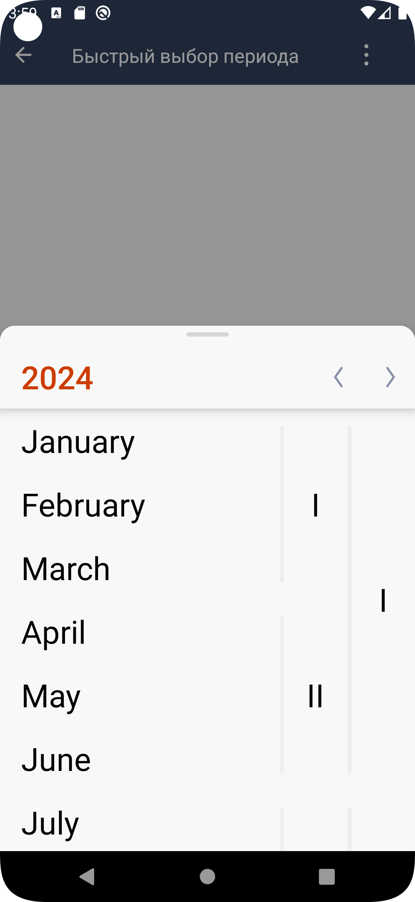
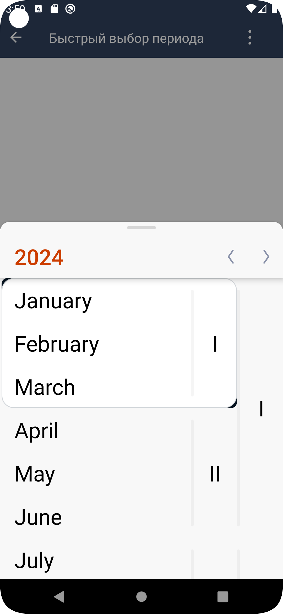
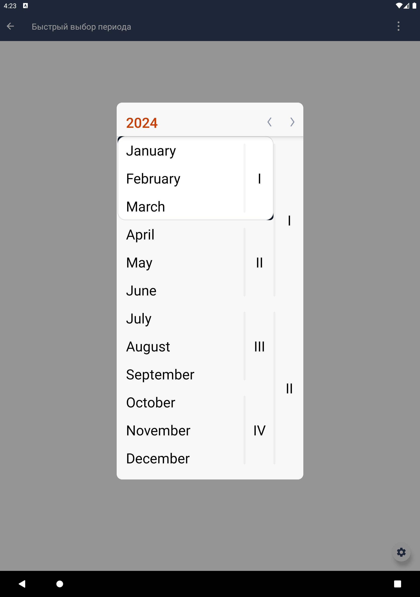

# Быстрый выбор периода

|Модуль|Ответственные|
|--|-------------|
[short_period_picker](design_period_picker/src/main/kotlin/ru/tensor/sbis/design/period_picker/view/short_period_picker)|[Круглова М.Б.](https://online.sbis.ru/person/8a7248e7-b4b2-4c2e-a988-3534eab414f8)

## Использование в приложениях
- [Коммуникатор](https://git.sbis.ru/mobileworkspace/apps/droid/communicator)
- [СБИС Presto](https://git.sbis.ru/mobileworkspace/apps/droid/retail)

## Внешний вид




## Стандарт
[Стандарт внешнего вида](http://axure.tensor.ru/StandardsV8/%D0%B1%D1%8B%D1%81%D1%82%D1%80%D1%8B%D0%B9_%D0%B2%D1%8B%D0%B1%D0%BE%D1%80_%D0%BF%D0%B5%D1%80%D0%B8%D0%BE%D0%B4%D0%B0.html)
[Спецификация](https://n.sbis.ru/article/2204ba9e-67ff-48b1-b9cb-cc29312752e0)
[Ссылка на API](https://n.sbis.ru/article/7f5f5235-b475-4de3-aee7-39cbd4487b57)

## Описание
Компонент позволяет выбрать период дат в один клик: год, полугодие, квартал, месяц, неделя, день. Список квантов
может быть различным, например: год, полугодие, квартал и месяц; только год; только месяц.
Подходит для участков системы, где требуется выбор отчетного периода.

## Подключение
В плагинной системе приложения необходимо зарегистрировать `SbisPeriodPickerPlugin`.
Для модуля, в котором быстрый выбор периода будет использоваться, должна быть объявлена зависимость в файле
build.gradle implementation project(':design_period_picker')
- SbisPeriodPickerFeature - для отображения компонента в шторке (для смартфонов) или в контейнере (для планшетов).

## Стилизация
Тема компонента по умолчанию SbisPeriodPickerViewTheme.
Для Розницы/Престо используется тема SbisPeriodPickerViewLargeTheme.
Тема компонента может задаваться через атрибут `sbisPeriodPickerViewTheme`.

## Описание особенностей работы
Для отображения самого компонента необходимо воспользоваться методом `showShortPeriodPicker` фичи
SbisPeriodPickerFeature, передав ему обязательные и желаемые параметры отображения.

Для получение результата выбора периода используется Fragment Result API. Поэтому чтобы получить результата выбора
периода необходимо подписаться на setFragmentResultListener. Результатом будет SbisPeriodPickerRange.
Ключ запроса и ключ результата лежат в интерфейсе SbisPeriodPickerFeature. Также можно использовать собственные ключи,
передав их в качестве параметра в метод `showShortPeriodPicker`.
```kotlin
/** Ключ запроса для получения выбранного периода через Fragment Result API. */
const val periodPickerRequestKey = "compactPeriodPickerRequestKey"

/** Ключ результата для получения выбранного периода через Fragment Result API. */
const val periodPickerResultKey = "compactPeriodPickerResultKey"
```

```kotlin
setFragmentResultListener(periodPickerRequestKey) { _, bundle ->
    val result = bundle.getParcelable(periodPickerResultKey) as? SbisPeriodPickerRange
    result?.let {
        // Do something with the result.
    }
}
```

### Пример использования
```kotlin
periodPickerFeature.showShortPeriodPicker(
    view.context,
    parentFragmentManager,
    SbisShortPeriodPickerVisualParams(
        arrowVisible = settingsViewModel.isArrowVisible,
        chooseMonths = settingsViewModel.isMonthVisible,
        chooseQuarters = settingsViewModel.isQuarterVisible,
        chooseHalfYears = settingsViewModel.isHalfYearVisible,
        chooseYears = settingsViewModel.isYearVisible
    ),
    startValue = currentPeriod?.startDate,
    endValue = currentPeriod?.endDate,
    isEnabled = settingsViewModel.isEnabled,
    isBottomPosition = settingsViewModel.isBottomCalendar,
    displayedRanges = if (settingsViewModel.isLimitedCalendar) {
        listOf(
            SbisPeriodPickerRange(
                startDate = startDisplayedRange,
                endDate = endDisplayedRange
            )
        )
    } else {
        null
    }
)
```

##### Трудозатраты внедрения
1 ч/д