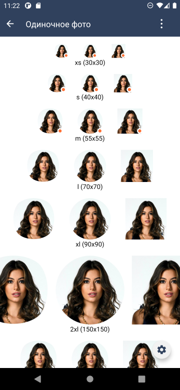
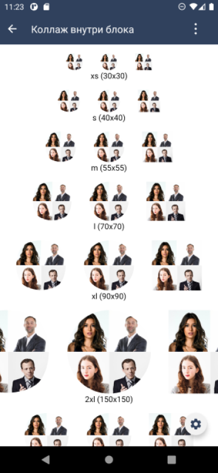
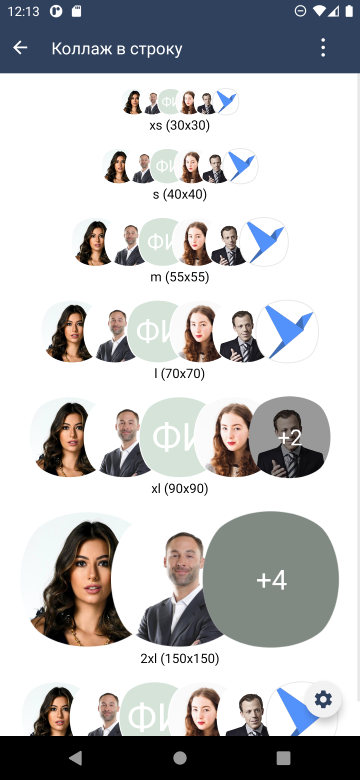

# Модуль компонентов фото сотрудника и компоновки заголовка с фото и подзаголовком в шапке

| Ответственность | Ответственные                                                                                                                                           |
|-----------------|---------------------------------------------------------------------------------------------------------------------------------------------------------|
| Участок работ   | [Фото персоны, коллажи Android (SuperEllipseDraweeView, SbisPersonView, PersonListView)](https://dev.sbis.ru/area/70ded448-175c-4f17-8bbe-b5e6183f8ba3) |  
| Участок работ   | [Шапка Android (SbisTitleView)](https://dev.sbis.ru/area/032ce313-3165-4a34-b847-852076e3cf03)                                                          |  

## Описание

Модуль содержит:

- Компоненты фото сотрудника (`PersonView`, `PersonCollageView`, `PersonCollageLineView`)
- Инструменты для использования фото сотрудника с databinding (`binding.kt`)
- Инструмент для предварительной загрузки изображений в bitmap-кэш (`ImageBitmapPreFetcher`)
- View для отображения заголовка, подзаголовка и фотографий в тулбаре (`SbisTitleView`)
- Инструмент для форматирования ФИО (`PersonNameTemplate`)

## Руководство по подключению и инициализации

Для добавления модуля в проект, в `settings.gradle` проекта должны быть подключены следующие модули:

| Репозиторий                                            | модуль                   |  
|--------------------------------------------------------|--------------------------|  
| https://git.sbis.ru/mobileworkspace/android-design.git | design                   |  
| https://git.sbis.ru/mobileworkspace/android-design.git | design_view_ext          |  
| https://git.sbis.ru/mobileworkspace/android-design.git | design_utils             |  
| https://git.sbis.ru/mobileworkspace/android-design.git | view_factory             |  
| https://git.sbis.ru/mobileworkspace/android-design.git | design_custom_view_tools |  
| https://git.sbis.ru/mobileworkspace/android-utils.git  | fresco_view              |  
| https://git.sbis.ru/mobileworkspace/android-utils.git  | plugin_struct            |  
| https://git.sbis.ru/mobileworkspace/android-serviceapi | person-decl              |  

В плагинной системе приложения необходимо зарегистрировать `PersonViewPlugin`.

## Описания UI компонентов

### Фото сотрудника (`PersonView`)

Предназначен для отображения одиночного фото с опциональным статусом активности, в одной из
предусмотренных форм (квадрат, круг или суперэллипс).

##### Внешний вид



[Стандарт внешнего вида](http://axure.tensor.ru/MobileStandart8/#p=изображения_3&g=1)

##### Руководство по использованию

Пример использования компонента в макете:

```xml
<ru.tensor.sbis.design.profile.person.PersonView 
    android:id="@+id/person_photo_m" 
    android:layout_width="wrap_content" android:layout_height="wrap_content" 
    app:PersonView_size="m"/>
```

Размер предпочтительно использовать один из предустановленных (описаны в стандарте). Для этого
предусмотрен атрибут `PersonView_size`, а также метод `setSize()`. При использовании метода, его
нужно вызвать до установки данных. Если требуется произвольный размер, то нужно явно указать
значения `layout_width` и `layout_height`.

Пример установки отображаемых данных:

```kotlin
personView.setViewData(
    PersonData(
        person.uuid,
        person.photoUrl,
        InitialsStubData(person.initials, person.initialsBackgroundColor)
    )
)
```

В качестве данных можно установить один из предусмотренных типов, ключевым отличием которых является
используемая при отсутствии изображения заглушка:

- `PersonData` - изображение персоны (заглушка с человечком)
- `CompanyData` - изображение компании (заглушка со зданием)
- `GroupData` - изображение группы социальной сети (заглушка с группой лиц)
- `ImageData` - изображение с произвольной заглушкой
- `DepartmentData` - данные подразделения. Использование для одиночного фото возможно только если
  список отображаемых данных пуст и `uuid == null`.

При использовании `PersonData` нужно указать инициалы, отображаемые в заглушке (`InitialsStubData`).
Несмотря на наличие инструментов по их формированию на основе ФИО, желательно использовать значения,
явно или неявно полученные от микросервиса профилей для заданного uuid. Для переопределения цвета
инициалов предусмотрен атрибут `PersonView_initialsColor`. При отсутствии инициалов, будет
отображаться стандартная заглушка с силуэтом персоны.

Можно установить форму изображения. По умолчанию - суперэллипс. Для изменения используется
атрибут `PersonView_shape` или метод `setShape()`.

У компонента может опционально отображаться индикатор статуса активности. Для его установки
предусмотрен метод `setActivityStatus()`. См.
стандарт ["Статусы пользователя"](https://www.figma.com/proto/gCd9BuxrlCBzYeBLaaRZhc/%E2%9C%8F%EF%B8%8F%D0%AD%D0%BA%D1%81%D0%BF%D0%B5%D1%80%D0%B8%D0%BC%D0%B5%D0%BD%D1%82%D1%8B-(%D0%9C%D0%B0%D0%B7%D0%B8%D0%BB%D0%BE%D0%B2%D0%B0)?page-id=2829%3A72708&node-id=3034%3A89264&scaling=min-zoom&starting-point-node-id=3034%3A89264&hide-ui=1)

###### Обработка нажатий

Если в приложении предусмотрен плагин, предоставляющий реализацию `PersonClickListener`, то все фото
сотрудника c валидным `uuid` по умолчанию кликабельны и вызывают его по клику. Если в частном случае
никакая обработка кликов не требуется, нужно установить `android:clickable="false"`. Также,
предусмотрена установка прикладного обработчика кликов, используя метод `setClickListener()`.

### Коллаж внутри блока (`PersonCollageView`)

Предназначен для отображения коллажа из 1-4 фото, в одной из предусмотренных форм (квадрат, круг или
суперэллипс).

##### Внешний вид



[Стандарт внешнего вида](http://axure.tensor.ru/MobileStandart8/#p=изображения_3&g=1)

##### Руководство по использованию

Пример использования компонента в макете:

```xml
<ru.tensor.sbis.design.profile.personcollage.PersonCollageView
    android:id="@+id/person_collage_s_circle" 
    android:layout_width="wrap_content"
    android:layout_height="wrap_content" 
    app:PersonCollageView_shape="circle"
    app:PersonCollageView_size="s"/>
```

Для установки размера и формы предусмотрены атрибуты, аналогичные с одиночным фото,
`PersonCollageView_size` и `PersonCollageView_shape`.

Пример установки отображаемых данных:

```kotlin
// Установка списка отображаемых фото
personCollage.setDataList(
    persons.map {
        PersonData(
            it.uuid,
            it.photoUrl,
            InitialsStubData(it.initials, it.initialsBackgroundColor)
        )
    }
)
// Установка данных подразделения. В списке первым должен быть руководитель подразделения
departmentCollage.setDataList(
    listOf(
        DepartmentData(
            departmentUuid,
            listOf(
                PersonData(headOfDepartment.uuid, headOfDepartment.photoUrl),
                PersonData(firstEmployee.uuid, firstEmployee.photoUrl),
                PersonData(secondEmployee.uuid, secondEmployee.photoUrl)
            )
        )
    )
)
```

Если задано единственное изображение, то компонент может опционально отображать индикатор статуса
активности. Для его установки предусмотрен метод `setActivityStatus()`.

###### Обработка нажатий

Если задано единственное изображение, либо коллаж подразделения с валидным `uuid`, то обработка
клика аналогична одиночному фото. Метод `setClickListener()` позволяет определить обработку как
клика по одиночному фото, так и клика по коллажу.

### Коллаж в строку (`PersonCollageLineView`)

Предназначен для отображения коллажа фото, располагаемых в ряд по горизонтали. Поверх последнего
фото может отображаться счётчик, если некоторые фото не поместились на экран, либо значение такого
счётчика задано явно.

##### Внешний вид



[Стандарт внешнего вида](http://axure.tensor.ru/MobileStandart8/#p=изображения_3&g=1)

##### Руководство по использованию

Пример использования компонента в макете:

```xml
<ru.tensor.sbis.design.profile.personcollagelist.PersonCollageLineView
    android:id="@+id/person_collage_xl" 
    android:layout_width="wrap_content"
    android:layout_height="wrap_content" 
    app:PersonCollageLineView_size="xl"/>
```

Размеры компонента могут быть как фиксированы, так и зависеть от содержимого.
Атрибут `PersonCollageLineView_size` определяет размер элементов в коллаже. По умолчанию, он не
указан, и определяется исходя из значения `layout_height`, с учётом внутренних отступов.
Рекомендуется использовать одно из предустановленных значений размера, либо указав атрибут, либо
вызвав метод `setSize()`.

Как и для одиночного фото, имеется возможность изменить форму изображений (по умолчанию -
суперэллипс) с помощью атрибута `PersonCollageLineView_shape`, а также задать цвет инициалов (
атрибут `PersonCollageLineView_initialsColor`).

Пример установки отображаемых данных:

```kotlin
personCollageLine.setDataList(
    persons.map {
        PersonData(
            it.uuid,
            it.photoUrl,
            InitialsStubData(it.initials, it.initialsBackgroundColor)
        )
    }
)
// Ограничиваем число видимых элементов не доступной шириной, а фиксированным числом.
// Число непоместившихся изображений будет присутствовать в счётчике.
personCollageLine.setMaxVisibleCount(5)
```

Можно указать максимальное число видимых фото (атрибут `PersonCollageLineView_maxVisibleCount` или
метод `setMaxVisibleCount()`). Тогда, если число элементов, установленных в `setDataList()`превышает
ограничение, то величина этого превышения отобразится в счётчике, а фактически отобразится только
ограниченное число элементов.

Не обязательно указывать все элементы для отображения, особенно, если их много больше, чем может
поместиться на экране. Используя метод `setTotalCount()` можно указать значение, которое будет
учитываться при формировании счётчика, если оно превышает число элементов, заданных
посредством `setDataList()`.

При использовании компонента в списке, рекомендуется задать пул элементов, чтобы избежать избыточное
число их пересоздания. Для этого предусмотрен метод `setViewPool()`.

##### Трудозатраты внедрения

0.8 ч/д
