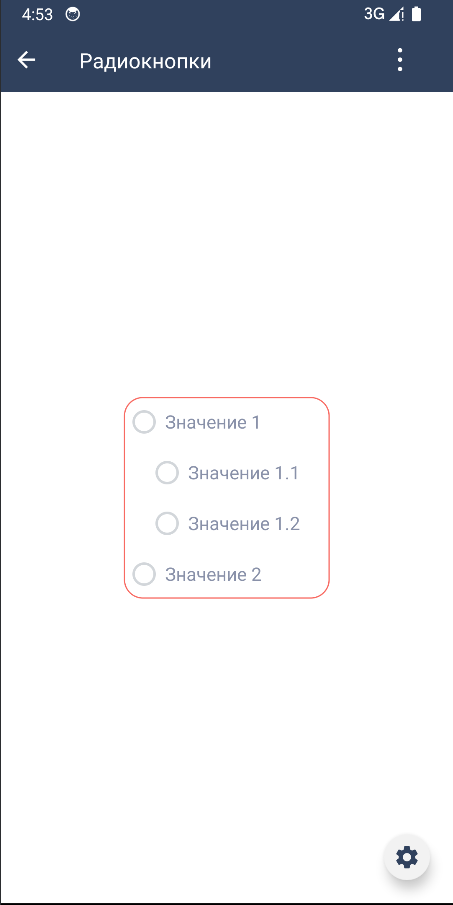

# Компонент "Радиокнопки"
| Ответственность                                                                 | Ответственные                                                                       |
|---------------------------------------------------------------------------------|-------------------------------------------------------------------------------------|
| [Радиокнопки](https://online.sbis.ru/area/300bbb19-c63a-4614-88b9-fc961174a8e9) | [Смирных Павел](https://online.sbis.ru/person/9bbcd3ea-ccea-4c94-a883-19c0d1d0ce0f) |  

## Описание
Компонент "Радиокнопки" позволяет выбрать одно значение из нескольких.


### Внешний вид



[Стандарт внешнего вида](https://www.figma.com/proto/huCYY2f1EDFdrQkGU9wyfU/%D0%A0%D0%B0%D0%B4%D0%B8%D0%BE%D0%BA%D0%BD%D0%BE%D0%BF%D0%BA%D0%B8?page-id=1%3A3&type=design&node-id=49-15623&t=PdVuRIltDcUPrZaW-0&scaling=min-zoom&starting-point-node-id=49%3A15623&hide-ui=1)

[Ссылка на API](https://dev.sbis.ru/article/2a3e87a1-df0d-444c-89d0-28cb93651c19)

### Описание особенностей работы

#### Использование

```kotlin

val radioGroup = SbisRadioGroupView(context).apply {
    multiline = true
    orientation = SbisRadioGroupOrientation.VERTICAL
    titlePosition = SbisRadioGroupTitlePosition.RIGHT
    validationStatus = SbisRadioGroupValidationStatus.INVALID
    readOnly = false
    items = listOf(
        SbisRadioGroupItem(
            id = "1",
            content = SbisRadioGroupContent.Default("Значение 1"),
            children = listOf(
                SbisRadioGroupItem(
                    id = "1.1",
                    content = SbisRadioGroupContent.Default("Значение 1.1")
                ),
                SbisRadioGroupItem(
                    id = "1.2",
                    content = SbisRadioGroupContent.Default("Значение 1.2")
                )
            )
        ),
        SbisRadioGroupItem(
            id = "2",
            content = SbisRadioGroupContent.Default("Значение 2")
        )
    )
    selectedKey = "1.2"
    onSelectedKeyChanged = { newKey ->
        Timber.d("New selected radio button id $newKey")
    }
}

```

#### Стилизация

Для стилизации компонента присутствуют следующие атрибуты:

 - `SbisRadioGroupView_selectedCircleColor` - цвет выбранного состояния маркера радиокнопки.
 - `SbisRadioGroupView_unselectedCircleColor` - цвет обычного состояния маркера радиокнопки.
 - `SbisRadioGroupView_readOnlySelectedCircleColor` - цвет выбранного состояния маркера радиокнопки в режиме чтения.
 - `SbisRadioGroupView_readOnlyUnselectedCircleColor` - цвет маркера радиокнопки в режиме чтения.
 - `SbisRadioGroupView_defaultContentTextColorReadOnly` - цвет текста для стандартного контента в режиме чтения.
 - `SbisRadioGroupView_defaultContentTextColorSelected` - цвет текста для стандартного контента в выбранном состоянии.
 - `SbisRadioGroupView_defaultContentTextColor` - цвет текста для стандартного контента.
 - `SbisRadioGroupView_validationBorderColor` - цвет рамки валидации.
 - `SbisRadioGroupView_borderCircleRadius` - радиус внешнего круга маркера радиокнопки.
 - `SbisRadioGroupView_selectedCircleRadius` - радиус внутреннего круга маркера радиокнопки.
 - `SbisRadioGroupView_borderWidth` - ширина внешнего круга маркера радиокнопки.
 - `SbisRadioGroupView_defaultMarkerPadding` - стандартный отступ от маркера до контента радиокнопки.
 - `SbisRadioGroupView_defaultHorizontalPadding` - стандартный отступ между радиокнопками в горизонтальной ориентации.
 - `SbisRadioGroupView_defaultContentTextSize` - размер текста для стандартного контента.
 - `SbisRadioGroupView_topPadding` - верхний отступ радиокнопки до стандартного контента.
 - `SbisRadioGroupView_bottomPadding` - нижний отступ радиокнопки от стандартного контента.
 - `SbisRadioGroupView_circleTopPadding` - верхний отступ маркера радиокнопки.
 - `SbisRadioGroupView_validationBorderRadius` - скругление рамки валидации.
 - `SbisRadioGroupView_validationBorderWidth` -толщина рамки валидации.
 - `SbisRadioGroupView_validationPadding` - отступ от рамки валидации до контента.

Для переопределения в теме можно задать атрибут `sbisRadioGroupTheme`.

##### Трудозатраты внедрения
0.5 ч/д