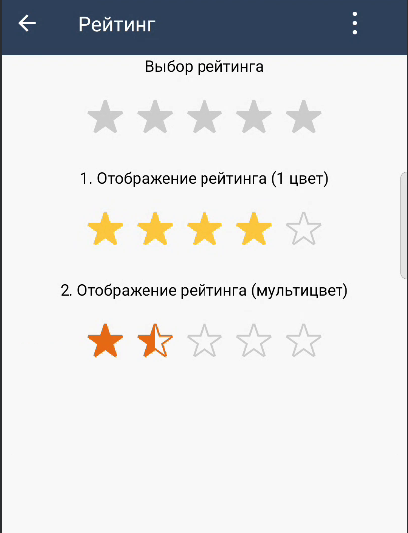

# Компонент "Рейтинг"
| Ответственность                                                          | Ответственные                                                                       |
|--------------------------------------------------------------------------|-------------------------------------------------------------------------------------|
| [Рейтинг](https://dev.sbis.ru/area/babbb2f3-c0e6-4fe8-846e-1da55d89525b) | [Смирных Павел](https://online.sbis.ru/person/9bbcd3ea-ccea-4c94-a883-19c0d1d0ce0f) |  

## Описание
Компонент Рейтинг используется для выставления оценки (например, когда пользователь оставляет отзыв) и отображения рейтинга.


### Внешний вид



[Стандарт внешнего вида](https://www.figma.com/proto/7RwDqYnCpBvKWuKPlGcI78/Рейтинг?page-id=0%3A1&node-id=2809-5620&viewport=386%2C48%2C0.64&scaling=min-zoom&starting-point-node-id=2809%3A5620&hide-ui=1&t=rOYlqNbIRU5SYDsP-8)

[Ссылка на API](https://n.sbis.ru/article/aa9c1dea-91a0-42cd-8cf0-a1c01562cdb7)

### Описание особенностей работы

#### Использование

```kotlin

val rating = SbisRatingView(context).apply {
    emptyIconFilledMode = SbisRatingFilledMode.BORDERED
    colorsMode = SbisRatingColorsMode.DYNAMIC
    precision = SbisRatingPrecision.HALF
    value = 4.5
    maxValue = 5
    readOnly = true
    iconType = SbisRatingIconType.HEARTS
    iconSize = IconSize.X7L
    allowUserToResetRating = true
    onRatingSelected = { newValue ->
        TODO()
    }
}

```

#### Стилизация

Для стилизации компонента присутствуют следующие атрибуты:

 - `SbisRatingView_oneIconColor` - цвет первой иконки в режиме [SbisRatingColorsMode.MULTI](src/main/kotlin/ru/tensor/sbis/design/rating/model/SbisRatingColorsMode.kt)
 - `SbisRatingView_twoIconColor` - цвет второй иконки в режиме [SbisRatingColorsMode.MULTI](src/main/kotlin/ru/tensor/sbis/design/rating/model/SbisRatingColorsMode.kt)
 - `SbisRatingView_threeIconColor` - цвет третей иконки в режиме [SbisRatingColorsMode.MULTI](src/main/kotlin/ru/tensor/sbis/design/rating/model/SbisRatingColorsMode.kt)
 - `SbisRatingView_fourIconColor` - цвет четверной иконки в режиме [SbisRatingColorsMode.MULTI](src/main/kotlin/ru/tensor/sbis/design/rating/model/SbisRatingColorsMode.kt)
 - `SbisRatingView_fiveIconColor` - цвет пятой иконки в режиме [SbisRatingColorsMode.MULTI](src/main/kotlin/ru/tensor/sbis/design/rating/model/SbisRatingColorsMode.kt)
 - `SbisRatingView_filledIconColor` - цвет залитой иконки в режиме [SbisRatingColorsMode.MONO](src/main/kotlin/ru/tensor/sbis/design/rating/model/SbisRatingColorsMode.kt)
 - `SbisRatingView_emptyIconColor` - цвет пустой иконки
 - `SbisRatingView_goodIconColor` - цвет иконки хорошей оценки для типов иконок [SbisRatingIconType.SMILES и SbisRatingIconType.THUMBS](src/main/kotlin/ru/tensor/sbis/design/rating/model/SbisRatingIconType.kt)
 - `SbisRatingView_neutralIconColor` - цвет иконки нейтральной оценки для типа иконок [SbisRatingIconType.SMILES](src/main/kotlin/ru/tensor/sbis/design/rating/model/SbisRatingIconType.kt)
 - `SbisRatingView_badIconColor` - цвет иконки плохой оценки для типов иконок [SbisRatingIconType.SMILES и SbisRatingIconType.THUMBS](src/main/kotlin/ru/tensor/sbis/design/rating/model/SbisRatingIconType.kt)

Для переопределения в теме можно задать атрибут `sbisRatingViewTheme`.

##### Трудозатраты внедрения
0.5 ч/д