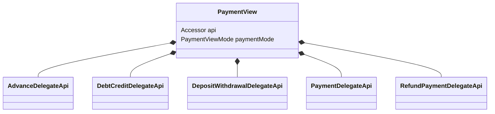
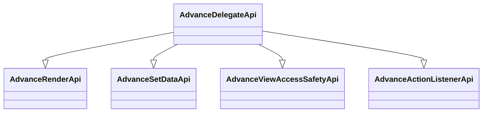

#### Виджет для оплаты

| Класс                                                                                       | Ответственные                                                                     |
|---------------------------------------------------------------------------------------------|-----------------------------------------------------------------------------------|
| [PaymentView](src/main/java/ru/tensor/sbis/design/retail_views/payment_view/PaymentView.kt) | [Павлов Д.А.](https://online.sbis.ru/person/79a90449-389a-4b55-85cb-50758063289d) |

##### Спецификация

- [Макет](http://axure.tensor.ru/carry_sheme/#g=1&p=%D0%BF%D0%B0%D0%BD%D0%B5%D0%BB%D1%8C_%D0%BE%D0%BF%D0%BB%D0%B0%D1%82%D1%8B)
- [Техническое задание](https://online.sbis.ru/shared/disk/5d509092-1d6c-4c1d-bb1b-c8da481e5bec#toc_8a9d4891-703c-4322-8fa3-fe45a13470f3)
- [Сценарии оплаты](https://online.sbis.ru/shared/disk/4d014d6c-84a0-4791-90e0-e0b6bbfc4151)

##### Описание

Виджет позволяет легко настроить отображение и взаимодействие окна оплаты.

Виджет имеет несколько режимов работы и в зависимости от режима инициализируется соответсвующий делегат для взаимодействия с отображением/данными/слушателями:
- [Режим Аванса](src/main/java/ru/tensor/sbis/design/retail_views/payment_view/modes/advance/AdvanceDelegateApi.kt)
- [Режим Кредита](src/main/java/ru/tensor/sbis/design/retail_views/payment_view/modes/debt_credit/DebtCreditDelegateApi.kt)
- [Режим Внесения/Изъятия](src/main/java/ru/tensor/sbis/design/retail_views/payment_view/modes/deposit_withdrawal/DepositWithdrawalDelegateApi.kt)
- [Режим Оплаты](src/main/java/ru/tensor/sbis/design/retail_views/payment_view/modes/payment/PaymentDelegateApi.kt)
- [Режим Возврата](src/main/java/ru/tensor/sbis/design/retail_views/payment_view/modes/refund_payment/RefundPaymentDelegateApi.kt)



Каждый делегат реализует ряд API для взаимодействия с определенным аспектом отображения/взаимодействия:
- [API для отрисовки](src/main/java/ru/tensor/sbis/design/retail_views/payment_view/internal/delegates/api/BaseRenderApi.kt)
- [API для установки данных](src/main/java/ru/tensor/sbis/design/retail_views/payment_view/internal/delegates/api/BaseSetDataApi.kt)
- [API для доступа к отдельным View](src/main/java/ru/tensor/sbis/design/retail_views/payment_view/internal/delegates/api/BaseViewAccessSafetyApi.kt)
- [API для слушателей](src/main/java/ru/tensor/sbis/design/retail_views/payment_view/internal/delegates/api/BaseActionListenerApi.kt)



Помимо этого, каждый из этих API реализует интерфейс для взаимодействия с [конкретной функциональностью](src/main/java/ru/tensor/sbis/design/retail_views/payment_view/internal/common_handlers) окна отплаты:
- Поле ввода денежных средств
- Комментарий
- Информация о долге
- Скидка
- Смешанная оплата
- Кнопки оплаты
- Кнопка выбор типа оплаты
- Налоговый режим
- Дополнительные кнопки (QR-код, Отправить счет, Еще)
- Клиент

##### Пример

```xml
<ru.tensor.sbis.design.retail_views.payment_view.PaymentView
    android:id="@+id/payment_view"
    android:layout_width="match_parent"
    android:layout_height="wrap_content"/>
```

```kotlin
PaymentView(requireContext()).apply {
    /* Выполняем инициализацию режима работы окна оплаты. */
    paymentMode = PaymentViewMode.Payment

    api.paymentApi.apply {
        /* Устанавливаем данные */
        setDataApi.apply {
            setClientName("Клиент")
            setPaymentType(PaymentInnerMode.PAYMENT)
            setTotalCheckValue(BigDecimal(123))
            setCommentTextValue("Комментарий")
        }
        
        /* Через доступ к отдельным view задаем параметры отображения */
        viewSafetyApi.apply {
            setClientButtonVisibility(true)
            setPaymentTypeButtonVisibility(true)
            setCheckButtonVisibility(true)
            setCommentTextVisibility(true)
        }

        /* Устанавливаем слушатели */
        actionListenerApi.apply {
            setClientClickListener { }
            setPaymentTypeListener { }
            setCheckClickListener { }
            setCommentClickListener { }
        }
    }
}
```