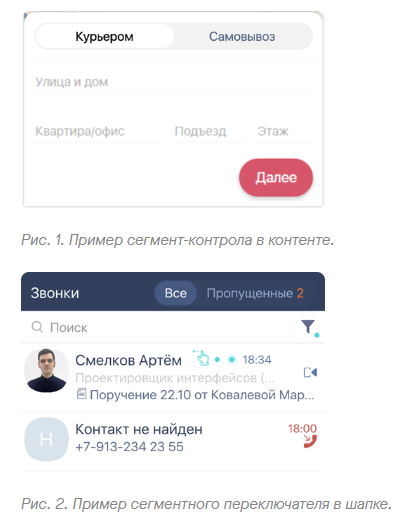

# Сегмент-контрол
| Ответственность | Ответственные |
|-----------------|---------------|
| Сегмент-контрол |[Смирных Павел](https://dev.sbis.ru/person/9bbcd3ea-ccea-4c94-a883-19c0d1d0ce0f)|

## Использование в приложениях
- [Коммуникатор](https://git.sbis.ru/mobileworkspace/apps/droid/communicator)

## Документация
[API компонента](https://n.sbis.ru/article/1db22936-810d-4517-8861-92d1525bbe84)

## Описание

Сегментный переключатель (тумблер) — это горизонтальный набор из нескольких связанных между собой 
элементов управления (сегментов), выполняющий функцию группы радиокнопок.

## Руководство по подключению и инициализации
Для добавления модуля в проект необходимо settings.gradle проекта должны быть подключены следующие модули

| Репозиторий | модуль |
|-----------------|---------------|
|https://git.sbis.ru/mobileworkspace/android-design.git|design|
|https://git.sbis.ru/mobileworkspace/android-design.git|design_custom_view_tools|
|https://git.sbis.ru/mobileworkspace/android-design.git|design_utils|

Для подключения необходимо имплементировать зависимость:

| Репозиторий | модуль |
|-----------------|---------------|
|https://git.sbis.ru/mobileworkspace/android-design.git|design_segmented_control|

## Описание публичного API
Установка списка сегментов для SbisSegmentedControl.
```kotlin
val segmentedControl: SbisSegmentedControl = SbisSegmentedControl(context)
val segments: List<SbisSegmentedControlItem> = listOf(SbisSegmentedControlItem(SbisSegmentedControlTitle("Title")))
segmentedControl.setSegments(segments)
```

##### Внешний вид

[Стандарт внешнего вида](https://www.figma.com/proto/X89AbolbCz2nG69ZVDF6Xj/%D0%A1%D0%B5%D0%B3%D0%BC%D0%B5%D0%BD%D1%82%D0%BD%D1%8B%D0%B9-%D0%BF%D0%B5%D1%80%D0%B5%D0%BA%D0%BB%D1%8E%D1%87%D0%B0%D1%82%D0%B5%D0%BB%D1%8C-(Web%2C-Mobile)?page-id=2%3A10&node-id=2088%3A5427&viewport=312%2C48%2C0.12&scaling=min-zoom)


##### xml атрибуты
- `SbisSegmentedControl_size` - Размер сегмент-контрола
- `SbisSegmentedControl_iconSize` - Размер иконки
- `SbisSegmentedControl_distribution` - Компоновка сегментов внутри контрола
- `SbisSegmentedControl_contrast` - Контрастный режим сегмент-контрола
- `SbisSegmentedControl_backgroundColor` - Цвет фона сегмент-контрола для включенного состояния
- `SbisSegmentedControl_backgroundColorDisabled` - Цвет фона сегмент-контрола для выключенного состояния
- `SbisSegmentedControl_itemBackgroundColor` - Цвет фона выбранного сегмента
- `SbisSegmentedControl_borderWidth` - Толщина обводки сегмент-контрола
- `SbisSegmentedControl_cornerRadius` - Размер скругления сегмент-контрола
- `SbisSegmentedControl_itemTextColor` - Цвет текста сегмента по умолчанию
- `SbisSegmentedControl_itemTextColorSelected` - Цвет текста выбранного сегмента
- `SbisSegmentedControl_itemTextColorDisabled` - Цвет текста сегмента в выключенном состоянии
- `SbisSegmentedControl_itemIconColor` - Цвет иконки сегмента по умолчанию
- `SbisSegmentedControl_itemIconColorSelected` - Цвет иконки выбранного сегмента
- `SbisSegmentedControl_itemIconColorDisabled` - Цвет иконки сегмента в выключенном состоянии
- `SbisSegmentedControl_hasShadow` - Наличие тени у сегмент-контрола
- `SbisSegmentedControl_selectedIndex` - Индекс выбранного сегмента по умолчанию

##### Стилизация
Стилизация осуществляется путем переопределения глобальных переменных темы themes_global.

##### Трудозатраты внедрения
0.7 ч/д
