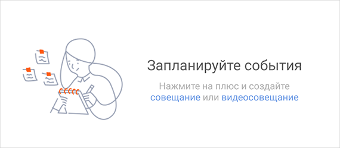

#### Заглушка

|Класс|Ответственные|Добавить|
|-----|-------------|--------|
|[StubView](src/main/java/ru/tensor/sbis/design/stubview/StubView.kt)|[Занин Артём](https://online.sbis.ru/person/84fbb56a-153a-41cd-8b3d-e74078742252)|[Задачу/поручение/ошибку](https://online.sbis.ru/area/d5cff451-8688-4af0-970a-8127570b0308)|

#### Используется в приложениях

- [Коммуникатор](https://git.sbis.ru/mobileworkspace/apps/droid/communicator)

##### Внешний вид

  
  
[Стандарт внешнего вида](http://axure.tensor.ru/MobileStandart8/заглушки_ver2.html)  
[Ссылка на API](https://n.sbis.ru/shared/disk/386b3dfb-c265-4e48-9b88-b6b58b6de830) 

##### Описание

Заглушка используется на месте контента, который по каким-то причинам не удалось отобразить. 
Она позволяет дать пояснение пользователю о причинах отсутствия контента и, если возможно, предложить интерактивные варианты решения проблем.

##### xml атрибуты

- `StubView_mode` - атрибут-флаг для режима отображения заглушки, может принимать значения: 
    - `base` - обычный режим отображения;
    - `block` - режим отображения в блоке (см. [стандарт](http://axure.tensor.ru/MobileStandart8/заглушки_ver2.html)).

##### Отображение заглушки:

Добавление заглушки в разметку:
```xml
<ru.tensor.sbis.design.stubview.StubView
    android:id="@+id/stub_view_default"
    android:layout_width="match_parent"
    android:layout_height="match_parent"/>
```

Чтобы отобразить данные заглушки, нужно применить [StubViewContent](src/main/java/ru/tensor/sbis/design/stubview/StubViewContent.kt) через метод setContent():
```kotlin
myStubView.setContent(myContent)
```
У класса [StubViewContent](src/main/java/ru/tensor/sbis/design/stubview/StubViewContent.kt) есть набор подклассов с множеством конструторов, которые позволяет определить полностью кастомный контент заглушки.

Вместо применения контента можно применить один из стандартных сценариев [StubViewCase](src/main/java/ru/tensor/sbis/design/stubview/StubViewCase.kt) через метод setCase():
```kotlin
myStubView.setCase(StubViewCase.NO_SEARCH_RESULTS)
```

Все поля [StubViewCase](src/main/java/ru/tensor/sbis/design/stubview/StubViewCase.kt) открыты и могут быть использованы для кастомного контента. Например, если от `StubViewCase.NO_MESSAGES` нужны иконка и заголовок, а описание нужно заменить своим:

Если ни один стандартный сценарий не подходит, можно использовать собственный [StubViewContent.ResourceImageStubContent](src/main/java/ru/tensor/sbis/design/stubview/StubViewContent.kt) с изображением `stub_view_etc`

```kotlin
val customContent = ResourceImageStubContent(
    icon = StubViewCase.NO_MESSAGES.iconRes,
    messageRes = StubViewCase.NO_MESSAGES.messageRes,
    details = "My custom details"
)
stubView.setContent(customContent)
```

##### DataBinding

Все публичные методы можно вызывать через databinding:

```xml
<ru.tensor.sbis.design.stubview.StubView
    bind:content="@{viewModel.content}"
    bind:contentFactory="@{viewModel.contentFactory}"
    bind:case="@{viewModel.case}"
    bind:mode="@{viewModel.mode}"/>
```

##### Стилизация

Стандартная тема `StubViewDefaultTheme` в файле `theme_stub_view.xml`.

Для изменения темы StubView во всём приложении нужно переопределить тему своей и прописать атрибут `stubViewTheme` в теме приложения:

```xml
<resources>

    <style name="AppTheme" parent="Theme.AppCompat.Light.DarkActionBar">
        <item name="stubViewTheme">@style/MyStubViewTheme</item>
    </style>

    <style name="MyStubViewTheme" parent="StubViewDefaultTheme">
        <item name="StubView_backgroundColor">@color/palette_color_white1</item>
        <item name="StubView_messageColor">@color/text_color_black_2</item>
        <item name="StubView_detailsColor">@color/text_color_black_3</item>
        <item name="StubView_detailsLinkColor">@color/text_color_link_1</item>
    </style>

</resources>
```

Атрибуты для изменения цветов отдельных элементов StubView:
 - `StubView_backgroundColor` - цвет фона
 - `StubView_messageColor` - цвет заголовка
 - `StubView_detailsColor` - цвет описания
 - `StubView_detailsLinkColor` - цвет ссылок в тексте описания

Для изменения цветов отдельного StubView нужно задать атрибуты в разметке:

```xml
<ru.tensor.sbis.design.stubview.StubView
    app:StubView_backgroundColor="@color/palette_color_white1"
    app:StubView_messageColor="@color/color_red_1"
    app:StubView_detailsColor="@color/color_red_2"
    app:StubView_detailsLinkColor="@color/color_orange"/>
```

##### Описание особенностей работы 

- Добавление кликабельных ссылок в описание:

    У класса [StubViewContent](src/main/java/ru/tensor/sbis/design/stubview/StubViewContent.kt) и у всех его подклассов
    есть параметр `actions: Map<Int, () -> Unit>`, где: 
    - **Int** - id строкового ресурса для слова(или фразы), присутствующего в тексте описания, которое должно быть кликабельной.
    - **() -> Unit>** - лямбда действия, которая будет выполнена при клике на ссылку.
        
     Чтобы добавить ссылки к стандартным сценариям из [StubViewCase](src/main/java/ru/tensor/sbis/design/stubview/StubViewCase.kt),
     нужно вызвать метод `getContent(actions: Map<Int, () -> Unit>): StubViewContent` и передать в него списк слушателей.
     
     Пример:
     
```kotlin
val actions = mapOf(R.string.my_clickable_text to { showToast("Clicked") })
val content = StubViewCase.NO_CONNECTION.getContent(actions)
stubView.setContent(content)
 ```

 - Корректировка размеров:

    При открытии клавиатуры для StubView нужно указать paddingBottom равный высоте клавиатуры, размеры автоматически подкорректируются.

- Режимы отображения:

    Метод для смены режимов отображения `setMode(mode: StubViewMode, minHeight: Boolean)`.

    Параметр StubViewMode - тип режима отображения: BASE - обычный, BLOCK - отображение в блоке (отличется от BASE только верхним отсутпом заглушки).

    Параметр minHeight отвечает за отображение при `height="wrap_content"`. true - высота заглушки будет минимально возможной, false - заглушка займёт высоту, необходимую для размещения всех элементов.

##### Трудозатраты внедрения
1.3 ч/д