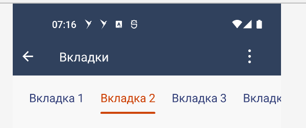

#### Компонент "Вкладки"

| Класс                                                                           | Ответственные                                                                     |
|---------------------------------------------------------------------------------|-----------------------------------------------------------------------------------|
| [SbisTabsView](src/main/kotlin/ru/tensor/sbis/design/tabs/view/SbisTabsView.kt) | [Золотарев Д.А.](https://dev.sbis.ru/person/fb135a4c-c712-4f6e-b52a-6a36dfbdff5e) |

#### Используется в приложениях

##### Внешний вид



##### Ссылки вид

[Стандарт внешнего вида](https://www.figma.com/proto/Zz20dqmmdEjHX730nJRAfm/Вкладки?page-id=1%3A26&node-id=96-15374&scaling=min-zoom&starting-point-node-id=96%3A15374&hide-ui=1)

##### Описание

Компонент вкладок используется для навигации или группировки контента.

##### Использование

Для того, чтобы использовать панель вкладок, необходимо создать `SbisTabsView` через xml или код и
передать сформированные модели
вкладок (`SbisTabsViewItem`) в поле `tabs`.

```kotlin
viewBinding.tabsView.tabs = LinkedList<SbisTabsViewItem>().apply {
    add(SbisTabsViewItem(content = SbisTabViewItemContent.Text(PlatformSbisString.Value("Вкладка 1"))))
    add(SbisTabsViewItem(content = SbisTabViewItemContent.Text(PlatformSbisString.Value("Вкладка 2"))))
    add(SbisTabsViewItem(content = SbisTabViewItemContent.Text(PlatformSbisString.Value("Вкладка 3"))))
    ...
}
```

Помимо этого способа еще можно использовать `SbisTabsViewDsl`, чтобы получить такой код:

```kotlin
viewBinding.tabsView.tabs = tabs {
    tab { content { text("Вкладка 1") } }
    tab { content { text("Вкладка 2") } }
    tab { content { text("Вкладка 3") } }
}
```

Или для более комплексных случаев:

```kotlin
viewBinding.tabsView.tabs = tabs {
    tab { content { text("Вкладка") } }
    tab {
        content {
            text("Вкладка cо счетчиком")
            counter(4)
        }
    }
    tab {
        customTitleColor = SbisColor.Int(Color.GREEN)
        content {
            text("Вкладка с иконкой")
            icon(PlatformSbisString.Icon(SbisMobileIcon.Icon.smi_Add))
        }
    }
    tab {
        content {
            text("Вкладка с иконкой, счетчиком и доп текстом")
            additionalText("доп. текст")
            icon(SbisMobileIcon.Icon.smi_Add)
            counter(8)
            additionalText("доп. текст")
        }
    }
    tab {
        customIconColor = SbisColor.Int(Color.RED)
        content { icon(SbisMobileIcon.Icon.smi_message, SbisDimen.Dp(30)) }
    }
    tab {
        content {
            text("Вкладка с картинкой")
            image(image ?: ColorDrawable(Color.MAGENTA))
        }
    }
}
```

##### Отображение компонента

Добавление в разметку:

```xml

<ru.tensor.sbis.design.tabs.view.SbisTabsView android:id="@+id/my_folders"
    android:layout_width="match_parent" android:layout_height="wrap_content"/>
```

##### xml атрибуты

- `sbisTabsView_style` - стиль панели вкладок (акцентная/неакцентная).

##### Внешнее управление вкладками
Чтобы возможность установки вкладок от сервиса навигации заработала, по аналогии с 
`ToolbarTabLayout`, необходимо зарегистрировать в плагинной системе приложения `TabsPlugin`, помимо 
`ToolbarPlugin`.

