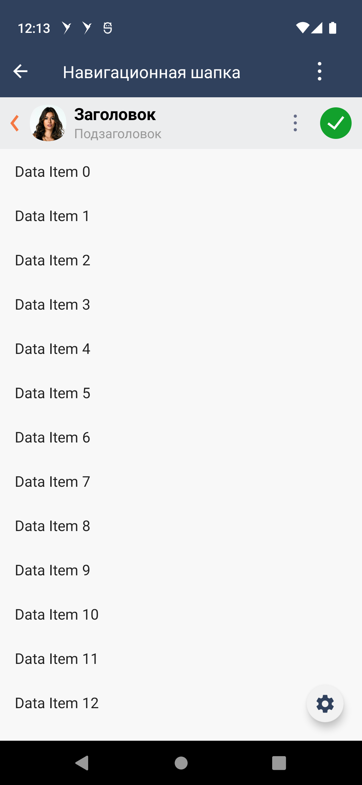

#### Компонент "Шапка"

| Класс                                                                                                      | Ответственные                                                                     |
|------------------------------------------------------------------------------------------------------------|-----------------------------------------------------------------------------------|
| [SbisTopNavigationView](src/main/kotlin/ru/tensor/sbis/design/topNavigation/view/SbisTopNavigationView.kt) | [Золотарев Д.А.](https://dev.sbis.ru/person/fb135a4c-c712-4f6e-b52a-6a36dfbdff5e) |

#### Используется в приложениях
Все
##### Внешний вид



##### Ссылки вид

[Стандарт внешнего вида](https://www.figma.com/proto/1AEZYnCOvCdWeeBjrNOmEz/Компоновка-шапок-мобильного-интерфейса?page-id=88%3A10173&type=design&node-id=194-8282&viewport=404%2C-13%2C0.23&t=wMWWv7wRsDFlS3LD-8&scaling=min-zoom&starting-point-node-id=194%3A8282&hide-ui=1)

##### Описание

Навигационная шапка представляет собой панель, размещенную в верхней части экрана.

Элементы, располагающиеся в шапке, выполняют роль заглавия экрана, а также служат для навигации и управления контентом.

##### Использование

Для того, чтобы использовать шапку, необходимо создать `SbisTopNavigationView` через xml или код.

Существует множество типов шапки: с заголовком, с вкладками, с логотипом и т.п. Все эти конфигурации настраиваются через поле `content`.
Все настройки шапки, описанные в стандарте устанавливаются через `SbisTopNavigationApi`.

```kotlin
viewBinding.topNavigation.content = SbisTopNavigationContent.LargeTitle("Title")
```

ВАЖНО, настраивать обработку событий с элементов шапки (заголовок, кнопки и т.п) нужно после установки контента, так
как только после этого будут созданы "инстансы" элементов. Также при смене контента необходимо заново устанавливать
слушатели на элементы шапки, установленные НЕ через `SbisTopNavigationApi`.

##### Подвалы
В шапке есть возможность устанавливать "подвалы"(элементы под основным контентом шапки)
```kotlin
viewBinding.topNavigation.footerItems = listOf(SbisTopNavigationFooterItem(content = SbisTopNavigationFooterContent.SearchInput))
```
##### Старый вид шапки
Для того чтобы компонент выглядел как старый(Toolbar) и применял темизацию с атрибутов старого компонента, необходимо выставить атрибут.
```xml
<attr name="SbisTopNavigation_isOldToolbarDesign" format="reference|boolean"/>
```
При этом подразумевается, что шапки должны выглядеть одинаково в рамках всего приложения, поэтому атрибут нужно устанавливать в теме приложения.

##### Отображение компонента

Добавление в разметку:

```xml

<ru.tensor.sbis.design.topNavigation.view.SbisTopNavigationView 
    android:layout_width="match_parent" android:layout_height="wrap_content"/>
```

##### xml атрибуты

- `SbisTopNavigation_showBackButton` - Показывать ли стрелочку "Назад".
- `SbisTopNavigation_isEditingEnabled` - Включено ли редактирование текста в шапке.
- `SbisTopNavigation_smallTitleMaxLines` - Максимальное количество строк в маленьком заголовке.
- `SbisTopNavigation_leftIconSize` - Размер иконки перед заголовком.
- `SbisTopNavigation_backgroundColor` - Цвет фона шапки.
- `SbisTopNavigation_titleColor` - Цвет заголовка шапки.
- `SbisTopNavigation_subtitleColor` - Цвет подзаголовка шапки.
- `SbisTopNavigation_backBtnColor` - Цвет кнопки-стрелочки назад.
- `SbisTopNavigation_isOldToolbarDesign` - Дизайн старой шапки (синий фон, белая стрелка назад).

##### Внешнее управление вкладками
Чтобы возможность установки вкладок от сервиса навигации заработала, необходимо следовать 
указаниям [отсюда](../design_tabs/README.md#внешнее-управление-вкладками), а также указать в коде, 
что ожидаемый тип содержимого - вкладки:
```kotlin
viewBinding.topNavigation.content = SbisTopNavigationContent.Tabs(LinkedList())
```

