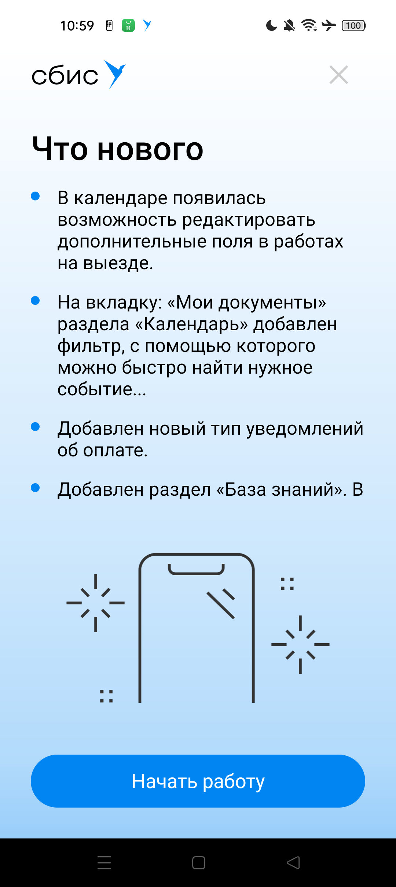
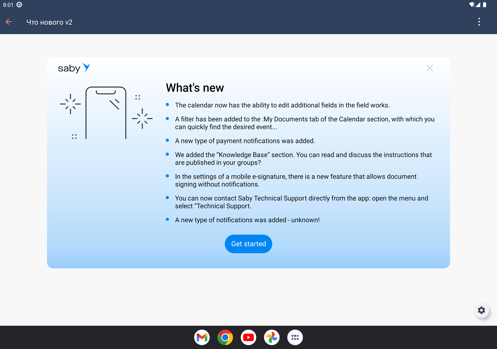

# Компонент "Что нового"
| Ответственность                                                                             | Ответственные                                                                       |
|---------------------------------------------------------------------------------------------|-------------------------------------------------------------------------------------|
| [Что нового в МП Android](https://online.sbis.ru/area/c86e7e80-9875-4baf-9a8f-3035b26c645f) | [Смирных Павел](https://online.sbis.ru/person/9bbcd3ea-ccea-4c94-a883-19c0d1d0ce0f) |  

## Описание

Компонент предназначен для информирования пользователя о новых функциях приложения при выходе новой версии.

### Внешний вид




[Стандарт внешнего вида](https://www.figma.com/proto/u4YkRlh5oAnIyHzt7vcQpJ/%D0%A7%D1%82%D0%BE-%D0%BD%D0%BE%D0%B2%D0%BE%D0%B3%D0%BE?page-id=1%3A2&type=design&node-id=2240-27581&t=8jC7ri8zHkJbZs8c-0&scaling=min-zoom&starting-point-node-id=2240%3A27581&hide-ui=1)

[Ссылка на API](https://n.sbis.ru/article/dff43326-d60a-4da7-967b-9c1d43e93fd6)

### Описание особенностей работы

#### Подключение

Для подключения компонента нужно зарегистрировать плагин [SbisWhatsNewPlugin](src/main/kotlin/ru/tensor/sbis/design/whats_new/SbisWhatsNewPlugin.kt).
```kotlin
@JvmOverloads
@JvmStatic
fun initialize(
    app: Application,
    pluginManager: PluginManager = PluginManager()
) {
    pluginManager.registerPlugins(
        ...
        SbisWhatsNewPlugin.apply {
            customizationOptions.whatsNewRes = 
                R.string.design_demo_whats_new_fullness_full
            customizationOptions.buttonStyle = SbisWhatsNewButtonStyle.BRAND
            customizationOptions.bannerLogo = 
                SbisLogoType.TextIconAppName(
                    PlatformSbisString.Res(R.string.app_name)
                )
            customizationOptions.displayBehavior = 
                SbisWhatsNewDisplayBehavior.ONLY_ONCE
        }
    )
}
```
Для настройки параметров компонента нужно использовать `CustomizationOptions`.
В примере выше показаны возможные настройки.

#### Использование

Для отображения экрана "Что нового" нужно вызвать метод открытия у фичи компонента.
```kotlin
whatsNewFeature.openIfNeeded(childFragmentManager, R.id.container)
```

Для отслеживания закрытия нужно подписаться на события через Fragment Result API.
```kotlin
fragmentManager.setFragmentResultListener(
    SbisWhatsNewFeature.SBIS_WHATS_NEW_FRAGMENT_RESULT_KEY, lifecycleOwner
) { _, _ ->
    // что-то сделать
}
```

##### Трудозатраты внедрения
0.5 ч/д