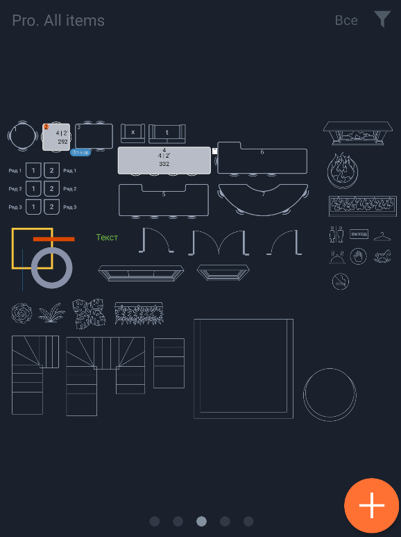
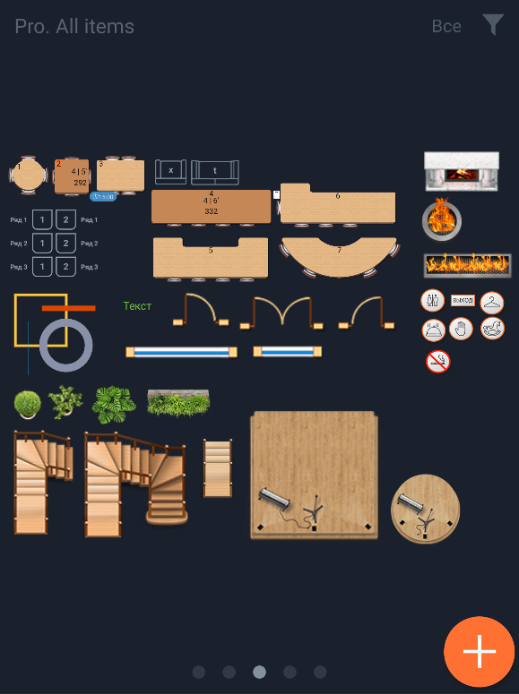
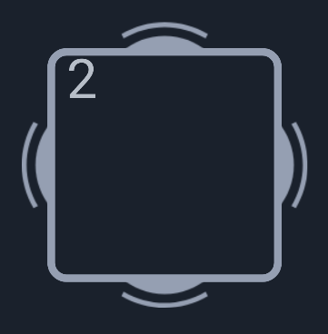
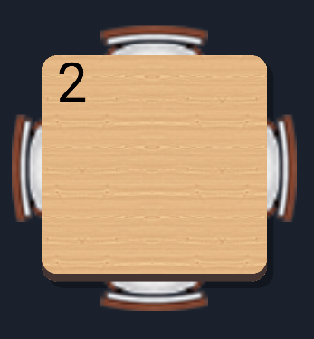
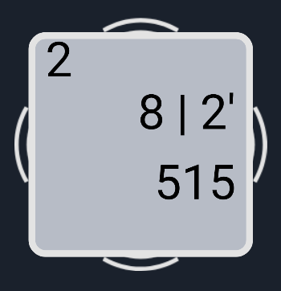
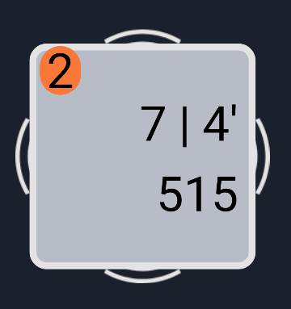
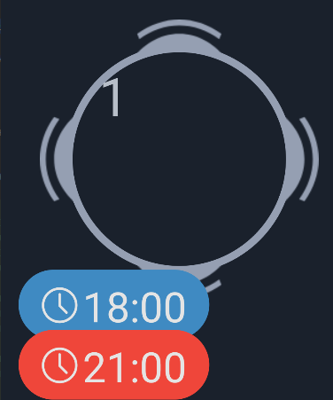
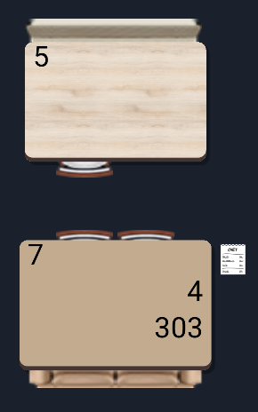
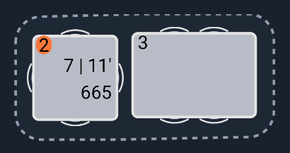

#### Схема зала

|Класс|Ответственный|Добавить|
|-----|-------------|--------|
|[HallSchemeV2](src/main/java/ru/tensor/sbis/hallscheme/v2/HallSchemeV2.kt)|[Арефьев Василий](https://online.sbis.ru/person/e527db11-4521-4f42-a160-d6fdbbc89e8e)|[Задачу/поручение/ошибку](https://online.sbis.ru/area/eacc8dbf-5fb4-4ca3-a357-2e7b206bd578)|

#### Использование в приложениях
- [Мобильный официант](https://git.sbis.ru/mobileworkspace/apps/droid/waiter2)
- [Мобильная витрина SabyGet](https://git.sbis.ru/mobileworkspace/apps/droid/showcase)

##### Внешний вид
Плоская схема зала



Объёмная схема зала


[Стандарт внешнего вида](http://axure.tensor.ru/presto4/#p=схема&g=1)
[Спецификация](http://axure.tensor.ru/sitebuilder/спецификация.html)

##### Описание
Компонент предназначен для отображения схемы зала со столами, барами, элементами декора, фигурами и текстом,
а также концертного зала с рядами и местами. Столы и бары могут иметь стулья, диваны, или и то и другое.
Реализована возможность скроллинга и масштабирования схемы.

В зависимости от настроек отображения, а также статуса заказа и наличия брони для стола или бара может отображаться следующая информация:
- название стола или бара
- общее количество блюд
- время самого старого готовящегося блюда с момента отправки на кухню (если такое есть)
- отметка о выставлении счёта или нескольких счетов
- отметка о бронировании стола или бара
- отметка о наличии оплаченного заказа
- отметка о том, что на столе есть настроенные кнопки вызова официанта
- отметка о том, что на столе была нажата кнопка вызова официанта
Необходимость отображения той или иной информации, а также стиль, цвет и размер шрифта задаются в настройках конкретной схемы.

Если стол или бар занят, то его столешница немного увеличивается, при этом создаётся визуальное ощущение, что стулья или диваны задвинуты под стол.

###### Цветовая дифференциация столов/баров
Для объёмной схемы может задаваться один из 9 типов текстуры стола, по умолчанию - "Клён натуральный".
В зависимости от текстуры применяется определённый контрастный цвет занятого стола.


Свободен:

|Плоская схема|Объёмная схема|
|-------------|--------------|
|||


Занят:



Столик, где есть готовое, но не забранное блюдо:



Столик с бронью:



Столики с диванами:



Обводка нескольких столов, используемая, к примеру, для множественного бронирования столиков:



##### xml атрибуты
- `maxZoom` - максимальный зум, значение по умолчанию - 2.0  

###### Переопределение темы
Возможно переопределить тему, задав необходимые атрибуты по аналогии с [HallSchemeLightTheme](src/main/res/values/theme_hall_scheme.xml):
```xml
    <style name="HallSchemeLightTheme" parent="Theme.AppCompat">
        <item name="hall_scheme_table_empty_contour">@color/hall_scheme_gray_empty</item>
        <item name="hall_scheme_table_occupied_contour">@color/hall_scheme_table_occupied_contour_light</item>

        <item name="hall_scheme_table_occupied_background">@color/hall_scheme_table_occupied_background_light</item>
        <item name="hall_scheme_table_occupied_background_pressed">@color/hall_scheme_table_occupied_background_pressed_light</item>

        <item name="hall_scheme_table_empty_primary_text_color">@color/hall_scheme_table_empty_primary_text_color_light</item>
        <item name="hall_scheme_table_empty_primary_text_3d_color">@color/hall_scheme_dark_blue</item>
        <item name="hall_scheme_table_occupied_primary_text_color">@color/hall_scheme_table_occupied_primary_text_color_light</item>
        <item name="hall_scheme_table_selected_primary_text_color">@color/palette_color_dark_red1</item>

        <item name="hall_scheme_table_empty_secondary_text_color">@color/hall_scheme_dark_blue</item>
        <item name="hall_scheme_table_occupied_secondary_text_color">@color/hall_scheme_table_occupied_secondary_text_color_light</item>
        <item name="hall_scheme_table_occupied_secondary_text_3d_color">@color/hall_scheme_dark_blue</item>

        <item name="hall_scheme_table_ready_name_background">@color/hall_scheme_table_ready_name_background_light</item>

        <item name="hall_scheme_item_default_color">@color/hall_scheme_dark_blue</item>
        <item name="hall_scheme_place_default">@color/hall_scheme_gray_empty</item>
    </style>
```

##### Описание особенностей работы 
1. Добавить схему как обычный view-элемент в разметку, указав тему в атрибуте `theme` и максимальный зум в атрибуте `maxZoom`
```xml    
<ru.tensor.sbis.hallscheme.v2.HallSchemeV2
        android:id="@+id/hallScheme"
        android:layout_width="match_parent"
        android:layout_height="match_parent"
        android:theme="?hall_scheme_style"
        app:maxZoom="3.0"/>
```
2. Подготовить данные для отображения на схеме зала с помощью метода `getHallSchemeModel` объекта класса [HallSchemeV2](src/main/java/ru/tensor/sbis/hallscheme/v2/HallSchemeV2.kt), передав в качестве параметра  
объект модели данных для схемы ([HallSchemeModelDto](src/main/java/ru/tensor/sbis/hallscheme/v2/data/HallSchemeModelDto.kt))  

```kotlin
        val hallSchemeModel = hallScheme.getHallSchemeModel(hallSchemeModelDto)
```
3. Показать данные на схеме, вызвав метод `show`, принимающий в качестве параметров модель для схемы, слушатель [OnHallSchemeItemClickListener](src/main/java/ru/tensor/sbis/hallscheme/v2/HallSchemeV2.kt),  
срабатывающий при клике на стол или бар, и уникальный номер стола для выделения (опционально):
```kotlin
        hallScheme.show(
            hallSchemeModel, 
            object : HallSchemeV2.OnHallSchemeItemClickListener {
                override fun onItemClick(hallSchemeItem: HallSchemeItem) {
                    // выполнить действие при тапе на элемент
                }
                override fun onItemLongTap(hallSchemeItem: HallSchemeItem): Boolean {
                    // выполнить действие при лонг-тапе на элемент            
                 }
            },
            selectedTableId)
```
4. В целях изменения данных по определённым элементам (например, данные по столу: информация о бронировании, сумме заказа и т.д.)  
без необходимости менять при этом схему целиком или размеры элементов (координаты, количество стульев и т.д.)  
реализован метод частичной перерисовки элементов схемы `updateItems`, принимающий на вход список изменившихся элементов `List<HallSchemeItemDto>`:
```kotlin
    hallScheme.updateItems(itemsForUpdate)
```

###### Одиночный выбор столика
1. Реализована функциональность выбора столика (выделение его цветом, например, при клике на нём). Для этого необходимо вызвать метод `selectTable`,  
передав ему в качестве параметра `id` стола. Метод возвращает true, если выбор столика произошёл успешно:
```kotlin
    hallScheme.selectTable(id)
```
2. Также можно программно снять выделение со столика. Для этого необходимо вызвать метод `unSelectTable`, передав ему в качестве параметра `id` стола:
```kotlin
    hallScheme.unSelectTable(id)
```

###### Режим мультиселекта для столиков
1. Реализована функциональность выбора нескольких столиков (выделение его цветом или изменения контура, например, при клике на нём).  
Для этого необходимо вызвать метод `selectTableForMultiSelect`, передав ему в качестве параметра `id` стола:
```kotlin
    hallScheme.selectTableForMultiSelect(id)
```
2. Также можно программно снять выделение со столика в режиме мультиселекта.  
Для этого необходимо вызвать метод `unSelectTableForMultiSelect`, передав ему в качестве параметра `id` стола:
```kotlin
    hallScheme.unSelectTableForMultiSelect(id)
```
3. Есть возможность получить список выбранных столиков в режиме мультиселекта, воспользовавшись методом `getSelectedTablesForMultiSelect`:
```kotlin
    val tables = hallScheme.getSelectedTablesForMultiSelect()
```
4. Есть возможность очистить список выбранных столиков в режиме мультиселекта - метод `clearMultiSelection`:
```kotlin
    hallScheme.clearMultiSelection()
```