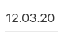

#### Описание группы компонентов
Компоненты полей ввода представлены следующими классами:
- `TextInputView` однострочное текстовое поле ввода
- `MultilineInputView` многострочное поле ввода
- `PasswordInputView` поле ввода пароля
- `ValueSelectionInputView` поле с выбором значения
- `NumberInputView` поле ввода числа
- `MoneyInputView` поле ввода денег
- `MaskInputView` поле ввода по маске
- `PhoneInputView` поле ввода телефона
- `DateInputView` поле ввода даты и/или времени
- `AccessCodeInputView` поле ввода кода доступа с фиксированной маской

#### Название компонента
| Класс                                                                                                            | Ответственные                                                                         | Добавить                                                                                 |
|------------------------------------------------------------------------------------------------------------------|---------------------------------------------------------------------------------------|------------------------------------------------------------------------------------------|
| [TextInputView](src/main/kotlin/ru/tensor/sbis/design/view/input/text/TextInputView.kt)                          | [Смирных Павел](https://dev.sbis.ru/person/9bbcd3ea-ccea-4c94-a883-19c0d1d0ce0f)      | [Задачу/поручение/ошибку](https://dev.sbis.ru/area/db183c64-2b8c-4cf1-8358-911d28862952) |
| [MultilineInputView](src/main/kotlin/ru/tensor/sbis/design/view/input/text/MultilineInputView.kt)                | [Смирных Павел](https://dev.sbis.ru/person/9bbcd3ea-ccea-4c94-a883-19c0d1d0ce0f)      | [Задачу/поручение/ошибку](https://dev.sbis.ru/area/db183c64-2b8c-4cf1-8358-911d28862952) |
| [PasswordInputView](src/main/kotlin/ru/tensor/sbis/design/view/input/password/PasswordInputView.kt)              | [Смирных Павел](https://dev.sbis.ru/person/9bbcd3ea-ccea-4c94-a883-19c0d1d0ce0f)      | [Задачу/поручение/ошибку](https://dev.sbis.ru/area/db183c64-2b8c-4cf1-8358-911d28862952) |
| [ValueSelectionInputView](src/main/kotlin/ru/tensor/sbis/design/view/input/selection/ValueSelectionInputView.kt) | [Смирных Павел](https://dev.sbis.ru/person/9bbcd3ea-ccea-4c94-a883-19c0d1d0ce0f)      | [Задачу/поручение/ошибку](https://dev.sbis.ru/area/db183c64-2b8c-4cf1-8358-911d28862952) |
| [NumberInputView](src/main/kotlin/ru/tensor/sbis/design/view/input/number/NumberInputView.kt)                    | [Смирных Павел](https://dev.sbis.ru/person/9bbcd3ea-ccea-4c94-a883-19c0d1d0ce0f)      | [Задачу/поручение/ошибку](https://dev.sbis.ru/area/db183c64-2b8c-4cf1-8358-911d28862952) |
| [MoneyInputView](src/main/kotlin/ru/tensor/sbis/design/view/input/money/MoneyInputView.kt)                       | [Смирных Павел](https://dev.sbis.ru/person/9bbcd3ea-ccea-4c94-a883-19c0d1d0ce0f)      | [Задачу/поручение/ошибку](https://dev.sbis.ru/area/db183c64-2b8c-4cf1-8358-911d28862952) |
| [MaskInputView](src/main/kotlin/ru/tensor/sbis/design/view/input/mask/MaskInputView.kt)                          | [Смирных Павел](https://dev.sbis.ru/person/9bbcd3ea-ccea-4c94-a883-19c0d1d0ce0f)      | [Задачу/поручение/ошибку](https://dev.sbis.ru/area/db183c64-2b8c-4cf1-8358-911d28862952) |
| [PhoneInputView](src/main/kotlin/ru/tensor/sbis/design/view/input/mask/phone/PhoneInputView.kt)                  | [Смирных Павел](https://dev.sbis.ru/person/9bbcd3ea-ccea-4c94-a883-19c0d1d0ce0f)      | [Задачу/поручение/ошибку](https://dev.sbis.ru/area/db183c64-2b8c-4cf1-8358-911d28862952) |
| [DateInputView](src/main/kotlin/ru/tensor/sbis/design/view/input/mask/date/DateInputView.kt)                     | [Смирных Павел](https://dev.sbis.ru/person/9bbcd3ea-ccea-4c94-a883-19c0d1d0ce0f)      | [Задачу/поручение/ошибку](https://dev.sbis.ru/area/db183c64-2b8c-4cf1-8358-911d28862952) |
| [AccessCodeInputView](src/main/kotlin/ru/tensor/sbis/design/view/input/accesscode/AccessCodeInputView.kt)        | [Круглова Марина](https://online.sbis.ru/person/8a7248e7-b4b2-4c2e-a988-3534eab414f8) | [Задачу/поручение/ошибку](https://dev.sbis.ru/area/db183c64-2b8c-4cf1-8358-911d28862952) |

##### Внешний вид





[Стандарт внешнего вида](http://axure.tensor.ru/MobileStandart8/#p=%D0%BF%D0%BE%D0%BB%D1%8F_%D0%B2%D0%B2%D0%BE%D0%B4%D0%B0_v2&g=1.)

[Ссылка на API](https://dev.sbis.ru/page/knowledge-bases?baseId=7e3a8970-4098-497d-8436-fc2f4d6b60c0&article=6706517f-a464-4cde-9afb-c0351204fb9a)

##### XML атрибуты
**BaseInputView**

_Стилизация_
- `inputView_isAccent` - акцентный стиль компонентов. По умолчанию `true`.
- `inputView_placeholderTextColor` - цвет текста подсказки.
- `inputView_titleTextColor` - цвет текста метки.
- `inputView_titleTextColorAccent` - цвет текста акцентной метки.
- `inputView_titleTextSize` - размер текста метки.
- `inputView_titleTextSizeAccent` - размер текста акцентной метки.
- `inputView_valueColor` - цвет текста поля ввода.
- `inputView_valueColorHighlight` - цвет выделения текста.
- `inputView_valueSize` - размер текста поля ввода.
- `inputView_validationUnderlineSize` - размер нижнего подчеркивания.
- `inputView_validationUnderlineSizeFocus` - размер нижнего подчеркивания в фокусе.
- `inputView_validationTextSize` - размер текста сообщения валидации внизу.
- `inputView_validationTextSizeAccent` - размер текста акцентного сообщения валидации внизу. 
- `inputView_validationDefaultColor` - цвет стандартного подчеркивания валидации.
- `inputView_validationDefaultColorReadOnly` - цвет стандартного подчеркивания валидации в режиме чтения.
- `inputView_validationTextDefaultColor` - цвет текста стандартного сообщения валидации.
- `inputView_validationErrorColor` - цвет подчеркивания валидации при error.
- `inputView_validationTextErrorColor` - цвет текста сообщения валидации при error.
- `inputView_validationWarningColor` - цвет подчеркивания валидации при warning.
- `inputView_validationTextWarningColor` - цвет текста сообщения валидации при warning.
- `inputView_validationSuccessColor` - цвет подчеркивания валидации при success.
- `inputView_validationTextSuccessColor` - цвет текста сообщения валидации при success.
- `inputView_iconColor` - цвет иконки справа от текста.
- `inputView_iconColorAccent` - цвет акцентной иконки справа от текста.
- `inputView_clearColor` - цвет иконки очистки текста.
- `inputView_progressColor` - цвет прогресса.
- `inputView_bottomOffsetUnderline` - толщина нижнего подчеркивания валидации.

_Свойства_
- `inputView_placeholder`- текст подсказки, отображается в поле ввода если оно пустое.
- `inputView_value` - значение в поле ввода.
- `inputView_minEms` - аналог TextView.minEms.
- `inputView_maxLength` - максимальная длина для значения.
- `inputView_validation_maxLines` - максимальное количество строк валидации.
- `inputView_readOnly` - разрешено ли редактировать значение в поле ввода, по-умолчанию разрешено.
- `inputView_title` - метка поля ввода, отображается над полем ввода.
- `inputView_isRequiredField` - является ли поле обязательным. Добавляет '*' в конец метки.
- `inputView_showPlaceholderAsTitle` - отображать ли метку всегда, если она задана, по-умолчанию true.
- `inputView_isClearVisible` - показывать ли кнопку очистки значения в поле ввода, по-умолчанию не показывается.
- `inputView_isProgressVisible` - показывать ли прогресс, по-умолчанию не показывается.
- `inputView_onHideKeyboard` - показывать ли курсор и клавиатуру в поле ввода.
- `inputView_showSoftInputOnFocus` - поднимать ли клавиатуру при клике.
- `inputView_type` - тип ввода поля ввода.
- `inputView_clearFocusOnBackPressed` - убрать фокус с поля при нажатии кнопки back.
- `android:gravity`
- `android:imeOptions`
- `android:digits`

**TextInputView**

_Стилизация_
- `inputView_linkTextColor` - цвет текста кнопки-ссылки.
- `inputView_linkTextSize` - размер текста кнопки-ссылки.
- `inputView_linkIconSize` - размер текста кнопки-ссылки, если это шрифтовая иконка.

_Свойства_
- `inputView_linkText` - текст кнопки-ссылки. Отображается справа поля ввода.
- `inputView_fontIcon` - является ли текст кнопки-ссылки шрифтовой иконкой.

**MultilineInputView**
- `inputView_minLines` - минимальное количество отображаемых строк поля ввода.
- `inputView_maxLines` - максимальное количество отображаемых строк поля ввода.
- `inputView_rightIconText` - текст иконки справа поля ввода.
- `inputView_rightIconColor` - цвет текста иконки справа поля ввода.

**NumberInputView**
- `inputView_fraction` - количество символов после запятой.
- `inputView_minValue` - минимальное значение в поле ввода.
- `inputView_maxValue` - максимальное значение в поле ввода.
- `inputView_isShownZeroValue` - отображать ли нулевое значение при пустом значении поля ввода.


**MoneyInputView**

_Стилизация со значениями по-умолчанию_
- `inputView_moneyColor` - цвет текста целой части значения.
- `inputView_fractionColor` - цвет текста дробной части значения.
- `inputView_moneySize` - размер текста целой части значения.
- `inputView_fractionSize` - размер текста дробной части значения.

_Свойства_
- `inputView_isDecorated` - декорировать значение в поле ввода.
- `inputView_moneyFraction` - дробная часть поля ввода.
  - `on` - включена (2 знака).
  - `off` - выключена (0 знаков).
  - `only_tens` - только десятая часть (1 знак).
- `inputView_minValue` - минимальное значение в поле ввода.
- `inputView_maxValue` - максимальное значение в поле ввода.
- `inputView_isShownZeroValue` - отображать ли нулевое значение при пустом значении поля ввода.

**MaskInputView**
- `inputView_mask` - маска поля ввода. (0 - число, A - буква, * - любой символ).

**DateInputView**
- `inputView_format` - предопределенные маски для дат и времени.
  - `date` - дата (00.00.00).
  - `time` - время (00:00).
  - `both` - дата и время (00.00.00 00:00).
  - `date_full_year` - дата с полным годом (00.00.0000).
  - `date_without_year` - дата без года (00.00).
  - `date_only_year` - только год (0000).

**PhoneInputView**
- `inputView_phoneFormat` - формат номера телефона.
  - `mobile` - формат для ввода мобильных номеров телефона. По умолчанию.
  - `mixed` - формат для ввода любых номеров телефона.

**ValueSelectionInputView**
- `inputView_iconText` - текст иконки поля ввода выбора. По умолчанию иконка гамбургера.
- `inputView_isIconVisible` - видимость иконки. При `readOnly = true` скрывается вне зависимости от флага.

##### Стилизация
Стандартная тема всех типов полей `BaseInputViewTheme` в файле `themes.xml`, для многострочных полей `MultilineInputViewTheme` и т.д.
```xml
<style name="YourTextInputViewTheme" parent="TextInputViewTheme">
    <item name="inputView_isAccent">false</item>
    <item name="inputView_titleTextColorAccent">@color/your_text_input_view_title_text_accent</item>
    ...
</style>
```

###### Переопределение темы
Для изменения темы нужно определить соответствующий атрибут темы для поля ввода. Например `baseInputViewTheme`.
```xml
<resources>
  <style name="YourAppTheme">
    <item name="baseInputViewTheme">@style/YourBaseInputViewTheme</item>
  </style>
  
  <style name="YourBaseInputViewTheme" parent="BaseInputViewTheme">
    <item name="inputView_isAccent">false</item>
    <item name="inputView_titleTextColorAccent">@color/your_text_input_view_title_text_accent</item>
    ...
  </style>
</resources>
```

##### Описание особенностей работы

- Валидация полей ввода реализуется на прикладной стороне.
Для этого нужно подписаться на `onValueChanged` и при выполнении валидации задавать `validationStatus`. Пример:
```kotlin
inputView.onValueChanged = { view, it ->
    val result = validate(it)
    inputView.validationStatus = when (result) {
        is Success -> ValidationStatus.Success("")
        is Error -> ValidationStatus.Error("")
    }
}
```


- Список с выбором значения для `ValueSelectionInputView` реализуется на прикладной стороне.
Для этого нужно подписаться на `onListIconClickListener`, подписчик покажет соответствующий экран списка. Пример:
```kotlin
inputView.onListIconClickListener = { view ->
    YourListDialogFragment.newInstance().show(childFragmentManager)
}
```
Затем при получении результата выбора значения установить `value`, например:
```kotlin
childFragmentManager.setFragmentResultListener(
    "VALUE",
    viewLifecycleOwner
) { request, result ->
    when (request) {
        "VALUE" -> {
            inputView.value = result.getSring("RESULT")
        }
    }
}
```


- Диалог выбора даты или времени для `DateInputView` вызывается на прикладной стороне.
Для этого нужно установить `onFieldClickListener`, подписчик покажет диалог выбора времени или даты, например:
```kotlin
inputView.onFieldClickListener = { view ->
    YourTimePickerDialog.newInstance(params).show(childFragmentManager)
}
```
Затем при получении результата выбора значения установить `value`, например:
```kotlin
childFragmentManager.setFragmentResultListener(
    "TIME",
    viewLifecycleOwner
) { request, result ->
    when (request) {
        "TIME" -> {
            inputView.value = result.getSring("RESULT")
        }
    }
}
```


- В многострочных полях ввода `MultilineInputView` можно из прикладного кода добавлять иконку справа снизу от
  многострочного текста. Это можно сделать двумя способами:
    1) через атрибуты
    - inputView_rightIconText - для символа иконки (если символ иконки не указан, ничего не будет отображено)
    - inputView_rightIconColor - для цвета иконки

```xml
<ru.tensor.sbis.design.view.input.text.MultilineInputView 
    android:id="@+id/multiline_input_view"
    android:layout_width="match_parent" 
    android:layout_height="wrap_content" 
    app:inputView_rightIconText='\ue90b'
    app:inputView_rightIconColor="@color/palette_color_pink1"/>
```

   2) в коде с помощью класса
   [MultilineRightIcon](src/main/kotlin/ru/tensor/sbis/design/view/input/text/utils/model/MultilineRightIcon.kt),
   в который необходимо передать `SbisMobileIcon.Icon` и цвет по желанию (по умолчанию цвет labelIconColor)

```kotlin
multilineInputView.rightIconView = MultilineRightIcon(SbisMobileIcon.Icon.smi_attach.character, Color.MAGENTA) 
```

Также в коде можно задать событие по клику на правую иконку

```kotlin
onRightIconViewClickListener = { showToast("Click on link") }
```

- `AccessCodeInputView` сразу получает фокус для ввода необходимых 4 символов. Курсор не может быть перемещен
  пользователем, а перемещается согласно количеству введенных/удаленных символов.
  На стороне прикладного кода можно отслеживать достижение максимальной длины текста с получением введенного кода
  с помощью maxLengthReachedListener:
```kotlin
maxLengthReachedListener = { code ->
  sendCodeToValidate(code)
}
```

- Для `NumberInputView` добавлена возможность задать количество знаков после запятой через поле fraction. 
Если эта величина будет равна 0, значит, что у поля нет дробной части. Тип данных такого поля UInt - беззнаковый Int. 
fraction может принимать значения от 0 до 2147483647 (максимальное значение Int)
```kotlin
numberInpetView.fraction = 4u
```

#### Используется в приложениях
- [Коммуникатор](https://git.sbis.ru/mobileworkspace/apps/droid/communicator)
- [Saby Get](https://git.sbis.ru/mobileworkspace/apps/droid/sabyget)
- [Курьер](https://git.sbis.ru/mobileworkspace/apps/droid/courier)
- [Saby My](https://git.sbis.ru/mobileworkspace/apps/droid/mysaby)
- [Saby Docs](https://git.sbis.ru/mobileworkspace/apps/droid/storekeeper)
- [Официант](https://git.sbis.ru/mobileworkspace/apps/droid/waiter2)

##### Трудозатраты внедрения
0.6 ч/д
