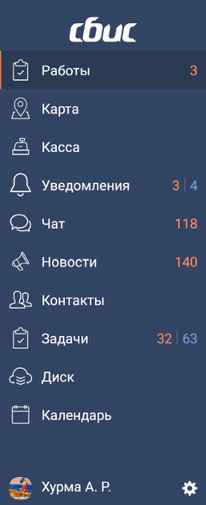

#### Аккордеон

| Класс                                                                          | Ответственные                                                                         | Добавить                                                                                 |
|--------------------------------------------------------------------------------|---------------------------------------------------------------------------------------|------------------------------------------------------------------------------------------|
| [NavView](src/main/java/ru/tensor/sbis/design/navigation/view/view/NavView.kt) | [Колпаков Михаил](https://online.sbis.ru/Person/6b7e7802-6118-4fe4-9ec3-1db87bc0853c) | [Задачу/поручение/ошибку](https://dev.sbis.ru/area/5cf6563d-4518-4d18-99dd-bb56db612cb7) |

#### Использование в приложениях
- [Коммуникатор](https://git.sbis.ru/mobileworkspace/apps/droid/communicator)
- [Мобильный официант](https://git.sbis.ru/mobileworkspace/apps/droid/waiter2)
- [Мобильная витрина SabyGet](https://git.sbis.ru/mobileworkspace/apps/droid/showcase)
- [Курьер](https://git.sbis.ru/mobileworkspace/apps/droid/courier)

##### Внешний вид
 
[Стандарт внешнего вида](http://axure.tensor.ru/MobileStandart8/#p=%D0%B0%D0%BA%D0%BA%D0%BE%D1%80%D0%B4%D0%B5%D0%BE%D0%BD&g=1) 

##### Описание
Боковая навигационная панель, как правило, размещается в `DrawerLayout`. Является дополнительным компонентом навигации, используемым вместе с [ННП](README_tab_nav_view.md)

##### xml атрибуты

- `header` - атрибут для указания ссылки на разметку "шапки". По умолчанию шапка отсутствует, но можно использовать реализацию `sbis_navigation_header.xml`:  
    
    ```xml
    <ru.tensor.sbis.design.navigation.view.view.NavView
                android:layout_width="match_parent"
                android:layout_height="match_parent"
                app:header="@layout/sbis_navigation_header"/> <!-- установка ссылки на разметку шапки -->
    ```
    При этом корневой элемент шапки будет доступен в коде следующим образом:
    ```kotlin
    // получение корневого view шапки
    val headerRootView: View? = accordion.header
    // пример использования (в нашем случае шапка установлена)
    val button: ImageButton = headerRootView!!.findViewById(R.id.my_header_button)
    button.setOnClickListener { /* действие по нажатию */ }
    ```
- `footer` - атрибут для указания ссылки на разметку "подвала". По умолчанию подвал отсутствует, но можно использовать реализацию `person_settings_panel.xml`:  

    ```xml
    <ru.tensor.sbis.design.navigation.view.view.NavView
                android:layout_width="match_parent"
                android:layout_height="match_parent"
                app:footer="@layout/person_settings_panel"/> <!-- установка ссылки на разметку подвала
    ```
    При этом корневой элемент подвала будет доступен в коде следующим образом:
    ```kotlin
    // получение корнового view подвала
    val footerRootView: View? = accordion.footer
    // пример использования (в нашем случае подвал установлен)
    val userNameView = footerRootView!!.findViewById(ru.tensor.sbis.design.R.id.username)
    userNameView.setText(userName)
    ```
- `name` - строковый атрибут для указания идентификатора элемента. Можно использовать для аналитики, идентификатор доставляется вместе с событиями выбора элемента. Если атрибут не указан, идентификатор будет сформирован автоматически выражением `"$javaClass_$id"`
- `showOnInitialization` - флаг отключения автоматического раскрытия аккордеона при первом запуске приложения. По умолчанию аккордеон раскрывается

##### Стилизация
У компонента предопределены две темы **NavView** (светлая) и **NavView.Dark** (тёмная). Тему компонента можно указать в атрибуте `navStyle` темы экрана/приложения:
```xml
<style name="AppTheme">
    <item name="navStyle">@style/NavView</item>
</style>
```
Если тема не указана явно, будет использоваться светлая тема.
###### Переопределение темы
Для переопределения темы рекомендуется расширить одну из [стандартных тем](src/main/res/values/theme_navigation.xml), подобно тому, как тёмная тема переопределяет атрибуты светлой темы:  
```xml
<style name="NavView.MyTheme"> <!-- "dot notation" способ расширения темы -->
    <item name="android:background">@color/colorBlue2_dark</item> <!-- переопределение атрибута -->
</style>
``` 
Общие стандартизованные темы рекомендуется добавлять непосредственно в файл [theme_navigation.xml](src/main/res/values/theme_navigation.xml). Для переопределения доступны android атрибуты и атрибуты из таблицы:

| Атрибут                       | Описание                                                           |
|-------------------------------|--------------------------------------------------------------------|
| navItemTheme                  | Тема, которая будет применена к корневому контейнеру элемента меню |
| navItemSelectedBorderTheme    | Тема маркера выделенного элемента                                  |
| navItemIconTheme              | Тема иконки элемента меню                                          |
| navItemNewCounterTheme        | Тема счётчика новых событий                                        |
| navItemCounterDividerTheme    | Тема разделителя счётчиков                                         |
| navItemTotalCounterTheme      | Тема счётчика общего количества событий                            |
| navViewTextTheme              | Тема текста элемента меню                                          |
| navViewHorizontalDividerTheme | Тема горизонтальной линии, которая отделяет аккордеон от подвала   |

##### Описание особенностей работы
См. [Описание ключевых особенностей компонентов навигации](README.md)