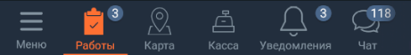

#### ННП

| Класс                                                                                        | Ответственные                                                                         | Добавить                                                                                 |
|----------------------------------------------------------------------------------------------|---------------------------------------------------------------------------------------|------------------------------------------------------------------------------------------|
| [TabNavView](src/main/java/ru/tensor/sbis/design/navigation/view/view/tabmenu/TabNavView.kt) | [Колпаков Михаил](https://online.sbis.ru/Person/6b7e7802-6118-4fe4-9ec3-1db87bc0853c) | [Задачу/поручение/ошибку](https://dev.sbis.ru/area/864da3b7-2e1c-49a4-8044-682d70f92791) |

#### Использование в приложениях
- [Коммуникатор](https://git.sbis.ru/mobileworkspace/apps/droid/communicator)
- [Мобильный официант](https://git.sbis.ru/mobileworkspace/apps/droid/waiter2)
- [Мобильная витрина SabyGet](https://git.sbis.ru/mobileworkspace/apps/droid/showcase)
- [Курьер](https://git.sbis.ru/mobileworkspace/apps/droid/courier)

##### Внешний вид
 
[Стандарт внешнего вида](http://axure.tensor.ru/MobileStandart8/#p=%D0%BD%D0%B8%D0%B6%D0%BD%D1%8F%D1%8F_%D0%BD%D0%B0%D0%B2%D0%B8%D0%B3%D0%B0%D1%86%D0%B8%D0%BE%D0%BD%D0%BD%D0%B0%D1%8F_%D0%BF%D0%B0%D0%BD%D0%B5%D0%BB%D1%8C__%D0%B2%D0%B5%D1%80%D1%81%D0%B8%D1%8F_2___%D1%82%D0%B0%D0%B1%D0%B1%D0%B0%D1%80_&g=1)  

##### Описание
Является основным компонентом навигации. Может использоваться вместе с [Аккордеоном](README_nav_view.md)

##### xml атрибуты

- `menuButtonLayout` - ссылка на разметку кнопки меню. Если атрибут не указан, по умолчанию используются разметки [tab_horizontal_menu_button.xml](src/main/res/layout/tab_horizontal_menu_button.xml) и [tab_vertical_menu_button.xml](src/main/res/layout/tab_vertical_menu_button.xml) в горизонтальной и вертикальной ориентации соответственно (см. атрибут `orientation`)

    ```xml
    <ru.tensor.sbis.design.navigation.view.view.tabmenu.TabNavView
        android:layout_width="match_parent"
        android:layout_height="wrap_content"
        app:menuButtonLayout="@layout/tab_horizontal_menu_button"/> <-- переопределение разметки кнопки меню
    ```
- `orientation` - ориентация меню: горизонтальная или вертикальная. Как правило, в планшетной ориентации нужно установить значение атрибута равным `vertical`:
 
    ```xml
    <ru.tensor.sbis.design.navigation.view.view.tabmenu.TabNavView
        android:layout_width="match_parent"
        android:layout_height="wrap_content"
        app:orientation="vertical"/> <-- установка вертикальной ориентации
    ```
    *Примечание:* размещением на экране и размерами элемента управляет разработчик.
- `name` - строковый атрибут для указания идентификатора элемента. Можно использовать для аналитики, идентификатор доставляется вместе с событиями выбора элемента. Если атрибут не указан, идентификатор будет сформирован автоматически выражением `"$javaClass_$id"`
- `menuVisibility` - атрибут для принудительного отображения кнопки меню. По умолчанию значение атрибута `auto`, в этом случае кнопка меню автоматически скрывается, когда все элементы могут быть размещены без прокрутки. Сейчас атрибут применяется только в горизонтальной ориентации ННП (`app:orientation="horizontal"`)
- `canScroll` - логический атрибут для определения возможности скролла. По умолчанию значение атрибута `true`, в этом случае отображаются все элементы, добавленные в список. При установлении значения в `false`, количество добавленных элементов ограничивается `TabNavView.MAX_ITEMS_WITHOUT_SCROLL` + кнопка меню отображается всегда. Ширина всех элементов, включая кнопку меню, одинакова. Аттрибут актуален для горизонтальной ориентации компонента в телефонной версии. Поведение для планшетов и при вертикальной ориентации ННП не изменится

##### Стилизация
У компонента предопределены две темы **TabNavView** (светлая) и **TabNavView.Dark** (тёмная). Тему компонента можно указать в атрибуте `tabNavStyle` темы экрана/приложения:
```xml
<style name="AppTheme">
    <item name="tabNavStyle">@style/TabNavView</item>
</style>
```
*Примечание:* счётчик в меню - самостоятельный компонент, его нужно стилизовать отдельно.  
Если тема не указана явно, будет использоваться светлая тема.
###### Переопределение темы
Для переопределения темы рекомендуется расширить одну из [стандартных тем](src/main/res/values/theme_tab_navigation.xml), подобно тому, как тёмная тема переопределяет атрибуты светлой темы:  
```xml
<style name="TabNavView.MyTheme"> <-- "dot notation" способ расширения темы
    <item name="android:background">@color/colorBlue2_dark</item> <-- переопределение атрибута
</style>
``` 
Общие стандартизованные темы рекомендуется добавлять непосредственно в файл [theme_tab_navigation.xml](src/main/res/values/theme_tab_navigation.xml). Для переопределения доступны android атрибуты и атрибуты из таблицы:

| Атрибут                         | Описание                                                                                                                                                                                                                                                                                                                                                                                                     |
|---------------------------------|--------------------------------------------------------------------------------------------------------------------------------------------------------------------------------------------------------------------------------------------------------------------------------------------------------------------------------------------------------------------------------------------------------------|
| tabNavItemIconTheme             | Тема иконки элемента меню                                                                                                                                                                                                                                                                                                                                                                                    |
| tabNavViewTextTheme             | Тема текста элемента меню                                                                                                                                                                                                                                                                                                                                                                                    |
| tabNavItemSelectedBorderTheme   | Тема маркера элемента меню                                                                                                                                                                                                                                                                                                                                                                                   |
| tabNavDividerTheme              | Тема горизонтальной линии над ННП, которая отделяет меню от остального содержимого экрана                                                                                                                                                                                                                                                                                                                    |
| tabNavVerticalMenuBtnStyle      | Тема, которая применяется к кнопке меню в вертикальной ориентации, если используется шаблон кнопки меню [по умолчанию](src/main/res/layout/tab_vertical_menu_button.xml). Этот атрибут можно использовать при интеграции кнопки меню в верхнюю панель. При переопределении шаблона кнопки меню (см. атрибут `menuButtonLayout`) разработчик несёт ответственность за применение темы в собственной разметке. |
| tabNavViewHorizontalShadowTheme | Тема тени, обозначающей доступность прокрутки горизонтального меню                                                                                                                                                                                                                                                                                                                                           |
| tabNavViewVerticalShadowTheme   | Тема тени, обозначающей доступность прокрутки вертикального меню                                                                                                                                                                                                                                                                                                                                             |

##### Описание особенностей работы
См. также [Описание ключевых особенностей компонентов навигации](README.md)
- Привязка пользовательского действия на кнопку меню  
    
    В ответственность разработчика входит связывание кнопки меню и `DrawerLayout` (содержит `NavView`, типичная ситуация):
    ```kotlin
    tabNavView.bindToNavigationDrawer(findViewById(R.id.navigation_drawer))
    ```  
    либо добавление собственного действия на кнопку меню вызовом:
    ```kotlin
    tabNavView.menuBtn.setOnClickListener { /* действие при нажатии */ }
    ```
- Автоматическое скрытие кнопки меню в горизонтальной ориентации    

    Кнопка меню в горизонтальной ориентации будет автоматически скрыта, если элементы меню помещаются по ширине на экран. Это правило в равной степени относится к добавлению/удалению скрытию/отображению элементов меню во время исполнения.

- Динамическое изменение видимости кнопки меню

    Не зависит от атрибута темы `menuVisibility`. Метод нужен для случая, когда не известо будет ли кнопка меню или нет. Например, при использовании с firebase remote config.
    ```kotlin
    tabNavView.setMenuVisibility( /* MenuButtonVisibility.AUTO/MenuButtonVisibility.VISIBLE/MenuButtonVisibility.HIDDEN */ )
    ```
- Автоматическое скрытие при прокрутке списков в горизонтальной ориентации

    В вертикальной ориентации поведение по скрытию не определено. Чтобы задействовать поведение по скрытию вниз в горизонтальной ориентации, нужно разместить компонент непосредственно в `CoordinatorLayout`. После этого компонент начнёт реагировать на прокрутку *ведущего компонента* (`app:layout_behavior="@string/appbar_scrolling_view_behavior"`). Для автоматического скрытия по событиям `ScrollEvent` нужно оформить подписку, например с помощью `TabNavScrollHelper`:
    ```kotlin
    // подписка нужна только в горизонтальной ориентации
    if (!resources.getBoolean(R.bool.is_landscape)) {
        val scrollHelper = CommonSingletonComponentProvider.get(context).scrollHelper
        disposables.add(TabNavScrollHelper(scrollHelper, tabNavView))
    }
    ```
    Подписку с помощью `TabNavScrollHelper` нужно оформлять, когда ННП готова и отображается, метод `Activity.onStart()` подходящее для этого место.
- Возможность зафиксировать компонент

    Для того, чтобы отключить реакцию на события  `ScrollEvent` и прокрутку списков пользователем, нужно зафиксировать панель вызовом `tabNavView.pinned = true`. Установка атрибута `tabNavView.pinned = false` восстановит реакции. Важно отметить, что `TabNavScrollHelper` автоматически фиксирует панель в скрытом состоянии при получении события `ScrollEvent.SCROLL_DOWN_FAKE`, а при получении события `ScrollEvent.SCROLL_UP_FAKE` восстанавливает отображение и реакции.

- Взаимодействие с компонентами UI

    В поведении по умолчанию определено взаимодействие с `FloatingActionButton` и `SnackBar`. Чтобы активировать взаимодействие `FloatingActionButton` с ННП, нужно связать их якорем:
    ```xml
    <com.google.android.material.floatingactionbutton.FloatingActionButton
        android:layout_width="wrap_content"
        android:layout_height="wrap_content"
        android:layout_gravity="top" <-- может быть важно https://link.medium.com/dK293UgGuT
        app:useCompatPadding="true"
        app:layout_anchor="@+id/bottom_navigation" <-- установка якоря на ННП для FloatingActionButton
        app:layout_anchorGravity="top|end"/>

    <ru.tensor.sbis.design.navigation.view.view.tabmenu.TabNavView
        android:id="@+id/bottom_navigation"
        android:layout_width="match_parent"
        android:layout_height="wrap_content"
        android:layout_gravity="bottom"
        app:orientation="horizontal"/>
    ```
- Интеграция кнопки меню в верхнюю панель

    При использовании вертикальной ориентации может потребоваться интегрировать кнопку меню в верхнюю панель, причём высота панели может отличаться от приложения к приложению и от экрана к экрану. Для того, чтобы ННП автоматически "подогнал" высоту кнопки меню в соответствии с высотой верхней панели, можно воспользоваться методом `adjustMenuBtnHeight`

- Интерфейс `EnableNavigationView` позволяет менять видимость панели из любого места приложения при возможность получить доступ к активити