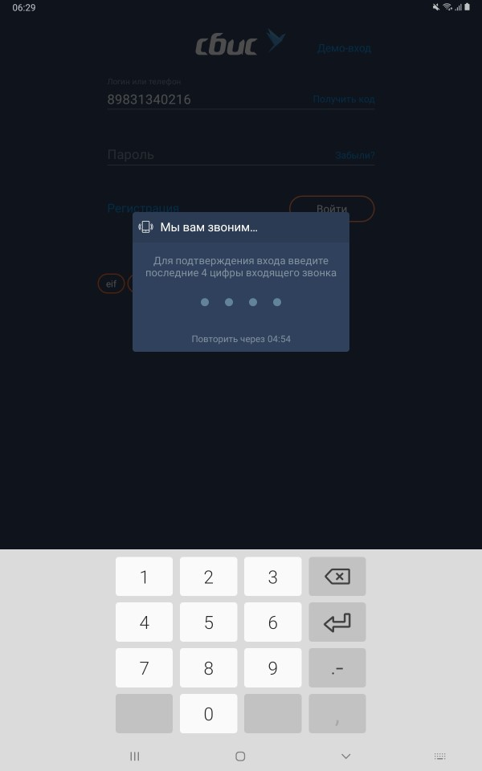
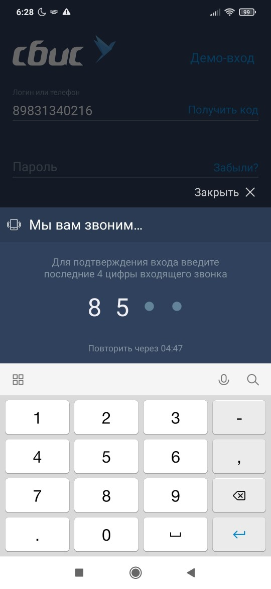

#### Компонент ввода пин-кода

|Класс|Ответственные|Добавить|
|-----|-------------|--------|
|[PinCodeFeature](src/main/java/ru/tensor/sbis/pin_code/decl/PinCodeFeature.kt)|[Стафеев А.С.](https://online.sbis.ru/person/2fa03c81-3767-447e-a503-6a1b1b08ddfa)|[Задачу/поручение/ошибку](https://online.sbis.ru/area/d5cff451-8688-4af0-970a-8127570b0308)|

#### Использование в приложениях
- [Коммуникатор](https://git.sbis.ru/mobileworkspace/apps/droid/communicator)
- [Курьер](https://git.sbis.ru/mobileworkspace/apps/droid/courier)
- [Сбис на складе](https://git.sbis.ru/mobileworkspace/apps/droid/storekeeper)
- [Витрина](https://git.sbis.ru/mobileworkspace/apps/droid/showcase)
- [Мобильный официант](https://git.sbis.ru/mobileworkspace/apps/droid/waiter2)
- [Бизнес](https://git.sbis.ru/mobileworkspace/apps/droid/business)

##### Внешний вид
 

[Стандарт внешнего вида](http://axure.tensor.ru/MobileStandart8/#p=%D0%B2%D0%B2%D0%BE%D0%B4_%D0%BF%D0%B8%D0%BD-%D0%BA%D0%BE%D0%B4%D0%B0&g=1)  

##### Описание
Компонент предназначен для создания или ввода кода подтверждения операции.

##### Подключение
Для модуля, в котором экран ввода пин-кода будет использоваться, должна быть объявлена зависимость в файле build.gradle
`implementation project(':pin_code')`

##### Стилизация
Тема компонента задаётся атрибутом `pin_code_theme` либо передав в конфигурации при вызове метода `PinCodeFeature.show` параметром `theme`. По умолчанию используется тема [PinCodeWhite](src/main/res/values/theme.xml), доступны дополнительные темы [PinCodeBlack](src/main/res/values/theme.xml), [PinCodeBlue](src/main/res/values/theme.xml).

###### Переопределение темы
При необходимости можно оформить собственную тему, задав требуемые значения следующих атрибутов:

|Атрибут|Описание|
|-------|--------|
|pin_code_header_text_color|Цвет текста заголовка и его иконки|  
|pin_code_header_background_color|Цвет фона заголовка|  
|pin_code_header_divider_color|Цвет разделителя между заголовком и основным контентом|  
|pin_code_entered_digit_color|Цвет введенного символа/цифры|  
|pin_code_not_entered_digit_color|Цвет не введенного символа/пузыря|  
|pin_code_main_text_color|Основной цвет текста используется для комментария и для таймера обратного отсчета|  
|pin_code_retry_text_color|Цвет ссылки "Получить код повторно"|  
|pin_code_content_background_color|Основной цвет фона контента| 
|pin_code_default_input_field_cursor_color|Цвет курсора для стандартного поля ввода| 
|pin_code_default_input_field_underline_color|Цвет нижнего подчеркивания для стандартного поля ввода| 

##### Описание особенностей работы
Точкой входа являются статические методы [createLazyPinCodeFeature](src/main/java/ru/tensor/sbis/pin_code/decl/PinCodeFeatureFacade.kt) или [createPinCodeFeature](src/main/java/ru/tensor/sbis/pin_code/decl/PinCodeFeatureFacade.kt), им необходимо передать реализацию [PinCodeRepository](src/main/java/ru/tensor/sbis/pin_code/decl/PinCodeRepository.kt), 
по `onCodeEntered` нужно произвести синхронное действие обработки полученного пин-кода,
по `onRetry` нужно произвести синхронное действие обработки нажатия на кнопку "Получить код повторно".
по `needCleanCode` нужно проверить тип переданного исключения и вернуть true, если нужно очищать поле ввода. Вызовется при возникновении исключения при выполнении `onCodeEntered`.
по `needCloseOnError` нужно проверить тип переданного исключения и вернуть true, если нужно скрыть окно ввода. Вызовется при возникновении исключения при выполнении `onCodeEntered` и `onRetry`.
Любое выброшенное исключение будет обработано самим компонентом в виде тост сообщения. Текст берется из возникшего исключения.
по `needCloseAndDisplayOnDialogOnError` нужно проверить тип переданного исключения и вернуть true, если нужно скрыть окно ввода пин-кода. Вызовется при возникновении исключения при выполнении `onCodeEntered` и `onRetry`.
Выброшенное исключение будет обработано самим компонентом в виде Информационного сообщения стиля DANGER. Текст берется из возникшего исключения.

Методы `createLazyPinCodeFeature` и `createPinCodeFeature` возвращают фичу компонента.
Эта фича является общей вью-моделью для хоста фрагмента/активности и фрагмента ввода пин-кода. Ее можно передать во вью-модель хост фрагмента/активности или роутер через DI.
Для получения результата выполнения проверки введенного пин-кода необходимо подписаться на событие `onRequestCheckCodeResult`. 
Для получения уведомления о закрытии компонента пин-кода пользователем необходимо подписаться на событие `onCanceled`. 
По вызову этого события прилетит успешный результат выполнения `PinCodeRepository.onCodeEntered` и фрагмент пин-кода автоматически закроется.

Для отображения самого фрагмента стоит воспользоваться методом `show` передав ему желаемый сценарий использования [PinCodeUseCase](src/main/java/ru/tensor/sbis/pin_code/decl/PinCodeUseCase.kt).
- `pinCodeFeature.show(useCase = PinCodeUseCase.ConfirmByCall("Информационное сообщение"))` - сценарий использования.
- `pinCodeFeature.show(theme = R.style.PinCodeWhite)` - тема оформления. По умолчанию белая тема. Используется если в текущей теме не найден атрибут `pin_code_theme`
- `pinCodeFeature.show(popoverAnchor = Anchor.createTopWithOverlayAnchor(R.id.some_view, AnchorGravity.START))` - якорь вью к которому должна быть прикреплена форма ввода пин-кода. Используется только для планшетов. Если якорь не задан, то размещение на планшете будет происходить по центру.

Если имеющихся сценариев не достаточно, то стоит воспользоваться методом `show` с кастомным сценарием `PinCodeUseCase.Custom` поддерживающий конфигуратор [PinCodeConfiguration](src/main/java/ru/tensor/sbis/pin_code/decl/PinCodeConfiguration.kt).
- `PinCodeConfiguration(headerIcon = SbisMobileIcon.Icon.smi_PhoneCell1)` - иконка в шапке. Опционален.
- `PinCodeConfiguration(header = R.string.header)` - текстовый заголовок в шапке. id строкового ресура. 
- `PinCodeConfiguration(comment= "Тестовый коммент")` - комментарий. Строка. 
- `PinCodeConfiguration(isDefaultField = true)` - нужно ли использовать обычное поле ввода вместо поля ввода с точками. По умолчанию false
- `PinCodeConfiguration(isMaskedCode = true)` - нужно ли скрывать вводимые пользователем символы. По умолчанию false
- `PinCodeConfiguration(transportType = PinCodeTransportType.SMS)` - тип доставки кода. По умолчанию `PinCodeTransportType.NONE`
- `PinCodeConfiguration(confirmationType = ConfirmationType.BUTTON)` - тип подтверждения действия завершения ввода пин-кода. По умолчанию по достижении максимальной длины ввода кода `INPUT_COMPLETION`
- `PinCodeConfiguration(codeLength = 4)` - длина вводимого пин-кода. Допустимы значения от 4 до 30. По умолчанию 4.
- `PinCodeConfiguration(inputHint = R.string.some_hint)` - дополнительная подсказка для поля ввода неограниченного пин-кода. Отобразится в случае использования `PRIVATE_DEFAULT_FIELD` или `PUBLIC_DEFAULT_FIELD`
- `PinCodeConfiguration(hasPeriod = false)` - имеет ли пин-код период действия. В случае true будет отображено доп. поле выбора длительности действия пин-кода.
- Пример использования:

```kotlin
//Пример создания фичи. Возможны варианты инициализации на активности и на фрагменте.

createPinCodeFeature(fragment) { RepositoryImpl() }
createPinCodeFeature(activity) { RepositoryImpl() }

//Ленивая инициализация через делегированное свойство.
val pinCodeFeature: PinCodeFeature<String> by createLazyPinCodeFeature (fragment) { RepositoryImpl() }
val pinCodeFeature: PinCodeFeature<String> by createLazyPinCodeFeature (activity) { RepositoryImpl() }
```

```kotlin
// Пример создания внешнего репозитория

class RepositoryImpl : PinCodeRepository<String> {
    override fun onCodeEntered(digits: String): String {
        //запрос в облако или какое-то локальное действие, должен выполняться синхронно      
        //именно этот результат ожидаем в pinCodeFeature.codeEnteredResult.observe
        return "123456789"
    }

    override fun onRetry() {
        //запрос в облако, должен выполняться синхронно
    }
	
	override fun needCleanCode(error: Throwable): Boolean {
        //проверить тип возникшего исключения и если помимо отображения сообщения необходимо очищать поле ввода, то вернуть true
        return true
    }

    override fun needCloseOnError(error: Throwable): Boolean {
        //проверить тип возникшего исключения, и если помимо отображения сообщения необходимо закрыть окно ввода, то вернуть true
        return true
    }
}
```

```kotlin
//Пример подписки на событие результата выполнения проверки введенного пин-кода.

override fun onViewCreated(view: View, savedInstanceState: Bundle?) {
    //слушаем результат выполнения от RepositoryImpl.onCodeEntered
    pinCodeFeature.onRequestCheckCodeResult.observe(viewLifecycleOwner, { result ->
        val data: String = result.data
        //получили конкретные данные, в данном примере это "123456789"
        //компонент был автоматически закрыт
    })
}
```

```kotlin
//Пример отображения формы ввода пин-кода.

pinCodeFeature.show(
    this,
    PinCodeUseCase.Custom(
        PinCodeConfiguration(        
            headerIcon = SbisMobileIcon.Icon.smi_PhoneCell1,
            header = R.string.header,
            comment = "Для подтверждения входа введите последние 4 цифры входящего звонка.",
            codeLength = 4,
            confirmationType = ConfirmationType.BUTTON     
        )
    ),
    popoverAnchor = Anchor.createTopWithOverlayAnchor(R.id.pin_code_tablet_test_view, AnchorGravity.START)
)

pinCodeFeature.show(this, PinCodeUseCase.Create("Вам нужно создать пин-код"))

```

##### Демо-приложение
Также пример работы с модулем можно посмотреть в демо-приложении `designDemo` модуля `demo` [PinCodeHostFragment](../demo/src/main/java/ru/tensor/sbis/appdesign/pincode/PinCodeHostFragment.kt) и [PinCodeHostActivity](../demo/src/main/java/ru/tensor/sbis/appdesign/pincode/PinCodeHostActivity.kt).

##### Трудозатраты внедрения
2 ч/д