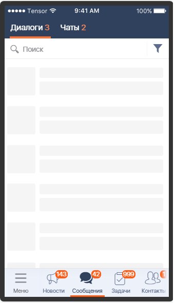

#### Скелетная анимация

|Класс|Ответственные|Добавить|
|-----|-------------|--------|
|[SkeletonView](skeleton_view/src/main/java/ru/tensor/sbis/design/skeleton_view/SkeletonView.kt)|[Мерзликина Ю.С.](https://online.sbis.ru/person/20f49b98-c02d-45c8-9051-49f3e2c82ed7)|[Задачу/поручение/ошибку](https://online.sbis.ru/area/d5cff451-8688-4af0-970a-8127570b0308)|
|[SkeletonRecyclerView](skeleton_view/src/main/java/ru/tensor/sbis/design/skeleton_view/recyclerview/SkeletonRecyclerView.kt)|[Мерзликина Ю.С.](https://online.sbis.ru/person/20f49b98-c02d-45c8-9051-49f3e2c82ed7)|[Задачу/поручение/ошибку](https://online.sbis.ru/area/d5cff451-8688-4af0-970a-8127570b0308)|
|[SkeletonViewPager2](skeleton_view/src/main/java/ru/tensor/sbis/design/skeleton_view/viewpager2/SkeletonViewPager2.kt)|[Мерзликина Ю.С.](https://online.sbis.ru/person/20f49b98-c02d-45c8-9051-49f3e2c82ed7)|[Задачу/поручение/ошибку](https://online.sbis.ru/area/d5cff451-8688-4af0-970a-8127570b0308)|

#### Использование в приложениях
- [Курьер](https://git.sbis.ru/mobileworkspace/apps/droid/courier)

##### Внешний вид


[Стандарт внешнего вида](http://axure.tensor.ru/MobileStandart8/#p=%D1%81%D0%BA%D0%B5%D0%BB%D0%B5%D1%82%D0%BE%D0%BD%D0%B2%D1%8C%D1%8E&g=1)

##### Описание
Компонент предназначен для отображения пользователю процесса загрузки данных, а также для подготовки пользователя к тому контенту, который он ожидает.

В итоге работы компонента пользователь видит плавный переход из состояния загрузки к отображению контента.

|Атрибут|Описание|
|-------|--------|
|SkeletonView_mask_color|Цвет маски для заполнения view|
|SkeletonView_mask_corner_radius|Радиус скругления углов у view маски|
|SkeletonView_show_shimmer|Показывать или нет анимацию мерцания|
|SkeletonView_shimmer_сolor|Цвет анимации мерцания|
|SkeletonView_shimmer_duration|Длительность интервала анимации мерцания|
|SkeletonView_shimmer_direction|Направление анимации мерцания|

##### Описание особенностей работы
- Компонент позволяет создавать обертки для отображения скелетной анимации для Layout, RecyclerView и ViewPager.

- Для создания обертки используются функции расширения createSkeleton, куда передаются параметры отображения создаваемой анимации.

- Параметры отображения анимации задаются с помощью объекта [SkeletonConfig](skeleton_view/src/main/java/ru/tensor/sbis/design/skeleton_view/SkeletonConfig.kt).

- Для переключения режима отображения SkeletonView используются методы `showSkeleton` и `hideSkeleton`

- Для определения текущего состояния view используется метод `isSkeletonActive`

- Пример оборачивания RecyclerView в Skeleton:
```kotlin
private val skeleton by lazy { recyclerView.createSkeleton(R.layout.iamhere_skeleton_item, 10).apply { showSkeleton() } }

fun updateViewState(result: Result<Any, Throwable>?) {
    when (result) {
        Result.Progress -> {
            if (skeleton.isSkeletonActive().not())
                skeleton.showSkeleton()
        }
        is Result.Data -> {
            skeleton.hideSkeleton()
        }
    }
}
```

- Пример использования SkeletonView в разметке:
```xml
<?xml version="1.0" encoding="utf-8"?>
<layout xmlns:android="http://schemas.android.com/apk/res/android"
    <ru.tensor.sbis.design.skeleton_view.SkeletonView
        android:layout_width="wrap_content"
        android:layout_height="wrap_content">

        <View
            ...
            />

    </ru.tensor.sbis.design.skeleton_view.SkeletonView>
</layout>
```
