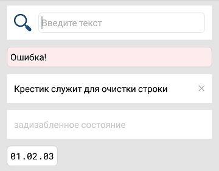

#### Поле ввода

|Класс|Ответственные|Добавить|
|-----|-------------|--------|
|[InputTextBox](src/main/java/ru/tensor/sbis/design/text_span/text/InputTextBox.kt)|[Бессонов Ю.С.](https://online.sbis.ru/person/0744ffc8-075a-40e7-a1bd-5d6fff8655f2)|[Задачу/поручение/ошибку](https://online.sbis.ru/area/d5cff451-8688-4af0-970a-8127570b0308)|

#### Использование в приложениях
- [Коммуникатор](https://git.sbis.ru/mobileworkspace/apps/droid/communicator)

##### Внешний вид


[Стандарт внешнего вида](http://axure.tensor.ru/MobileAPP/#p=поля_ввода&g=1)

##### Описание
Поле ввода даёт возможность ввести данные с клавиатуры.
Каждое поле ввода может быть в одном из  состояний:
- незаполненное
- заполненное
- ошибочно заполненное (валидация)
- задизабленное. (Состояние - исключение. В случае невозможности для редактирования такое поле лучше не отображать).

Компонент представляет собой композитный View, содержащий EditText, для использования в качестве "поля ввода, растянутого на ширину экрана" и "поля ввода с фиксированной шириной (рамкой)", описанных в стандарте.

##### xml атрибуты
- `inputTextBoxStyle` - определяет тему поля ввода
- `InputTextBox_hasClearButton` - определяет наличие кнопки очистки текста в непустом поле ввода (по умолчанию отсутствует)
- `InputTextBox_hasFrame` - определяет наличие у фона рамки со скруглёнными углами (по умолчанию отсутствует)
- `InputTextBox_editTextLayoutRes` - атрибут, позволяющий переопределить используемый EditText - можно указать id ресурса layout'а, содеражащего конкретный EditText, с заданными значениями специфичных для него атрибутов (по умолчанию используется AppCompatEditText)
- `InputTextBox_editTextMinHeight` - минимальная высота непосредственно поля ввода (для поля с мин. 1 строкой по умолчанию 34 или 48 dp, при наличии или отсутствии рамки фона соответственно)
- `InputTextBox_editTextMaxHeight` - максимальная высота непосредственно поля ввода
- `InputTextBox_dynamicMultiline` - задаёт многострочный режим ввода текста, в котором подсказка отображается в одну строку с ellipsize, но при этом не ограничивается число вводимых строк (по умолчанию отключен)
- `android:icon` - id строкового ресурса иконки слева от поля ввода
- `android:text`, `android:fontFamily`, `android:hint`, `android:imeOptions`, `android:inputType`, `android:minLines`, `android:maxLines` - атрибуты, делегируемые EditText

##### Стилизация
Компонент имеет тему по умолчанию `InputTextBox`, в которой, в частности в атрибуте `editTextStyle` задан стандартный стиль EditText `InputTextBoxEditText`. Тема компонента задаётся атрибутом `inputTextBoxStyle`

###### Переопределение темы
На данный момент переопределение темы заданием атрибута `inputTextBoxStyle` позволяет изменить некоторые атрибуты, такие как цвет текста, курсора, выделения, но далеко не все. Например, цвет иконки, кнопки очистки текста, фона в нормальном состоянии и состоянии ошибки не переопределяются.

##### Описание особенностей работы
Компонент позволяет использовать поля ввода следующих типов
- Поле ввода растянутое на ширину экрана (без рамки).
Для реализации такого поля требуется добавление **InputTextBox** в xml и ограничение ширины только отступами по краям.

- Поле ввода с фиксированной шириной (с рамкой).
Для реализации такого поля требуется указать атрибут `InputTextBox_hasFrame`. Если вид поля типовой, с иконкой слева, нужно также задать ресурс иконки, используя `android:icon`

В каждом случае необходимо указать тип поля ввода с нужными флагами (text/textMultiLine/number и т.п. ) и, при необходимости, максимальное и минимальное число строк. По умолчанию используются значения, определяемые EditText'ом. Исключение составляет мин. число строк - по умолчанию 1. Если и максимальное, и минимальное число строк - 1, то, вне зависимости от типа ввода, содержимое при переполнении будет прокручиваться по горизонтали.

- Padding поля ввода сверху зависит от того, превышает ли фактическое число линий минимальное. Значение gravity зависит от минимального числа строк: если оно больше 1, то используется `Gravity.TOP`, иначе - `Gravity.CENTER_VERTICAL`. Если задана иконка, то задаётся фон контейнера по умолчанию. Для поля ввода с минимальным числом строк, не превышающим 1, задаётся мин. высота по умолчанию, в зависимости от наличия рамки, если иная не задана.

- Возможен перевод состояния поля ввода в disabled, как в xml, так и в коде (`android:enabled`, `setEnabled(boolean)`).

- Для перевода поля в состояние ошибки нужно выполнить
```kotlin
input_text_box.setErrorState(true)
```

- Если требуется обработать событие нажатия на кнопку устройства до его обработки IME, можно задать `OnKeyPreImeListener`. Для этого есть метод
```kotlin
 fun setOnKeyPreImeListener(
        onKeyPreImeListener: OnKeyPreImeListener?,
        delegateDispatchOnKeyPreImeToListener: Boolean = false
    )
```
* Задание значения `delegateDispatchOnKeyPreImeToListener = true` (см. выше) позволяет возвращать результат вызова `OnKeyPreImeListener.onKeyPreImeEvent` в методе `dispatchKeyEventPreIme`. В противном случае, результат вызова игнорируется

- Задание атрибута `InputTextBox_editTextLayoutRes` позволяет переопределить используемый **EditText**. При этом, рекомендуется устанавливать только значения специфичных атрибутов. Нежелательно указывать собственные значения атрибутов, определённых в  стиле, заданном в `editTextStyle` (см. стиль `InputTextBoxEditText`), а также `android:background`, `android:padding`, `android:gravity`и других, которые могут привести к расхождениям со спецификацией.

- Метод `setInputTypeWithRestrictedPhoneSymbols(Int)` позволяет при задании типа ввода `InputType.TYPE_CLASS_PHONE` ограничить набор допустимых символов цифрами и символом `+`

- Пример объявления однострочного поля ввода с рамкой, иконкой и кнопкой очистки
```xml
<ru.tensor.sbis.design.text_span.text.InputTextBox
            android:id="@+id/text_with_icon"
            android:layout_width="match_parent"
            android:layout_height="wrap_content"
            android:inputType="text"
            android:hint="@string/text_with_icon_hint"
            android:icon="@string/design_mobile_icon_loupe"
            app:InputTextBox_hasClearButton="true"
            app:InputTextBox_hasFrame="true"/>
```
- Пример объявления простого поля с не более чем 5-ю видимыми строками
```xml
 <ru.tensor.sbis.design.text_span.text.InputTextBox
            android:id="@+id/text_without_frame_and_clear"
            android:layout_width="match_parent"
            android:layout_height="wrap_content"
            android:inputType="textMultiLine|textCapSentences"
            android:maxLines="5"/>
```

##### Используется в приложениях
- [Курьер](https://git.sbis.ru/mobileworkspace/apps/droid/courier)