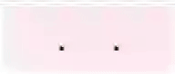

### Поля ввода с маской

Набор инструментов для реализации полей ввода c маской размещены в пакете [masked](src/main/java/ru/tensor/sbis/design/text_span/text/masked). Готовые реализации, такие как [PhoneEditText](src/main/java/ru/tensor/sbis/design/text_span/text/masked/PhoneEditText.kt)
и [StaticMaskEditText](src/main/java/ru/tensor/sbis/design/text_span/text/masked/StaticMaskEditText.kt) можно найти в корне пакета.  
Рассмотрим принципиальную схему реализации нового маскированного поля. Для реализации потребуется:

1. Определить способ наложения маски в реализации [Formatter](src/main/java/ru/tensor/sbis/design/text_span/text/masked/formatter/Formatter.kt). Можно воспользоваться существующими реализациями:
    
    - [StaticFormatter](src/main/java/ru/tensor/sbis/design/text_span/text/masked/formatter/StaticFormatter.kt) - для случая, когда маску нужно отображать целиком независимо от ввода
    - [DynamicFormatter](src/main/java/ru/tensor/sbis/design/text_span/text/masked/formatter/DynamicFormatter.kt) - для случая, когда маску нужно отображать по мере ввода
    - [ConditionalFormatter](src/main/java/ru/tensor/sbis/design/text_span/text/masked/formatter/ConditionalFormatter.kt) - для реализаций, где маски должны меняться в зависимости от ввода пользователя

    класс `Formatter` отвечает только за наложение маски, проверку ввода обеспечивает [InputFilter](https://developer.android.com/reference/android/text/InputFilter)

2. Определить правила фильтрации ввода в реализации (или нескольких) `InputFilter`. Для простых случаев, когда форматирование и фильтрация совпадают,
   можно воспользоваться реализацией [MaskInputFilter](src/main/java/ru/tensor/sbis/design/text_span/text/masked/mask/MaskInputFilter.kt).

3. Завершающим шагом для создаваемого компонента нужно реализовать расширение от [AbstractMaskEditText](src/main/java/ru/tensor/sbis/design/text_span/text/masked/AbstractMaskEditText.kt) с установкой фильтров и форматирования

    ```kotlin
    init {
        // подготовка форматтера
        val formatter = ConditionalFormatter(
            listOf(
                // описание форматирований и их правил выбора
                FOUR_DIGIT to DynamicFormatter("##-##"),
                FIVE_DIGIT to DynamicFormatter("#-##-##"),
                SIX_DIGIT to DynamicFormatter("##-##-##"),
                SEVEN_DIGIT to DynamicFormatter("###-##-##"),
                UP_TO_TEN_DIGIT to DynamicFormatter("(###) ###-##-##"),
                MORE_THAN_TEN to COMMON_FORMATTER
            )
        )

        // установка подписки на ввод для форматирования 
        transformationMethod = FormatterHolder(formatter)

        // установка фильтров ввода
        filters = arrayOf(
                InputFilter.LengthFilter(COMMON_PHONE_MASK.length),
                MaskInputFilter(MaskParser(COMMON_PHONE_MASK).types),
                FirstSymbolInputFilter())
    }
    ```

#### Поле ввода номера телефона

|Класс|Ответственные|
|-----|-------------|
|[PhoneEditText](src/main/java/ru/tensor/sbis/design/text_span/text/masked/PhoneEditText.kt)|[Бубенщиков Сергей](https://online.sbis.ru/person/1fb93b8c-350f-4785-8589-b0ff2edfbfa7)| 

#### Использование в приложениях
- [Мобильная витрина SabyGet](https://git.sbis.ru/mobileworkspace/apps/droid/showcase)
- [Курьер](https://git.sbis.ru/mobileworkspace/apps/droid/courier)

##### Внешний вид
   
[Стандарт внешнего вида](http://axure.tensor.ru/MobileStandart8/#p=%D0%BF%D0%BE%D0%BB%D1%8F_%D0%B2%D0%B2%D0%BE%D0%B4%D0%B0&g=1)   
[Поле для ввода телефонного номера](http://axure.tensor.ru/standarts/v7/%D0%BF%D0%BE%D0%BB%D0%B5_%D0%B2%D0%B2%D0%BE%D0%B4%D0%B0__%D0%B2%D0%B5%D1%80%D1%81%D0%B8%D1%8F_3_1_.html)   

##### Описание
Компонент осуществляет форматироване ввода номера телефона. Алгоритм его работы дублирует логику из Web.

##### Стилизация
Компонент является тонкой надстройкой над `AppCompatEditText`. Для стилизации доступны все его атрибуты и за исключением `inputType` (задан фиксировано).

###### Переопределение темы
Тема компонента получается из атрибута `com.google.android.material.R.attr.editTextStyle`.

##### Описание особенностей работы 

- если редактирование текста доступно (`isEnabled == true`), атрибут `inputType` устанавливается автоматически, и не доступен для переопределения. Его значение `InputType.TYPE_CLASS_PHONE | InputType.TYPE_TEXT_FLAG_NO_SUGGESTIONS`. Если редактирование недоступно, то допускается изменение `inputType`, в частности, для возможности многострочного отображения.
- доступен метод `setWorkPhoneFormat(Boolean)`, позволяющий использовать формат для ввода рабочего номера телефона, отличающийся тем, что для номеров короче 5 символов маска не применяется.
- если нужно задать ограничение на ввод символов для российских номеров, тогда нужно указать атрибуту `PhoneEditText_decoration` значения: `ru` - сохранится форматирование телефона по умолчанию и добавится ограничение на ввод количества символов, `ru_format` - форматирование для российских сотовых номеров, которые начинаются с +7 и 8 ,`ru_len` - форматирования российских сотовых телефонов не будет, а будет только ограничение на ввод количества символов для российских сотовых телефонов, `common_format` - значение по умолчанию, только базовое форматирование и ограничение на ввод для домашних и других телефонов
- для применения форматирования к собственным полям ввода, можно задавать `TransformationMethod`, либо `TextWatcher`, которые можно получить, преобразованием `formatter.asTransformationMethod()`, либо `formatter.asTextWatcher()` соответственно.

#### Поле ввода со статичной маской

|Класс|Ответственные|
|-----|-------------|
|[StaticMaskEditText](src/main/java/ru/tensor/sbis/design/text_span/text/masked/StaticMaskEditText.kt)|[Бубенщиков Сергей](https://online.sbis.ru/person/1fb93b8c-350f-4785-8589-b0ff2edfbfa7)| 

##### Внешний вид
   
[Стандарт внешнего вида](http://axure.tensor.ru/MobileStandart8/#p=%D0%BF%D0%BE%D0%BB%D1%8F_%D0%B2%D0%B2%D0%BE%D0%B4%D0%B0&g=1)    

##### Описание
Поле ввода с маской, которая не меняется в зависимости от пользовательского ввода.

##### xml атрибуты
- `mask` - строка или ссылка на ресурс с описанием маски. Формат описания маски определяется набором символов из [MaskSymbol](src/main/java/ru/tensor/sbis/design/text_span/text/masked/mask/MaskSymbol.kt),
остальные символы будут считаться символами форматирования.

##### Стилизация
Компонент является тонкой надстройкой над `AppCompatEditText`, для стилизации доступны все его атрибуты.

###### Переопределение темы
Тема компонента получается из атрибута `com.google.android.material.R.attr.editTextStyle`.

##### Описание особенностей работы 

- атрибут `inputType` устанавливается автоматически. Он доступен для расширения, но его значение должно содержать `InputType.TYPE_TEXT_FLAG_NO_SUGGESTIONS` (устанавливается автоматически).
