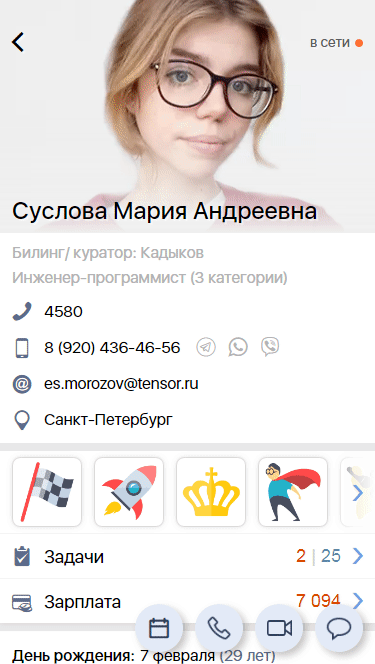

#### Графическая шапка

|Класс|Ответственные|Добавить|
|-----|-------------|--------|
|[SbisAppBarLayout](src/main/java/ru/tensor/sbis/design/toolbar/appbar/SbisAppBarLayout.kt)|[Бубенщиков Сергей](https://online.sbis.ru/person/1fb93b8c-350f-4785-8589-b0ff2edfbfa7)|[Задачу/поручение/ошибку](https://online.sbis.ru/area/d5cff451-8688-4af0-970a-8127570b0308)|

#### Использование в приложениях
- [Коммуникатор](https://git.sbis.ru/mobileworkspace/apps/droid/communicator)
- [Мобильная витрина SabyGet](https://git.sbis.ru/mobileworkspace/apps/droid/showcase)
- [Курьер](https://git.sbis.ru/mobileworkspace/apps/droid/courier)

##### Внешний вид
   
[Стандарт внешнего вида](http://axure.tensor.ru/MobileStandart8/%D0%B3%D1%80%D0%B0%D1%84%D0%B8%D1%87%D0%B5%D1%81%D0%BA%D0%B0%D1%8F_%D1%88%D0%B0%D0%BF%D0%BA%D0%B0.html)   

##### Описание
Графическая шапка - это не самодостаточная `View` в привычном понимании, а набор инструментов и подготовленных стилей. 
Такой формат выбран ввиду того, что наполнение графической шапки отличается в приложениях (и экранах) и стандартизовать его _единым view компонентом_ нецелесообразно.  
Тем не менее, можно выделить центральный элемент, который выступает в роли медиатора (с точки зрения бизнес логики) и агрегатора стилей (с точки зрения внешнего вида) - `SbisAppBarLayout`.  
Пример построения макета для графической шапки:
```xml
<ru.tensor.sbis.design.toolbar.appbar.SbisAppBarLayout
    android:id="@+id/appBar"
    android:layout_width="match_parent"
    android:layout_height="@dimen/app_bar_height"
    app:SbisAppBarLayout_image="@+id/mainImage"
    app:SbisAppBarLayout_gradient_holder="@+id/gradientHolder"
    app:SbisAppBarLayout_color_dependent_views="toolbarLayout,toolbar">

    <!-- Атрибут style нужно указать явно так как стиль определяет поведение -->
    <ru.tensor.sbis.design.toolbar.multilinecollapsingtoolbar.CollapsingToolbarLayout
        style="?collapsingToolbarStyle"
        android:id="@+id/toolbarLayout"
        android:layout_width="match_parent"
        android:layout_height="match_parent"
        app:title="Суслова Мария Андреевна"
        app:subtitle="Инженер-программист (3 категории)"
        app:toolbarId="@+id/toolbar">

        <!-- Используется реализация с возможностью отображения заглушки. Стиль указан явно -->
        <com.facebook.drawee.view.DraweeView
            style="?imageViewStyle"
            android:id="@+id/mainImage"
            android:layout_width="match_parent"
            android:layout_height="match_parent"/>
			
        <!-- View, посредством которой будет добавлен градиент -->
        <View
        	android:id="@+id/gradientHolder"
        	android:layout_width="match_parent"
        	android:layout_height="match_parent"/>
            
        <!-- Элементы UI в соответствии с прикладным макетом -->

        <!-- Атрибут style нужно указать явно так как стиль определяет поведение -->
        <android.support.v7.widget.Toolbar
            style="?toolbarStyle"
            android:id="@+id/toolbar"
            android:layout_width="match_parent"
            android:layout_height="?attr/actionBarSize"/>

    </ru.tensor.sbis.design.toolbar.multilinecollapsingtoolbar.CollapsingToolbarLayout>
</ru.tensor.sbis.design.toolbar.appbar.SbisAppBarLayout>
```
Пример построения макета для графической шапки с ссылкой на `View` с toolbar-ом и изображением:
```xml
<androidx.coordinatorlayout.widget.CoordinatorLayout
    xmlns:android="http://schemas.android.com/apk/res/android"
    xmlns:app="http://schemas.android.com/apk/res-auto"
    xmlns:tools="http://schemas.android.com/tools"
    android:layout_width="match_parent"
    android:layout_height="match_parent"
    android:fitsSystemWindows="true">

    <ru.tensor.sbis.design.toolbar.appbar.SbisAppBarLayout
        android:id="@+id/appBar"
        android:layout_width="match_parent"
        android:layout_height="wrap_content"
        android:onClick="onHeaderClicked"
        app:SbisAppBarLayout_layoutId="@layout/sbis_app_bar_view">

    </ru.tensor.sbis.design.toolbar.appbar.SbisAppBarLayout>

    <androidx.core.widget.NestedScrollView
        android:layout_width="match_parent"
        android:layout_height="match_parent"
        app:layout_behavior="@string/appbar_scrolling_view_behavior"
        tools:showIn="@layout/activity_app_bar"
        android:fitsSystemWindows="true">

        <TextView
            android:layout_width="wrap_content"
            android:layout_height="wrap_content"
            android:text="@string/large_text" />

    </androidx.core.widget.NestedScrollView>

</androidx.coordinatorlayout.widget.CoordinatorLayout>
```
Пример динамического задания заголовка расширениями из файла [SbisAppBarHelper.kt](https://git.sbis.ru/mobileworkspace/android-design/blob/20.2104/feature/design/sbis_app_bar_custom_view/design/src/main/java/ru/tensor/sbis/design/view/appbar/SbisAppBarHelper.kt) для шаблона [sbis_app_bar_view.xml](https://git.sbis.ru/mobileworkspace/android-design/blob/20.2104/feature/design/sbis_app_bar_custom_view/design/src/main/res/layout/sbis_app_bar_view.xml)
```kotlin
sbisAppBarLayout.setup {
    setTitle("Суслова Мария Андреевна")
}
```
Пример динамического задания заголовка расширениями из файла [SbisAppBarWithSbisToolbarHelper.kt](https://git.sbis.ru/mobileworkspace/android-design/blob/20.2104/feature/design/sbis_app_bar_custom_view/design/src/main/java/ru/tensor/sbis/design/view/appbar/SbisAppBarWithSbisToolbarHelper.kt) для шаблона [sbis_app_bar_with_sbis_toolbar_view.xml](https://git.sbis.ru/mobileworkspace/android-design/blob/20.2104/feature/design/sbis_app_bar_custom_view/design/src/main/res/layout/sbis_app_bar_with_sbis_toolbar_view.xml)
```kotlin
sbisAppBarLayout.setupWithSbisToolbar {
    setTitle("Суслова Мария Андреевна")
}
```
##### xml атрибуты
- `SbisAppBarLayout_image` - ссылка на `ImageView`, которая выступает в роли фоновой картинки для графической шапки   
- `SbisAppBarLayout_gradient_holder` - ссылка на `View` которой будет задан градиент (при её отсутствии градиент отображаться не будет). Если её контейнер не является FrameLayout или унаследованным от него, необходимо явно расположить View снизу контейнера
- `SbisAppBarLayout_color_dependent_views` - строка с перечислением id view (через запятую без пробелов), для которых нужно применять обновление цветовой схемы.
    Напрмер, для обновления цвета иконки "назад" в toolbar нужно указать его id (раскраска элементов меню должна поддерживаться на стороне пользователя).
- `SbisAppBarLayout_layoutId` - ссылка на ресурс типовой компоновки, благодаря которому `SbisAppBarLayout` можно внедрить без указания других тегов
    - `sbis_app_bar_view.xml` - компоновка с картинкой и toolbar из android SDK
    - `sbis_app_bar_with_sbis_toolbar_view.xml` - компоновка с картинкой и СБИС toolbar, прозрачным статус баром
- `SbisAppBarLayout_titleWithBackground` - определяет, должен ли заголовок отображаться на непрозрачном фоне. При значении `true` текст с фоном располагается под фото, высота градиента фиксирована. По умолчанию значение `false`

##### Стилизация
В комплекте с `SbisAppBarLayout` поставляется тема `SbisAppBar`, которая содержит настройки стилей и поведения для ключевых элементов графической шапки.
В состав темы включены атрибуты:
- `toolbarStyle` - стилизация для `Toolbar` из Android SDK
- `Toolbar_theme` - стиизация для [стандартной шапки](http://axure.tensor.ru/MobileStandart8/#p=%D1%88%D0%B0%D0%BF%D0%BA%D0%B0_2_0_&g=1) `Toolbar`
- `collapsingToolBarStyle` - стилизация для `CollapsingToolbarLayout`
- `imageViewStyle` - стилизация для фоновой картинки `ImageView` в графической шапке

Тема подключается из атрибута `appBarStyle`
```xml
<style name="AppTheme">
    <item name="appBarStyle">@style/SbisAppBar</item>
</style>
```
В случае, если атрибут не указан, используется стандартная тема `SbisAppBar`.
```xml
<ImageView
    style="?imageViewStyle"
    android:id="@+id/mainImage"
    android:layout_width="match_parent"
    android:layout_height="match_parent"/>
```

###### Переопределение темы
Для переопределения темы рекомендуется расширить стандартную тему. Такой подход позволит изменить только интересующие атрибуты:
```xml
<style name="SbisAppBar.MyTheme">
    <!-- Переопределение атрибута -->
    <item name="toolbarStyle">@style/SbisAppBar.Toolbar.MyToolbarTheme</item>
</style>

<style name="SbisAppBar.Toolbar.MyToolbarTheme">
    <!-- Прикладная тема для Toolbar из Android SDK-->
</style>
```

##### Описание особенностей работы 
- Содержимое графической шапки описывает модель [`AppBarModel`](src/main/java/ru/tensor/sbis/design/toolbar/appbar/model/AppBarModel.kt), которая содержит:
    - описание фона [`BackgroundModel`](src/main/java/ru/tensor/sbis/design/toolbar/appbar/model/BackgroundModel.kt), который устанавливается в `SbisAppBarLayout_image`
    - описание цветовой схемы [`ColorModel`](src/main/java/ru/tensor/sbis/design/toolbar/appbar/model/ColorModel.kt) для текста и градиента
    - состояние раскрытия `AppBarModel.currentOffset`  
   
  Модель поддерживает сохранение в `Parcel` и передачу между экранами для восстановления состояния при переходах.  
  Получать и устанавливать модеть нужно через свойство `SbisAppBarLayout.model`.
  
- Предусмотрены два варианта подписки на сворачивание графической шапки:
    - подписка на изменение абсолютной величины `SbisAppBarLayout.addOnOffsetChangedListener()` - стандатрная реализация из Android SDK
    - подписка на изменение относительной величины `SbisAppBarLayout.addOffsetObserver()` - величины раскрытия в процентах. Предпочтительный способ.  
        _Примечение: для корректного вычисления необходима установка минимальной высоты. По умолчанию она установлена в теме равной `attr/actionBarSize`_
    
  Подписки могут пригодиться, например, для изменения прозрачности UI элементов в зависимости от величины раскрытия [`AlphaOffsetObserver`](src/main/java/ru/tensor/sbis/design/toolbar/appbar/offset/AlphaOffsetObserver.kt).
- Установка заголовка осуществляется через атрибут `title`  для  `Toolbar`, либо `CollapsingToolbarLayout`. Реализация `CollapsingToolbarLayout` из `ru.tensor.sbis.design.toolbar.multilinecollapsingtoolbar` поддерживает также установку подзаголовка, отображаемого над заголовком, посредством атрибута `subtitle`, либо вызова `setSubtitle()`
- Если стандартное поведение раскрытия графической шапки Вам не подходит (автоматическая установка высоты), то его можно переопределить через атрибут `app:layout_behavior` и высоту `android:layout_height="wrap_content"`. В это случае высота раскрытой графической шапки будет подстраиваться под высоту ее содержимого. Пример:
```xml
<ru.tensor.sbis.design.toolbar.appbar.SbisAppBarLayout
    android:layout_width="match_parent"
    android:layout_height="wrap_content"
    app:layout_behavior="com.google.android.material.appbar.AppBarLayout$Behavior">

    <ru.tensor.sbis.design.toolbar.multilinecollapsingtoolbar.CollapsingToolbarLayout
        android:layout_width="match_parent"
        android:layout_height="match_parent">

        <!-- Какой-то контент с высотой -->

    </ru.tensor.sbis.design.toolbar.multilinecollapsingtoolbar.CollapsingToolbarLayout>
</ru.tensor.sbis.design.toolbar.appbar.SbisAppBarLayout>  
```
- В общем случае, шапка не должна сворачиваться, если содержимого на экране недостаточно для прокрутки. Для обеспечения такого поведения необходимо установить для контейнера `app:layout_behavior`, в котором определяется, когда шапка не должна сворачиваться - расширение [`SbisAppBarScrollingViewBehavior`](src/main/java/ru/tensor/sbis/design/toolbar/appbar/behavior/SbisAppBarScrollingViewBehavior.kt). Если готовой подходящей реализации не нашлось, можно оформить [задачу](https://online.sbis.ru/area/d5cff451-8688-4af0-970a-8127570b0308), либо добавить её самостоятельно (например, если определение высоты содержимого специфично для конкретного экрана). Пример:
```xml
<androidx.coordinatorlayout.widget.CoordinatorLayout
    android:layout_width="match_parent"
    android:layout_height="match_parent">

    <ru.tensor.sbis.design.toolbar.appbar.SbisAppBarLayout
        android:id="@+id/header"
        android:layout_width="match_parent"
        android:layout_height="wrap_content">

        <!-- Содержимое шапки -->

    </ru.tensor.sbis.design.toolbar.appbar.SbisAppBarLayout>

    <androidx.core.widget.NestedScrollView
        android:id="@+id/content"
        android:layout_width="match_parent"
        android:layout_height="match_parent"
        app:layout_behavior="@string/design_sbisappbar_nested_scrollview_behavior">

        <!-- Содержимое экрана -->

    </androidx.core.widget.NestedScrollView>

</androidx.coordinatorlayout.widget.CoordinatorLayout>
```
- При установке стандартного туллбара в CollapsingToolbarLayout, id кнопки "назад" будет перезаписываться.